# 基于自然语言处理的英语口语训练系统 — 系统设计说明书

**Keywords 关键词：**

自然语言处理, 英语口语训练, AI发音评测, 智能语音对话, 音素纠错, Spring Boot, MyBatis-Plus, CEFR自适应测评, AI Gateway, Adapter模式, 前后端分离

**Abstract 摘 要：**

本文档为基于自然语言处理的英语口语训练系统的概要设计及详细设计说明书，用于指导编码实现阶段工作，也是产品最终提交文档之一。技术选型采用 Java Spring Boot 3.x + MyBatis-Plus 3.x + MySQL 8.0 + Redis 7.x + React 18 + TypeScript 体系。系统按 7 大模块组织（用户中心、智能测评、口语训练、学习数据与推荐、游戏化与社区、管理后台、智能客服），覆盖 V1.0（MVP）→ V2.0（增强版）→ V3.0（完整版）三版本演进。本文档描述系统外界环境、系统框架、模块分解、接口契约、数据库设计、业务流程、核心类设计及出错处理策略。

**List of abbreviations 缩略语清单：**

| Abbreviations 缩略语 | Full spelling 英文全名                               | Chinese explanation 中文解释 |
| -------------------- | ---------------------------------------------------- | ---------------------------- |
| SPA                  | Single Page Application                              | 单页应用                     |
| B/S                  | Browser/Server                                       | 浏览器/服务器                |
| JWT                  | JSON Web Token                                       | JSON Web令牌                 |
| ASR                  | Automatic Speech Recognition                         | 自动语音识别                 |
| TTS                  | Text to Speech                                       | 文本转语音                   |
| LLM                  | Large Language Model                                 | 大语言模型                   |
| CEFR                 | Common European Framework of Reference for Languages | 欧洲语言共同参考框架         |
| IRT                  | Item Response Theory                                 | 项目反应理论                 |
| OSS                  | Object Storage Service                               | 对象存储服务                 |
| RBAC                 | Role-Based Access Control                            | 基于角色的访问控制           |
| RAG                  | Retrieval-Augmented Generation                       | 检索增强生成                 |
| CSRF                 | Cross-Site Request Forgery                           | 跨站请求伪造                 |
| CSP                  | Content Security Policy                              | 内容安全策略                 |
| FK                   | Foreign Key                                          | 外键                         |
| PK                   | Primary Key                                          | 主键                         |
| DAO                  | Data Access Object                                   | 数据访问对象                 |
| ER                   | Entity Relation                                      | 实体关系                     |

---

**目 录**

1. [Introduction 简介](#1-introduction-简介)
   - [1.1 Purpose 目的](#11-purpose-目的)
   - [1.2 Scope 范围](#12-scope-范围)
   - [1.3 Reference 参考资料](#13-reference-参考资料)
2. [High Level Design 概要设计](#2-high-level-design-概要设计)
   - [2.1 Level 0 Design Description 第0层设计描述](#21-level-0-design-description-第0层设计描述)
   - [2.2 Level 1 Design Description 第1层设计描述](#22-level-1-design-description-第1层设计描述)
3. [Data Structure / Database Design 数据结构与数据库设计](#3-data-structure--database-design-数据结构与数据库设计)
4. [UI Design 界面设计](#4-ui-design-界面设计)
5. [Detailed Design 详细设计](#5-detailed-design-详细设计)
6. [Error Design 出错处理设计](#6-error-design-出错处理设计)

---

# 1 Introduction 简介

## 1.1 Purpose 目的

本文档为"基于自然语言处理的英语口语训练系统"的系统设计说明书，用于描述系统的整体架构设计、模块分解、接口定义、数据库设计、核心功能详细设计以及出错处理策略。

本说明书的预期读者为：

1. 本项目的所有责任人和决策者（产品经理、技术负责人）；
2. 参与概要设计和需求确认的有关业务人员和技术人员；
3. 本项目的软件开发人员、测试人员、文档编写人员。

本文档全部内容均为商业机密，应严格控制其应用和阅读范围。在项目开展过程中，由本项目小组负责管理，项目完成后交专人负责保存。未经文档责任人许可，任何人不得将本文档部分或全部内容私自保留或交于他人。

## 1.2 Scope 范围

### 1.2.1 Name 软件名称

基于自然语言处理的英语口语训练系统（AI English Speaking Training System）

### 1.2.2 Functions 软件功能

系统按 7 大模块组织，覆盖 V1.0（🟢）→ V2.0（🔵）→ V3.0（🟣）三版本演进：

| 模块                   | 版本覆盖   | 核心功能                                                                                                                                             |
| ---------------------- | ---------- | ---------------------------------------------------------------------------------------------------------------------------------------------------- |
| 模块一：用户中心       | 🟢→🔵→🟣 | 注册与登录（V1.0）、个人资料管理（V1.0）、多维用户画像（V2.0）、账号安全中心（V3.0）                                                                 |
| 模块二：智能测评       | 🟢→🔵     | 英语水平测评-20题固定三档定级（V1.0）、自适应测评-CEFR六级映射（V2.0）                                                                               |
| 模块三：口语训练       | 🟢→🔵     | AI发音跟读评测-三维→五维评分+逐词纠错（V1.0→V2.0）、智能情景对话-3场景×5轮→60+场景（V1.0→V2.0）、AI语法纠错与润色（V2.0）、情景角色扮演（V2.0） |
| 模块四：学习数据与推荐 | 🟢→🔵     | 学习进度可视化-数字卡片→雷达图/趋势图（V1.0→V2.0）、个性化学习路径规划（V2.0）、学习资料智能推荐（V2.0）、学习效果预测与预警（V2.0）               |
| 模块五：游戏化与社区   | 🔵         | 游戏化闯关学习、单词PK对战、积分与勋章系统、学习小组、组内语音挑战、匿名互评                                                                         |
| 模块六：管理后台       | 🟣         | 教师端-班级管理/作业布置与点评/学习报告、运营端-用户管理/内容审核/数据看板                                                                           |
| 模块七：智能客服       | 🟣         | FAQ帮助中心、LLM智能客服（RAG检索）                                                                                                                  |

详细内容可参考需求分析文档——《基于自然语言处理的英语口语训练系统需求规格说明书》。

### 1.2.3 Applications 软件应用

本系统为基于自然语言处理和大语言模型技术的英语口语训练 Web 应用平台，主要面向以下用户群体：

- **K12 学生（12-18 岁）**：中考/高考口语应试需求，通过 AI 驱动的个性化教学和实时语音评估进行口语练习
- **大学生（18-22 岁）**：四六级口语考试备考，通过发音评测、情景对话模拟提升口语能力
- **职场人士**：商务英语口语提升，偏好碎片化、低频使用
- **儿童（6-12 岁）**：需家长辅助操作（平板为主），英语启蒙口语训练
- **中老年用户**：兴趣爱好驱动，偏好简洁直观的界面

应用领域涵盖在线教育、语言学习、AI 教育。系统核心价值主张为"音素级发音评测"与"大模型情景对话"深度融合，形成"练习→评测→纠正→应用"闭环。

详细内容可参见需求分析文档——项目介绍。

## 1.3 Reference 参考资料

| 编号   | 文档名称                     | 来源/路径                             | 说明                                                          |
| ------ | ---------------------------- | ------------------------------------- | ------------------------------------------------------------- |
| REF-01 | 需求规格说明书（全版本）     | doc/prds/需求文档111.md              | 7大模块34条需求、数据字典、ER图、系统架构图                   |
| REF-02 | 三版本迭代计划               | doc/plans/英语口语系统_迭代计划.md   | 40天三版本排期、分工、风险与依赖                              |
| REF-03 | 评审纪要                     | doc/reviews/英语口语系统_评审纪要.md | SA+QA双角色评审意见、PM决议事项                               |
| REF-04 | PM→SA交接提示词             | doc/交接/PM_SA_交接提示词.md         | 关键设计约束、6个核心设计要点                                 |
| REF-05 | Spring Boot 官方文档         | spring.io                             | 后端框架技术参考（Spring MVC、Spring Security、Spring Cache） |
| REF-06 | MyBatis-Plus 官方文档        | baomidou.com                          | ORM框架技术参考（BaseMapper、LambdaQueryWrapper）             |
| REF-07 | React 官方文档               | react.dev                             | 前端框架技术参考（Hooks、组件化、路由）                       |
| REF-08 | MySQL 参考手册               | dev.mysql.com                         | 数据库技术参考（JSON字段、InnoDB引擎、索引优化）              |
| REF-09 | Redis 官方文档               | redis.io                              | 缓存与限流技术参考（Spring Cache、Lettuce、Lua脚本）          |
| REF-10 | DeepSeek 大语言模型 API 文档 | platform.deepseek.com                 | LLM对话与评测模型接口                                         |
| REF-11 | Flyway 官方文档              | flywaydb.org                          | 数据库版本迁移工具参考                                        |
| REF-12 | 腾讯云 ASR 语音识别 API 文档 | cloud.tencent.com                     | 一句话识别接口参考                                            |

---

# 2 High Level Design 概要设计

## 2.1 Level 0 Design Description 第0层设计描述

### 2.1.1 软件系统上下文定义

本系统（AI英语口语训练系统）为Web响应式SPA应用，部署于云服务器。系统通过HTTPS与外部用户交互，通过AI Gateway代理层与第三方AI服务交互。

**系统上下文图：**

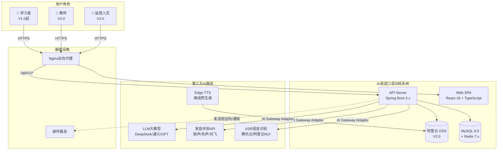

**图2-1 系统上下文图**

**上下文说明：**

- **学习者**（V1.0 起）：系统主要使用者，通过桌面/移动/微信浏览器访问前端SPA，进行注册登录、测评、发音跟读、情景对话、学习进度查看等操作。覆盖全年龄段（6-99岁），核心群体K12学生和大学生。
- **教师**（V3.0 启用）：通过电脑端访问管理后台，进行班级管理、作业布置与点评、学习报告查看。
- **运营人员**（V3.0 启用）：通过电脑端访问管理后台，进行用户管理、内容审核、运营数据看板查看和系统配置。
- **第三方AI服务**：所有AI能力（ASR识别、发音评测、LLM对话/评分、TTS合成）均通过后端AI Gateway统一代理，前端不直接持有任何API Key。TTS为离线批量预生成模式，生成的mp3文件上传至OSS。
- **阿里云OSS**（V2.0 起）：音频、图片、课件等文件的持久化存储。V1.0过渡期使用本地磁盘。
- **邮件服务**：发送注册验证码、通知等。V1.0 不使用邮件验证（直接注册），V3.0 安全中心启用邮箱验证。

### 2.1.2 Design Considerations 设计思路

#### （1）架构设计思路

系统采用**前后端分离 + 后端单体（Spring Boot多模块分层）**架构。整体分为五层：

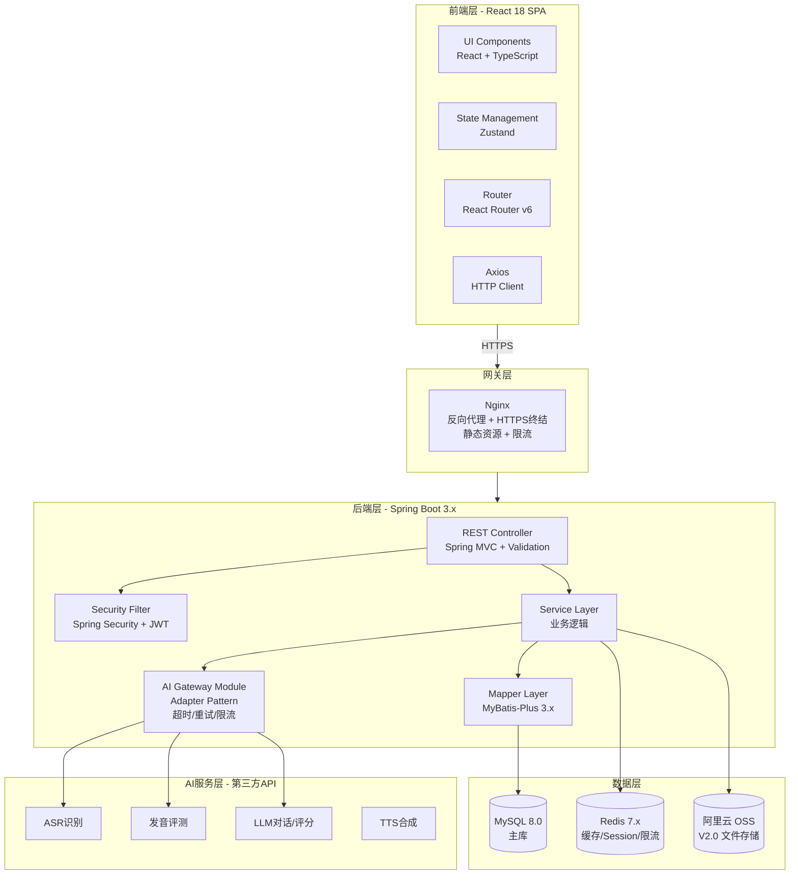

**图2-2 系统分层架构图（包图）**

**架构设计要点：**

本系统采用低耦合高内聚的模块化设计，将前端SPA与后端API服务分离，以实时反馈处理来自不同功能模块的信息，最终反馈到界面与用户进行交互。

- **前端层**：React 18 + TypeScript SPA，采用 Zustand 轻量级状态管理、React Router v6 路由、Axios HTTP客户端（含请求拦截/Token刷新/弱网重试）。Tailwind CSS 原子化CSS实现响应式布局，适配375px-1440px。V3.0 管理后台引入 Ant Design 5.x 组件库。
- **网关层**：Nginx 作为反向代理，HTTPS 终结，静态资源托管，基础限流。
- **后端层**：Spring Boot 3.x 单体应用，按职责划分为 Controller（Spring MVC REST接口 + 参数校验）、Service（业务逻辑）、Mapper（MyBatis-Plus数据访问）、AI Gateway（Adapter模式统一代理所有第三方AI调用）。Spring Security 负责JWT鉴权和CSRF防护。各层之间通过接口依赖，上层不感知下层实现细节，确保良好的封装性和数据独立性。
- **数据层**：MySQL 8.0 主库存储业务数据，利用JSON字段存半结构化数据（如feature_flags、eval_detail_json）。Redis 7.x 承担热点数据缓存、Session管理、限流计数。V2.0 起引入阿里云OSS存储音频文件和图片，V1.0过渡期使用本地磁盘。
- **AI服务层**：所有第三方AI API调用统一走后端AI Gateway代理，前端不持有任何API Key。通过Adapter模式实现供应商可替换（发音评测API供应商驰声/先声/讯飞三选一，切换只需更换Adapter实现类）。

#### （2）程序框架与目录结构

**后端 Spring Boot 多模块目录结构：**

```
english-speaking-backend/
├── pom.xml                          # Maven 父 POM
├── es-server/                       # 主启动模块
│   ├── pom.xml
│   └── src/main/java/com/es/
│       └── EsServerApplication.java # Spring Boot 启动类
├── es-common/                       # 公共模块
│   └── src/main/java/com/es/common/
│       ├── constant/                # 常量定义
│       ├── exception/               # 全局异常处理
│       ├── dto/                     # 通用 DTO
│       ├── util/                    # 工具类
│       └── annotation/              # 自定义注解
├── es-modules/                      # 业务模块
│   ├── es-user/                     # 用户中心模块
│   │   └── src/main/java/com/es/user/
│   │       ├── controller/          # UserController
│   │       ├── service/             # UserService / UserServiceImpl
│   │       ├── mapper/              # UserMapper (MyBatis-Plus)
│   │       ├── entity/              # User, UserProfile
│   │       └── dto/                 # RegisterDTO, LoginDTO
│   ├── es-assessment/               # 智能测评模块
│   ├── es-practice/                 # 口语训练模块
│   ├── es-learning/                 # 学习数据与推荐模块
│   ├── es-gamification/             # 游戏化与社区模块 (V2.0)
│   ├── es-admin/                    # 管理后台模块 (V3.0)
│   └── es-support/                  # 智能客服模块 (V3.0)
├── es-ai-gateway/                   # AI Gateway 模块
│   └── src/main/java/com/es/aigw/
│       ├── adapter/                 # Adapter 接口 + 各供应商实现
│       ├── config/                  # 超时/重试/限流配置
│       ├── dto/                     # AI 请求/响应 DTO
│       └── util/                    # 音频处理工具 (ffmpeg)
├── es-security/                     # 安全模块
│   └── src/main/java/com/es/security/
│       ├── config/                  # Spring Security 配置
│       ├── filter/                  # JWT Filter
│       ├── util/                    # JWT 工具类
│       └── annotation/              # @CurrentUser 等注解
└── src/main/resources/
    ├── db/migration/                # Flyway 迁移脚本
    │   ├── V1__init_users.sql
    │   ├── V2__init_assessment.sql
    │   ├── V3__init_practice.sql
    │   └── ...
    ├── application.yml              # 主配置
    ├── application-dev.yml          # 开发环境
    └── application-prod.yml         # 生产环境
```

**前端 React 项目目录结构：**

```
english-speaking-frontend/
├── package.json
├── tsconfig.json
├── tailwind.config.js
├── vite.config.ts
├── public/
│   └── audio/                       # Edge TTS 预生成音频（开发环境）
└── src/
    ├── main.tsx                     # 入口
    ├── App.tsx                      # 根组件 + 路由
    ├── api/                         # Axios 封装 + API 函数
    │   ├── client.ts                # Axios 实例 + 拦截器
    │   ├── auth.ts                  # 注册/登录 API
    │   ├── assessment.ts            # 测评 API
    │   ├── practice.ts              # 发音评测 API
    │   ├── conversation.ts          # 对话 API
    │   ├── progress.ts              # 进度 API
    │   └── ...
    ├── stores/                      # Zustand 状态管理
    │   ├── authStore.ts             # 用户认证状态
    │   ├── practiceStore.ts         # 练习状态
    │   └── ...
    ├── components/                  # 公共组件
    │   ├── layout/                  # 布局组件（Header/Footer/Nav）
    │   ├── ui/                      # 通用UI组件（Button/Modal/Toast/Skeleton）
    │   ├── recorder/                # 录音组件（Push-to-Talk/波形动画）
    │   ├── charts/                  # 图表组件（折线图/雷达图/热力图）
    │   └── guard/                   # 路由守卫（AuthGuard）
    ├── pages/                       # 页面组件
    │   ├── auth/                    # 登录页 / 注册页
    │   ├── home/                    # 首页
    │   ├── assessment/              # 测评页 / 测评结果页
    │   ├── practice/                # 发音评测页 / 评测结果页
    │   ├── conversation/            # 场景选择页 / 对话页 / 评分弹窗
    │   ├── progress/                # 学习进度页
    │   ├── grammar/                 # 语法纠错页 (V2.0)
    │   ├── gamification/            # 闯关/PK/勋章页 (V2.0)
    │   ├── community/               # 小组/挑战/互评页 (V2.0)
    │   ├── admin/                   # 管理后台页 (V3.0)
    │   └── support/                 # 客服页 (V3.0)
    ├── hooks/                       # 自定义 Hooks
    ├── types/                       # TypeScript 类型定义
    └── utils/                       # 工具函数
        ├── audio.ts                 # 音频录制/转码工具
        ├── indexeddb.ts             # IndexedDB 离线暂存
        └── format.ts                # 格式化工具
```

## 2.2 Level 1 Design Description 第1层设计描述

### 2.2.1 System Architecture 系统结构

#### 2.2.1.1 Description of the Architecture 系统结构描述

系统按 7 大模块组织功能，每个模块覆盖 V1.0 → V2.0 → V3.0 三版本演进：

```mermaid
graph TB
    System[AI英语口语训练系统]

    System --> M1[模块一：用户中心<br/>🟢→🔵→🟣]
    System --> M2[模块二：智能测评<br/>🟢→🔵]
    System --> M3[模块三：口语训练<br/>🟢→🔵]
    System --> M4[模块四：学习数据与推荐<br/>🟢→🔵]
    System --> M5[模块五：游戏化与社区<br/>🔵]
    System --> M6[模块六：管理后台<br/>🟣]
    System --> M7[模块七：智能客服<br/>🟣]

    System --> AILayer[AI 服务层<br/>跨版本]

    M1 --> M11[注册与登录 V1.0]
    M1 --> M12[个人资料管理 V1.0]
    M1 --> M13[多维用户画像 V2.0]
    M1 --> M14[账号安全中心 V3.0]

    M2 --> M21[英语水平测评 V1.0<br/>20题三档定级]
    M2 --> M22[自适应测评 V2.0<br/>CEFR六级]

    M3 --> M31[AI发音跟读评测<br/>V1.0→V2.0]
    M3 --> M32[音素级发音纠错 V1.0]
    M3 --> M33[智能情景对话<br/>V1.0→V2.0]
    M3 --> M34[AI语法纠错与润色 V2.0]
    M3 --> M35[情景角色扮演 V2.0]

    M4 --> M41[学习进度可视化<br/>V1.0→V2.0]
    M4 --> M42[学习路径规划 V2.0]
    M4 --> M43[学习资料推荐 V2.0]
    M4 --> M44[学习效果预测 V2.0]

    M5 --> M51[游戏化闯关 V2.0]
    M5 --> M52[单词PK对战 V2.0]
    M5 --> M53[积分勋章系统 V2.0]
    M5 --> M54[学习小组 V2.0]
    M5 --> M55[语音挑战 V2.0]
    M5 --> M56[匿名互评 V2.0]

    M6 --> M61[教师端 V3.0]
    M6 --> M62[运营端 V3.0]

    M7 --> M71[FAQ帮助中心 V3.0]
    M7 --> M72[LLM智能客服 V3.0]

    AILayer --> AI1[ASR语音识别]
    AILayer --> AI2[音素级发音评测]
    AILayer --> AI3[LLM对话引擎]
    AILayer --> AI4[TTS语音合成]
```

**图2-3 系统功能结构图（7大模块全景）**

**模块与版本矩阵：**

| # | 模块           | V1.0 MVP               | V2.0 增强版                  | V3.0 完整版            |
| - | -------------- | ---------------------- | ---------------------------- | ---------------------- |
| 1 | 用户中心       | 🟢 注册/登录/基础资料  | 🔵 多维画像/偏好采集         | 🟣 安全中心/多设备管理 |
| 2 | 智能测评       | 🟢 20题固定/三档定级   | 🔵 CEFR自适应/能力雷达       | —                     |
| 3 | 口语训练       | 🟢 3场景×5轮/三维评测 | 🔵 60+场景/五维评测/独立纠错 | —                     |
| 4 | 学习数据与推荐 | 🟢 3张数字卡片         | 🔵 雷达图/学习路径/效果预测  | —                     |
| 5 | 游戏化与社区   | —                     | 🔵 闯关/PK/勋章/小组/互评    | —                     |
| 6 | 管理后台       | —                     | —                           | 🟣 教师端+运营端       |
| 7 | 智能客服       | —                     | —                           | 🟣 FAQ + LLM客服       |

#### 2.2.1.2 Representation of the Business Flow 业务流程说明

本节按7大模块逐一描述核心业务流程。已有流程图在需求文档中的，此处引用并补充说明；需求文档未覆盖的模块则新增流程设计。

---

**1. 模块一：用户中心 — 注册与登录流程**

注册和登录流程已在需求文档中详细定义（图3-4、图3-5），此处概要说明关键节点：

- **注册**：前端校验（邮箱RFC 5322、密码8-20位含字母数字、年龄6-99、学习目标三选一）→ 后端同IP限流（3/min）→ 唯一性校验 → BCrypt加密(strength=12) → 写入users表 → 自动登录返回JWT
- **登录**：前端非空校验 → 后端同IP限流(10/min) → 账号存在性检查 → 锁定状态检查 → BCrypt密码匹配 → 错误计数（Redis，5次锁定30分钟）→ 生成JWT(7天) → 更新last_login

**登录流程活动图：**

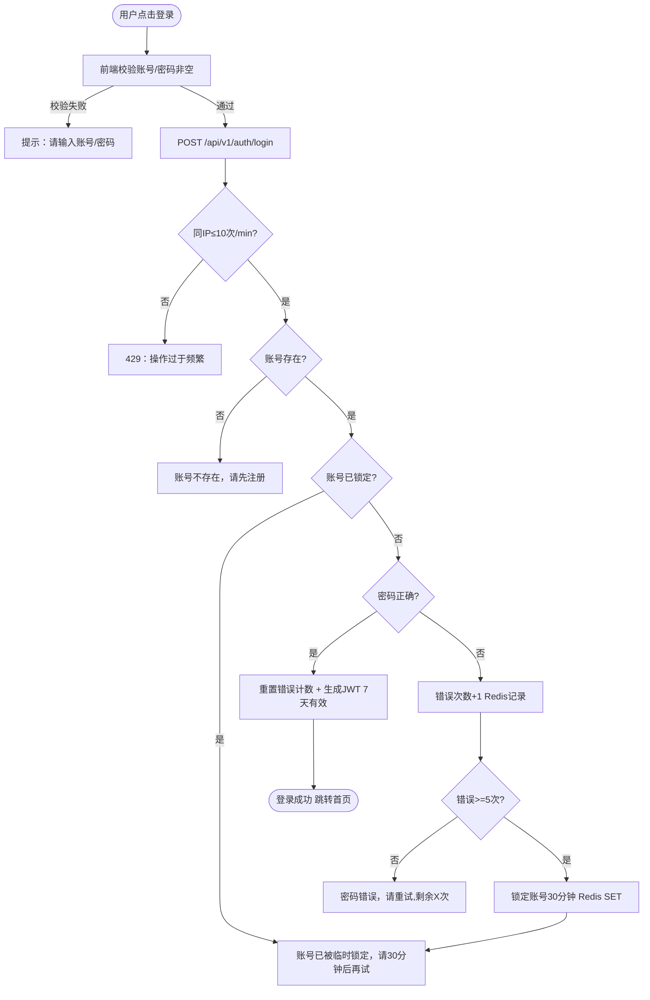

**图2-4 用户登录活动图**

**个人资料管理流程：**

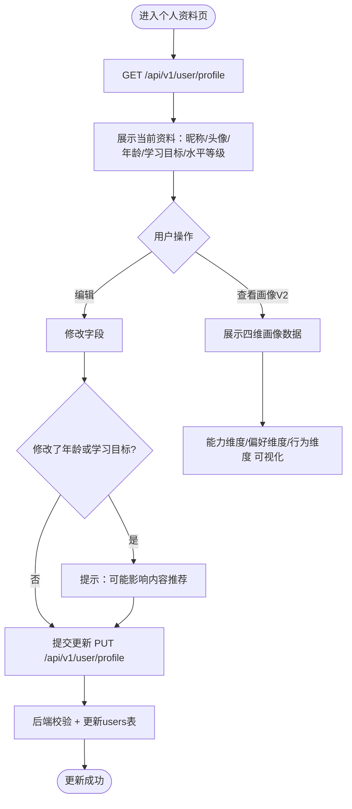

**图2-5 个人资料管理活动图**

---

**2. 模块二：智能测评 — 测评流程**

**V1.0固定测评流程（活动图）：**

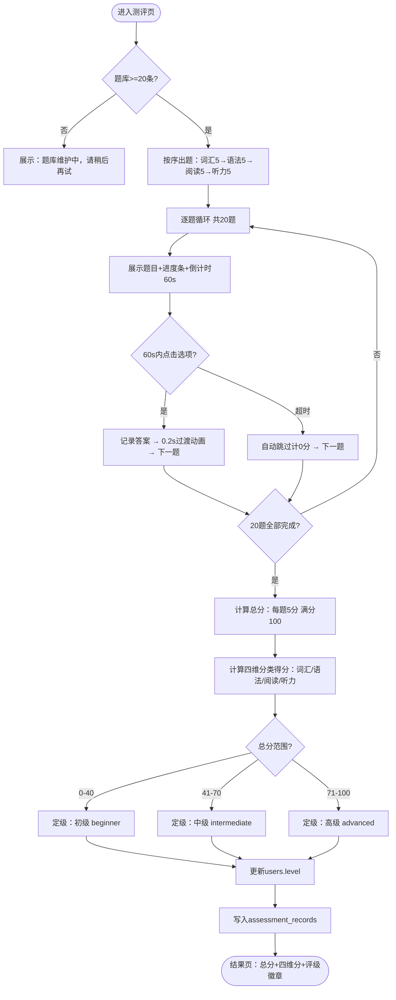

**图2-6 V1.0水平测评活动图**

**V2.0自适应测评流程（活动图）：**

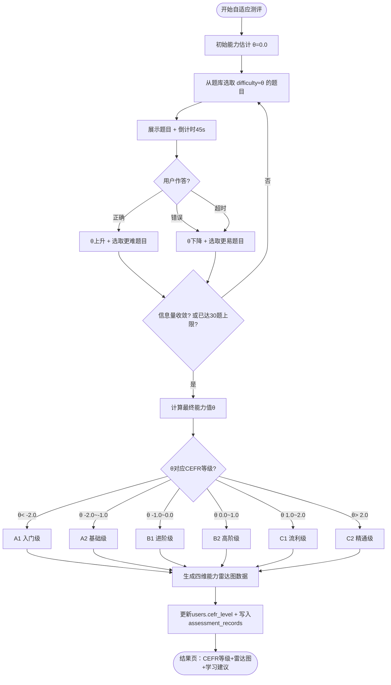

**图2-7 V2.0自适应测评活动图**

---

**3. 模块三：口语训练 — 核心业务流程**

**AI发音跟读评测流程（活动图）：**

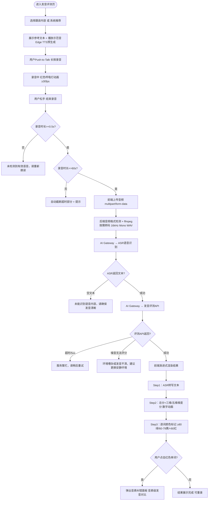

**图2-8 发音评测活动图**

**智能情景对话流程（活动图）：**

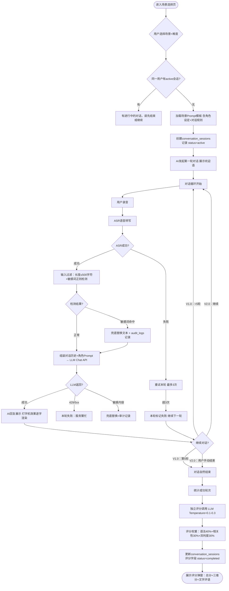

**图2-9 智能情景对话活动图**

**AI语法纠错与润色流程（V2.0，活动图）：**

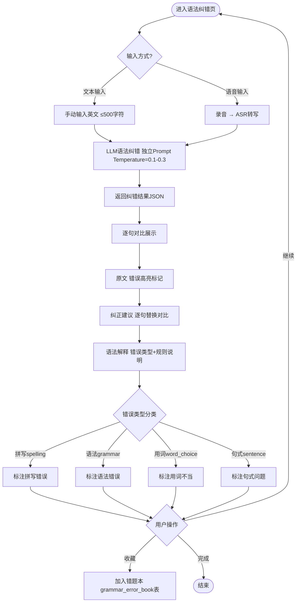

**图2-10 AI语法纠错活动图（V2.0）**

**情景角色扮演流程（V2.0，活动图）：**

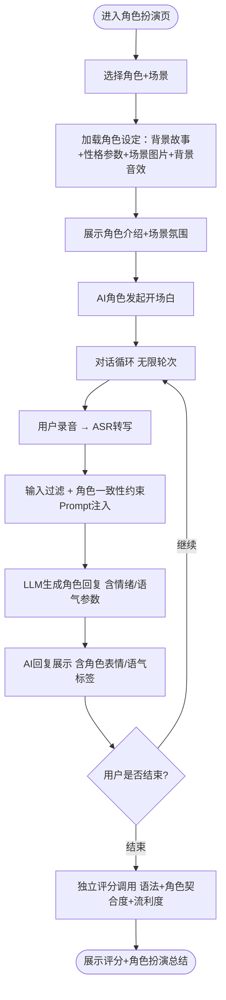

**图2-11 情景角色扮演活动图（V2.0）**

---

**4. 模块四：学习数据与推荐 — 业务流程**

**学习进度可视化流程（活动图）：**

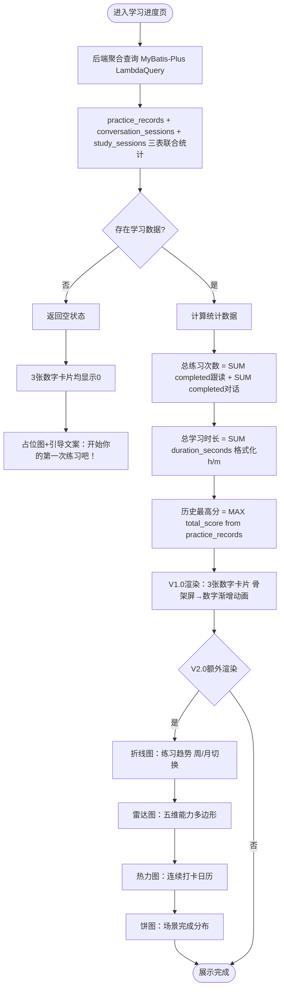

**图2-12 学习进度可视化活动图**

**学习路径规划流程（V2.0，活动图）：**

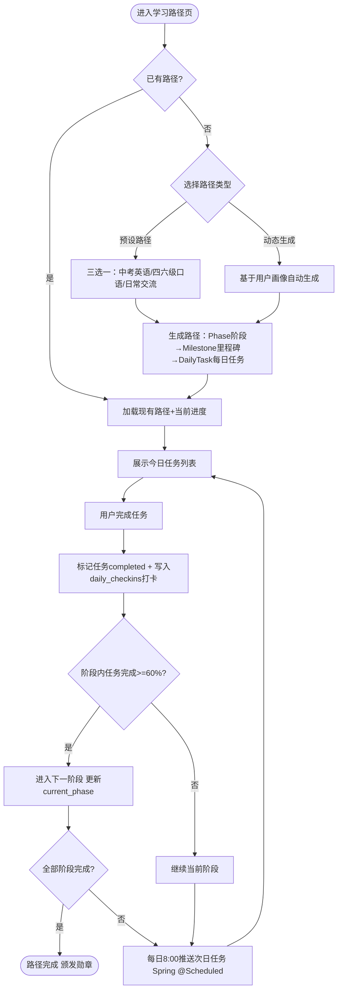

**图2-13 学习路径规划活动图（V2.0）**

---

**5. 模块五：游戏化与社区 — 业务流程（V2.0）**

**游戏化闯关流程（活动图）：**

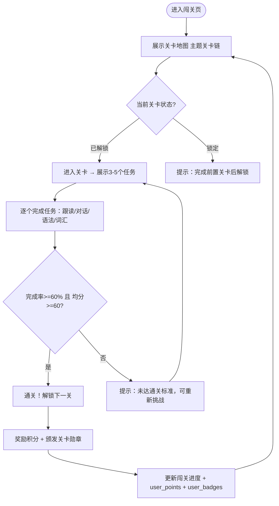

**图2-14 游戏化闯关活动图（V2.0）**

**单词PK对战流程（V2.0，活动图）：**

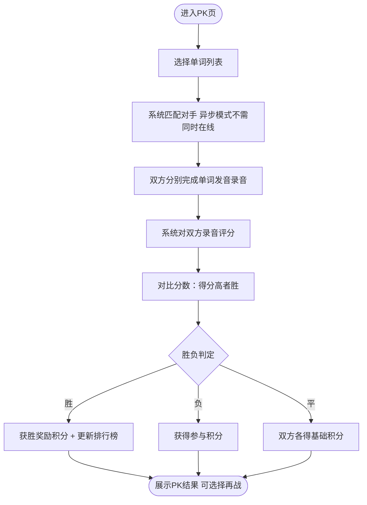

**图2-15 单词PK对战活动图（V2.0）**

**组内语音挑战流程（V2.0，活动图）：**

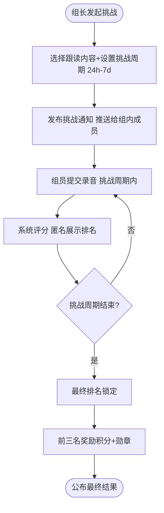

**图2-16 组内语音挑战活动图（V2.0）**

---

**6. 模块六：管理后台 — 业务流程（V3.0）**

**教师端 — 班级管理与作业流程（活动图）：**

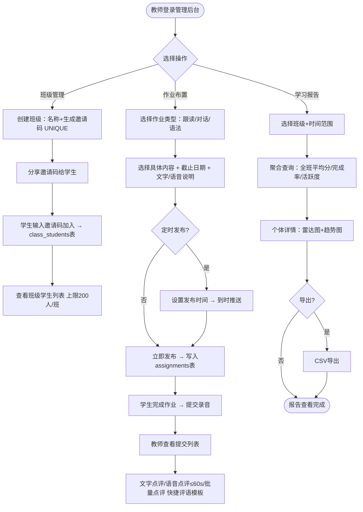

**图2-17 教师端管理后台活动图（V3.0）**

**运营端 — 内容审核流程（V3.0，活动图）：**

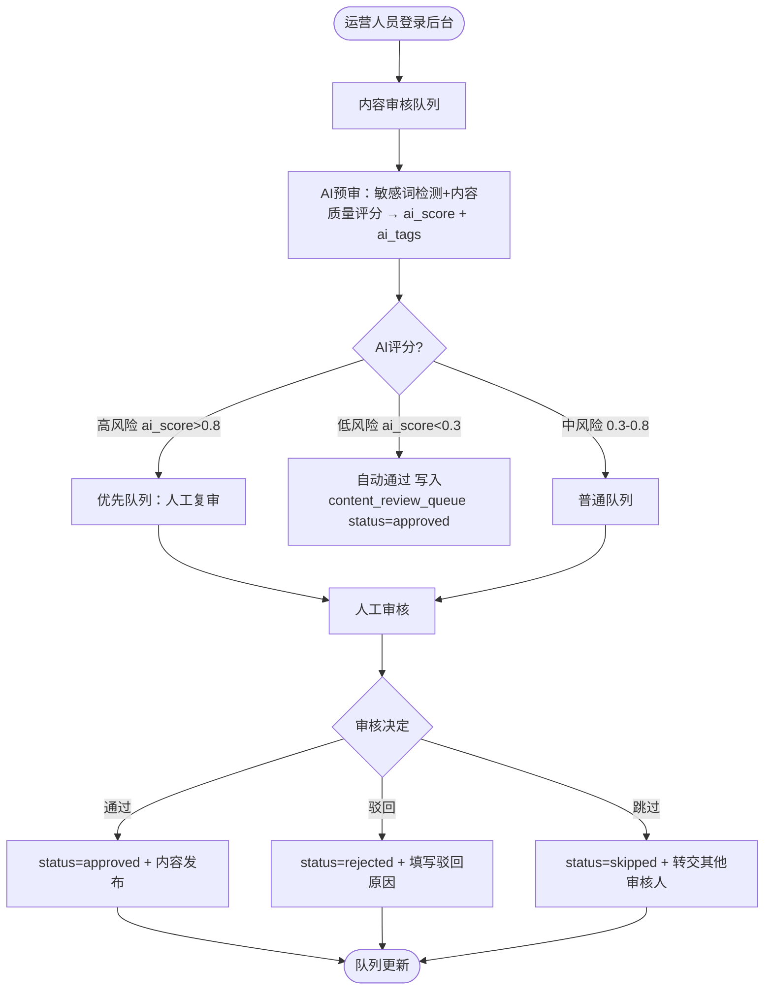

**图2-18 内容审核活动图（V3.0）**

---

**7. 模块七：智能客服 — 业务流程（V3.0）**

**LLM智能客服流程（活动图）：**

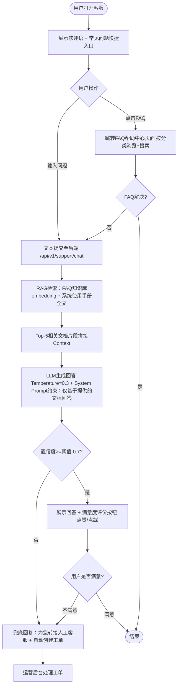

**图2-19 LLM智能客服活动图（V3.0）**

---

**端到端全景流程：**

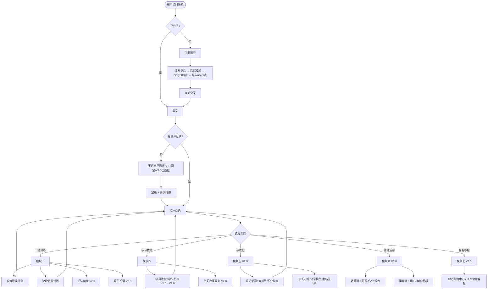

**图2-20 端到端全景业务流程图**

### 2.2.2 Decomposition Description 分解描述

本节对各模块进行功能分解，包含功能列表、类图设计，以及每个子功能的文件清单和时序图。

---

#### 2.2.2.1 模块一：用户中心

**1、简介**

负责用户的注册、登录、个人资料管理（V1.0）、多维用户画像采集与分析（V2.0）、账号安全中心（V3.0）。使用 Spring Security + BCrypt（strength=12）密码编码，JWT Token 7 天有效，支持基于 IP 的全局限流（Redis 计数）。

**2、功能列表**

| 序号 | 功能名称     | 功能描述                                                                                         | 版本 |
| ---- | ------------ | ------------------------------------------------------------------------------------------------ | ---- |
| 1    | 用户注册     | 邮箱/手机号注册，采集年龄和学习目标。BCrypt 加密存储，同 IP 限流 3/min                           | V1.0 |
| 2    | 用户登录     | 账号+密码登录，连续 5 次错误锁定 30 分钟，同 IP 限流 10/min，JWT 7 天                            | V1.0 |
| 3    | 个人资料管理 | 查看/编辑昵称、年龄、学习目标、水平等级。修改年龄/目标时提示可能影响推荐                         | V1.0 |
| 4    | 多维用户画像 | 自动采集学习行为，构建四维画像（基础/能力/偏好/行为），驱动推荐引擎                              | V2.0 |
| 5    | 账号安全中心 | 修改密码（需验证原密码）、绑定/解绑手机邮箱、设备管理、账号注销（7 天冷静期），操作写 audit_logs | V3.0 |

**3、类与类之间关系**

```mermaid
classDiagram
    class UserController {
        +register(RegisterDTO) ResponseVO
        +login(LoginDTO) ResponseVO
        +getProfile() ResponseVO
        +updateProfile(ProfileDTO) ResponseVO
        +getPortrait() ResponseVO
        +changePassword(PasswordDTO) ResponseVO
        +logout() ResponseVO
    }

    class UserService {
        <<interface>>
        +register(dto) LoginResult
        +login(dto) LoginResult
        +getProfile(userId) UserProfileVO
        +updateProfile(userId, dto) void
        +getPortrait(userId) PortraitVO
    }

    class UserServiceImpl {
        -UserMapper userMapper
        -UserProfileMapper profileMapper
        -PasswordEncoder passwordEncoder
        -JwtUtil jwtUtil
        -RedisTemplate redis
    }

    class UserMapper {
        <<interface>>
        +selectByEmail(email) User
        +selectByPhone(phone) User
    }

    class UserProfileMapper {
        <<interface>>
        +selectByUserId(userId) UserProfile
        +upsert(profile) int
    }

    class User {
        -Long id
        -String email
        -String phone
        -String passwordHash
        -String nickname
        -Integer age
        -GoalEnum goal
        -LevelEnum level
        -String cefrLevel
        -StatusEnum status
        -JSON featureFlags
    }

    class UserProfile {
        -Long id
        -Long userId
        -JSON pronunciationTrend
        -JSON preferredScenes
        -Integer streakDays
        -Integer totalPracticeCount
        -Date updatedAt
    }

    UserController --> UserService
    UserServiceImpl ..|> UserService
    UserServiceImpl --> UserMapper
    UserServiceImpl --> UserProfileMapper
    UserServiceImpl --> PasswordEncoder
    UserServiceImpl --> JwtUtil
    UserServiceImpl --> RedisTemplate
    UserMapper --> User
    UserProfileMapper --> UserProfile
```

**图2-21 用户中心模块类图**

##### 2.2.2.1.1 子功能：用户注册

**1 文件列表**

| 名称                 | 类型 | 存放位置              | 说明                  |
| -------------------- | ---- | --------------------- | --------------------- |
| RegisterPage.tsx     | TSX  | src/pages/auth/       | 注册表单页面          |
| auth.ts              | TS   | src/api/              | 注册/登录 API 封装    |
| authStore.ts         | TS   | src/stores/           | 认证状态管理          |
| UserController.java  | Java | es-user/controller/   | /api/v1/auth/register |
| UserServiceImpl.java | Java | es-user/service/impl/ | 注册业务逻辑          |
| UserMapper.java      | Java | es-user/mapper/       | users 表 CRUD         |
| User.java            | Java | es-user/entity/       | 用户实体类            |
| RegisterDTO.java     | Java | es-common/dto/        | 注册请求体            |

**2 时序图**

```mermaid
sequenceDiagram
    actor U as 用户
    participant FE as 前端
    participant C as UserController
    participant S as UserService
    participant M as UserMapper
    participant DB as MySQL
    participant R as Redis

    U->>FE: 填写表单并提交
    FE->>FE: 校验格式通过
    FE->>C: POST /api/v1/auth/register
    C->>R: 检查 IP 注册频率
    R-->>C: count
    alt 超限
        C-->>FE: 429 操作过于频繁
    end
    C->>S: register(dto)
    S->>M: 检查邮箱/手机唯一性
    M->>DB: SELECT WHERE email=? OR phone=?
    DB-->>M: result
    alt 已存在
        S-->>C: DuplicateException
        C-->>FE: 409 已注册
    end
    S->>S: BCrypt.encode(password) strength=12
    S->>M: insert(user)
    M->>DB: INSERT INTO users
    S->>S: jwtUtil.generateToken(userId)
    S->>R: INCR register:rate:ip + EXPIRE 60s
    S-->>C: LoginResult
    C-->>FE: 200 token + user
    FE->>FE: 存 Token + 跳转首页
```

**图2-22 用户注册时序图**

##### 2.2.2.1.2 子功能：用户登录

**1 文件列表**

| 名称                 | 类型 | 存放位置              | 说明               |
| -------------------- | ---- | --------------------- | ------------------ |
| LoginPage.tsx        | TSX  | src/pages/auth/       | 登录表单页面       |
| auth.ts              | TS   | src/api/              | 注册/登录 API      |
| UserController.java  | Java | es-user/controller/   | /api/v1/auth/login |
| UserServiceImpl.java | Java | es-user/service/impl/ | 登录业务逻辑       |
| JwtUtil.java         | Java | es-security/util/     | JWT 生成/校验      |

**2 时序图**

```mermaid
sequenceDiagram
    actor U as 用户
    participant FE as 前端
    participant C as UserController
    participant S as UserService
    participant M as UserMapper
    participant DB as MySQL
    participant R as Redis
    participant J as JwtUtil

    U->>FE: 输入账号密码
    FE->>C: POST /api/v1/auth/login
    C->>R: 检查 IP 登录频率
    R-->>C: count
    alt 超限
        C-->>FE: 429 操作过于频繁
    end
    C->>S: login(dto)
    S->>M: 查询账号
    M->>DB: SELECT WHERE email=? OR phone=?
    alt 不存在
        C-->>FE: 404 账号不存在
    end
    S->>R: 检查锁定状态
    alt 已锁定
        C-->>FE: 403 已锁定 30 分钟
    end
    S->>S: passwordEncoder.matches()
    alt 不匹配
        S->>R: INCR error:userId + 判断≥5 则锁定
        C-->>FE: 401 密码错误 剩余 X 次
    end
    S->>R: DEL error:userId
    S->>J: generateToken(userId, 7d)
    J-->>S: token
    S->>M: 更新 last_login_at/ip
    S-->>C: LoginResult
    C-->>FE: 200 token + user
    FE->>FE: 存 Token + 跳转首页
```

**图2-23 用户登录时序图**

##### 2.2.2.1.3 子功能：个人资料管理

**1 文件列表**

| 名称                 | 类型 | 存放位置              | 说明                 |
| -------------------- | ---- | --------------------- | -------------------- |
| ProfilePage.tsx      | TSX  | src/pages/profile/    | 个人资料页面         |
| UserController.java  | Java | es-user/controller/   | /api/v1/user/profile |
| UserServiceImpl.java | Java | es-user/service/impl/ | 资料查询/更新逻辑    |

**2 时序图**

```mermaid
sequenceDiagram
    actor U as 用户
    participant FE as 前端
    participant C as UserController
    participant S as UserService
    participant M as UserMapper
    participant DB as MySQL

    U->>FE: 进入"我的"页面
    FE->>C: GET /api/v1/user/profile
    C->>S: getProfile(userId)
    S->>M: selectById(userId)
    M->>DB: SELECT FROM users
    DB-->>S: user
    S-->>C: user
    C-->>FE: 200 展示资料
    U->>FE: 编辑并保存
    FE->>C: PUT /api/v1/user/profile
    C->>S: updateProfile(userId, dto)
    S->>S: 校验修改项
    alt 年龄或目标变更
        S->>FE: 提示可能影响推荐
    end
    S->>M: updateById(user)
    M->>DB: UPDATE users
    S-->>C: ok
    C-->>FE: 200 更新成功
```

**图2-24 个人资料管理时序图**

##### 2.2.2.1.4 子功能：多维用户画像（V2.0）

**1 文件列表**

| 名称                   | 类型 | 存放位置           | 说明                      |
| ---------------------- | ---- | ------------------ | ------------------------- |
| PortraitPage.tsx       | TSX  | src/pages/profile/ | 画像展示页面              |
| PortraitEvent.java     | Java | es-user/event/     | Spring Event 画像更新事件 |
| PortraitListener.java  | Java | es-user/listener/  | 异步画像更新监听器        |
| UserProfileMapper.java | Java | es-user/mapper/    | user_profile 表 CRUD      |

**2 时序图**

```mermaid
sequenceDiagram
    participant SVC as 业务 Service
    participant EVT as Spring Event
    participant L as PortraitListener
    participant M as UserProfileMapper
    participant DB as MySQL

    SVC->>EVT: publishEvent(PortraitEvent)
    EVT->>L: onPortraitUpdate @Async
    L->>L: 聚合用户行为数据
    L->>L: 计算四维指标：发音趋势/流利度/偏好/连续天数
    L->>M: upsert(user_profile)
    M->>DB: INSERT ... ON DUPLICATE KEY UPDATE
    L->>L: 写入 audit_logs
```

**图2-25 多维用户画像更新时序图（V2.0）**

---

#### 2.2.2.2 模块二：智能测评

**1、简介**

负责用户英语水平定级测评。V1.0 为 20 道固定选择题（词汇/语法/阅读/听力各 5 题），每题 60 秒限时，按总分定级为初/中/高三档。V2.0 升级为 IRT 自适应测评，动态 15-30 题，输出 CEFR 六级（A1-C2）+ 四维能力雷达图。**安全要求：API 返回题目时必须做字段白名单过滤，禁止返回 correct_answer。**

**2、功能列表**

| 序号 | 功能名称     | 功能描述                                                                                              | 版本 |
| ---- | ------------ | ----------------------------------------------------------------------------------------------------- | ---- |
| 1    | 英语水平测评 | 20 题固定出题（词汇 5/语法 5/阅读 5/听力 5），60s/题限时，最后 10s 变红，总分定级三档。中途刷新不保存 | V1.0 |
| 2    | 自适应测评   | IRT 算法动态出题，做对升难度/做错降难度，信息量收敛后结束（15-30 题），CEFR 六级映射                  | V2.0 |

**3、类与类之间关系**

```mermaid
classDiagram
    class AssessmentController {
        +getQuestions(type) ResponseVO
        +submitAnswers(dto) ResponseVO
        +getResult(recordId) ResponseVO
    }

    class AssessmentService {
        <<interface>>
        +getQuestions(userId, type) List~QuestionVO~
        +submitAnswers(userId, dto) AssessmentResult
        +getResult(recordId) AssessmentResult
    }

    class AssessmentServiceImpl {
        -QuestionMapper questionMapper
        -AssessmentMapper assessmentMapper
        -UserMapper userMapper
        +getQuestions() List~QuestionVO~
        +submitAnswers() AssessmentResult
        +calculateScore() ScoreResult
        +determineLevel() LevelEnum
        +irtSelectNext(ability) Question
        +mapToCEFR(theta) CefrLevel
    }

    class QuestionMapper {
        <<interface>>
        +selectByType(type, limit) List~Question~
        +selectByDifficulty(diff) List~Question~
        +selectByCefrLevel(cefr) List~Question~
    }

    class AssessmentMapper {
        <<interface>>
        +selectByUserId(userId) List~AssessmentRecord~
    }

    class AssessmentRecord {
        -Long id
        -Long userId
        -AssessmentType type
        -Integer totalScore
        -LevelEnum resultLevel
        -String cefrLevel
        -JSON answersJson
        -BigDecimal abilityTheta
    }

    class AssessmentQuestion {
        -Integer id
        -QuestionType type
        -String questionText
        -JSON optionsJson
        -String correctAnswer "API 禁止返回"
        -BigDecimal difficulty IRT
        -BigDecimal discrimination IRT
        -BigDecimal guessing IRT
        -String cefrLevel
    }

    AssessmentController --> AssessmentService
    AssessmentServiceImpl ..|> AssessmentService
    AssessmentServiceImpl --> QuestionMapper
    AssessmentServiceImpl --> AssessmentMapper
    AssessmentServiceImpl --> UserMapper
    QuestionMapper --> AssessmentQuestion
    AssessmentMapper --> AssessmentRecord
```

**图2-26 智能测评模块类图**

##### 2.2.2.2.1 子功能：英语水平测评（V1.0）

**1 文件列表**

| 名称                       | 类型 | 存放位置                    | 说明                       |
| -------------------------- | ---- | --------------------------- | -------------------------- |
| AssessmentPage.tsx         | TSX  | src/pages/assessment/       | 测评页（题目+进度+倒计时） |
| AssessmentResultPage.tsx   | TSX  | src/pages/assessment/       | 测评结果页                 |
| assessment.ts              | TS   | src/api/                    | 测评 API                   |
| AssessmentController.java  | Java | es-assessment/controller/   | /api/v1/assessment/*       |
| AssessmentServiceImpl.java | Java | es-assessment/service/impl/ | 测评逻辑                   |
| QuestionMapper.java        | Java | es-assessment/mapper/       | 题库访问                   |

**2 时序图**

```mermaid
sequenceDiagram
    actor U as 用户
    participant FE as 前端
    participant C as AssessmentController
    participant S as AssessmentService
    participant QM as QuestionMapper
    participant AM as AssessmentMapper
    participant DB as MySQL

    U->>FE: 点击"开始测评"
    FE->>C: GET /api/v1/assessment/questions?type=fixed
    C->>S: getQuestions(userId, fixed)
    S->>QM: 按类型查各 5 题
    QM->>DB: SELECT * WHERE type=? ORDER BY sort_order LIMIT 5
    S->>S: 字段白名单过滤 correct_answer
    S-->>C: List~QuestionVO~
    C-->>FE: 200 题目列表

    loop 20 题
        FE->>FE: 展示题目 + 60s 倒计时
        U->>FE: 点击选项 / 超时自动跳过
        FE->>FE: 记录答案
    end

    FE->>C: POST /api/v1/assessment/submit
    C->>S: submitAnswers(userId, dto)
    S->>S: 逐题对答案算分
    S->>S: 定级：0-40=初级, 41-70=中级, 71-100=高级
    S->>AM: insert(record)
    AM->>DB: INSERT INTO assessment_records
    S->>S: 更新 users.level
    S-->>C: result
    C-->>FE: 200 总分+四维分+评级
    FE->>FE: 结果页展示
```

**图2-27 水平测评时序图（V1.0）**

##### 2.2.2.2.2 子功能：自适应测评（V2.0）

**1 文件列表**

| 名称                       | 类型 | 存放位置                    | 说明                          |
| -------------------------- | ---- | --------------------------- | ----------------------------- |
| AdaptiveAssessmentPage.tsx | TSX  | src/pages/assessment/       | 自适应测评页（支持中途保存）  |
| AssessmentController.java  | Java | es-assessment/controller/   | /api/v1/assessment/adaptive/* |
| AssessmentServiceImpl.java | Java | es-assessment/service/impl/ | IRT 自适应算法                |

**2 时序图**

```mermaid
sequenceDiagram
    actor U as 用户
    participant FE as 前端
    participant C as AssessmentController
    participant S as AssessmentService
    participant QM as QuestionMapper
    participant DB as MySQL

    U->>FE: 开始自适应测评
    FE->>C: GET /api/v1/assessment/adaptive/start
    C->>S: initAssessment(userId)
    S->>S: 初始 θ=0.0
    S->>QM: 按 difficulty≈0 取首题
    QM->>DB: SELECT ORDER BY ABS(difficulty-0) LIMIT 1
    S-->>C: {sessionId, question}
    C-->>FE: 首题

    loop 15-30 题 信息量收敛
        U->>FE: 作答
        FE->>C: POST /api/v1/assessment/adaptive/answer {sessionId, answer}
        C->>S: processAnswer(sessionId, answer)
        alt 正确
            S->>S: θ 上升
        else 错误/超时
            S->>S: θ 下降
        end
        S->>S: 检查信息量收敛
        S->>QM: 按新 θ 取下一题
        QM->>DB: SELECT
        S-->>C: {nextQuestion} or {finished}
        C-->>FE: 下一题 / 测评结束
    end

    S->>S: 计算最终 θ → CEFR 等级映射
    S->>S: 生成雷达图数据
    S->>QM: 写入 assessment_records
    S-->>C: result
    C-->>FE: 200 CEFR 等级 + 雷达图 + 学习建议
    FE->>FE: 结果展示
```

**图2-28 自适应测评时序图（V2.0）**

---

#### 2.2.2.3 模块三：口语训练（核心模块）

**1、简介**

系统核心差异化模块。V1.0 提供 AI 发音跟读评测（三维评分+逐词颜色标记+音素纠错）和智能情景对话（3 场景×固定 5 轮+独立评分调用）。V2.0 升级为五维评测（+重音准确度/语调自然度）、60+ 场景自由轮次对话、AI 语法纠错与润色（独立入口）、情景角色扮演（独立入口）。安全要求：LLM 输入≤500 字符过滤+敏感词检测；评分与对话 Prompt 分离独立调用（评分 Temperature=0.1-0.3）。

**2、功能列表**

| 序号 | 功能名称          | 功能描述                                                                                           | 版本       |
| ---- | ----------------- | -------------------------------------------------------------------------------------------------- | ---------- |
| 1    | AI 发音跟读评测   | 跟读→录音→ASR→评测 API→总分+三维/五维分+逐词颜色标记（≥80 绿/60-79 黄/<60 红）+音素纠错面板   | V1.0→V2.0 |
| 2    | 智能情景对话      | 选场景+难度→多轮语音对话→LLM 角色回复→对话结束后独立评分（语法 40%+相关性 30%+流利度 30%）      | V1.0→V2.0 |
| 3    | AI 语法纠错与润色 | 文本/语音输入英文→LLM 语法错误检测→4 类错误分类（拼写/语法/用词/句式）→逐句对比展示→错题本收藏 | V2.0       |
| 4    | 情景角色扮演      | 独立入口，增强沉浸感：角色背景故事+性格参数（友好度/正式度/语速）+场景图片/音效+角色一致性 Prompt  | V2.0       |

**3、类与类之间关系**

```mermaid
classDiagram
    class PracticeController {
        +evaluatePronunciation(audio, contentId) ResponseVO
        +getContentList(level) ResponseVO
    }

    class ConversationController {
        +startSession(scene, difficulty) ResponseVO
        +sendMessage(sessionId, audio) ResponseVO
        +endSession(sessionId) ResponseVO
    }

    class GrammarController {
        +checkGrammar(text) ResponseVO
        +saveToBook(dto) ResponseVO
    }

    class PracticeService {
        <<interface>>
        +evaluate(userId, audio, contentId) EvalResult
    }

    class ConversationService {
        <<interface>>
        +start(userId, scene, difficulty) Session
        +processMessage(sessionId, audio) MessageResult
        +endAndScore(sessionId) ScoreResult
    }

    class GrammarService {
        <<interface>>
        +check(text) GrammarResult
        +saveToBook(userId, error) void
    }

    class AIGatewayAdapter {
        <<interface>>
        +asrRecognize(audio) ASRResult
        +pronunciationEvaluate(audio, refText) EvalResult
        +llmChat(messages, prompt) ChatResult
        +llmScore(dialogue) ScoreResult
        +llmGrammarCheck(text) GrammarResult
    }

    class AudioConverter {
        +detectFormat(audio) AudioFormat
        +convertToWav(audio, format) byte[]
    }

    class PromptTemplateManager {
        +loadScenePrompt(scene) Prompt
        +loadRolePlayPrompt(role) Prompt
    }

    PracticeController --> PracticeService
    ConversationController --> ConversationService
    GrammarController --> GrammarService
    PracticeService --> AIGatewayAdapter
    ConversationService --> AIGatewayAdapter
    ConversationService --> PromptTemplateManager
    GrammarService --> AIGatewayAdapter
    PracticeService --> AudioConverter
    ConversationService --> AudioConverter
```

**图2-29 口语训练模块类图**

##### 2.2.2.3.1 子功能：AI 发音跟读评测

**1 文件列表**

| 名称                     | 类型 | 存放位置                  | 说明                            |
| ------------------------ | ---- | ------------------------- | ------------------------------- |
| PracticePage.tsx         | TSX  | src/pages/practice/       | 跟读评测页（文本+录音+动画）    |
| PracticeResultPage.tsx   | TSX  | src/pages/practice/       | 评测结果页（逐词颜色+纠错面板） |
| Recorder.tsx             | TSX  | src/components/recorder/  | Push-to-Talk 录音组件           |
| practice.ts              | TS   | src/api/                  | 评测 API                        |
| PracticeController.java  | Java | es-practice/controller/   | /api/v1/eval/pronounce          |
| PracticeServiceImpl.java | Java | es-practice/service/impl/ | 评测逻辑                        |
| AudioConverter.java      | Java | es-ai-gateway/util/       | ffmpeg 转码                     |

**2 时序图**

```mermaid
sequenceDiagram
    actor U as 用户
    participant FE as 前端
    participant C as PracticeController
    participant S as PracticeService
    participant AC as AudioConverter
    participant GW as AIGateway
    participant ASR as 第三方ASR
    participant EVAL as 评测API

    U->>FE: 长按录音 + 松手
    FE->>FE: 校验时长 0.5s-60s
    FE->>C: POST /api/v1/eval/pronounce multipart
    C->>S: evaluate(userId, audio, contentId)
    S->>AC: detectFormat + 按需转码 16kHz Mono WAV
    AC-->>S: wav bytes
    S->>GW: asrRecognize(audio)
    GW->>ASR: HTTP POST
    alt 空文本
        C-->>FE: 422 未能识别语音
    end
    ASR-->>GW: text
    GW-->>S: ASRResult
    S->>GW: pronunciationEvaluate(audio, refText)
    GW->>EVAL: HTTP POST
    alt 超时/失败
        C-->>FE: 503 服务繁忙
    end
    EVAL-->>GW: EvalResult JSON
    GW-->>S: 总分+五维+逐词+音素
    S->>S: 写入 practice_records
    S-->>C: EvalResultVO
    C-->>FE: 200 渐进式渲染结果
    FE->>FE: Step1 转写文本 → Step2 分数 → Step3 逐词颜色
```

**图2-30 发音评测时序图**

##### 2.2.2.3.2 子功能：智能情景对话

**1 文件列表**

| 名称                         | 类型 | 存放位置                  | 说明                       |
| ---------------------------- | ---- | ------------------------- | -------------------------- |
| ConversationSelectPage.tsx   | TSX  | src/pages/conversation/   | 场景选择页                 |
| ConversationPage.tsx         | TSX  | src/pages/conversation/   | 对话页（气泡+录音+打字机） |
| ScoreModal.tsx               | TSX  | src/components/           | 评分弹窗                   |
| conversation.ts              | TS   | src/api/                  | 对话 API                   |
| ConversationController.java  | Java | es-practice/controller/   | /api/v1/chat/*             |
| ConversationServiceImpl.java | Java | es-practice/service/impl/ | 对话逻辑                   |
| PromptTemplateManager.java   | Java | es-ai-gateway/util/       | 场景 Prompt 模板管理       |

**2 时序图**

```mermaid
sequenceDiagram
    actor U as 用户
    participant FE as 前端
    participant C as ConversationController
    participant S as ConversationService
    participant PM as PromptTemplateManager
    participant GW as AIGateway
    participant LLM as 第三方LLM

    U->>FE: 选择场景+难度
    FE->>C: POST /api/v1/chat/session/start
    C->>S: start(userId, scene, difficulty)
    S->>S: 检查无 active 会话
    S->>PM: loadScenePrompt(scene)
    PM-->>S: SystemPrompt + 角色设定
    S->>GW: llmChat([system], "开始对话")
    GW->>LLM: POST Chat API
    LLM-->>GW: AI 第一轮文本
    GW-->>S: ChatResult
    S->>S: 写入 conversation_sessions + messages
    S-->>C: {sessionId, firstMessage}
    C-->>FE: 200

    loop 每轮
        U->>FE: 录音
        FE->>C: POST /api/v1/chat/message multipart
        C->>S: processMessage(sessionId, audio)
        S->>GW: asrRecognize
        GW-->>S: 用户文本
        S->>S: 输入过滤 ≤500 字符+敏感词
        S->>GW: llmChat(history, rolePrompt)
        GW->>LLM: POST
        LLM-->>GW: AI 回复
        GW-->>S: ChatResult
        S->>S: 写入 messages
        S-->>C: {round, aiText}
        C-->>FE: 200 打字机展示
    end

    U->>FE: 结束对话
    FE->>C: POST /api/v1/chat/score/{sessionId}
    C->>S: endAndScore(sessionId)
    S->>GW: llmScore(fullHistory) T=0.1-0.3
    GW->>LLM: POST 独立评分 Prompt
    LLM-->>GW: 语法/相关性/流利度 JSON
    GW-->>S: ScoreResult
    S->>S: 更新 session 评分
    S-->>C: ScoreResult
    C-->>FE: 200 评分弹窗
```

**图2-31 智能情景对话时序图**

##### 2.2.2.3.3 子功能：AI 语法纠错与润色（V2.0）

**1 文件列表**

| 名称                        | 类型 | 存放位置                  | 说明                        |
| --------------------------- | ---- | ------------------------- | --------------------------- |
| GrammarPage.tsx             | TSX  | src/pages/grammar/        | 语法纠错页（输入+对比展示） |
| grammar.ts                  | TS   | src/api/                  | 语法纠错 API                |
| GrammarController.java      | Java | es-practice/controller/   | /api/v1/grammar/check       |
| GrammarServiceImpl.java     | Java | es-practice/service/impl/ | 纠错逻辑                    |
| GrammarErrorBookMapper.java | Java | es-practice/mapper/       | 错题本 CRUD                 |

**2 时序图**

```mermaid
sequenceDiagram
    actor U as 用户
    participant FE as 前端
    participant C as GrammarController
    participant S as GrammarService
    participant GW as AIGateway
    participant LLM as 第三方LLM
    participant DB as MySQL

    U->>FE: 输入英文文本 / 语音录入
    FE->>C: POST /api/v1/grammar/check {text, inputType}
    C->>S: check(text)
    S->>S: 长度校验 ≤500 字符
    S->>GW: llmGrammarCheck(text) T=0.1-0.3
    GW->>LLM: POST 语法纠错 Prompt
    LLM-->>GW: 纠错结果 JSON
    GW-->>S: GrammarResult
    S-->>C: {corrections: [...]}
    C-->>FE: 200 逐句对比展示
    FE->>FE: 原文高亮 + 纠正建议 + 错误类型
    U->>FE: 点击收藏
    FE->>C: POST /api/v1/grammar/bookmark
    C->>S: saveToBook(userId, errorItem)
    S->>DB: INSERT INTO grammar_error_book
    S-->>C: ok
```

**图2-32 语法纠错时序图（V2.0）**

##### 2.2.2.3.4 子功能：情景角色扮演（V2.0）

**1 文件列表**

| 名称                     | 类型 | 存放位置                  | 说明               |
| ------------------------ | ---- | ------------------------- | ------------------ |
| RolePlaySelectPage.tsx   | TSX  | src/pages/conversation/   | 角色选择页         |
| RolePlayPage.tsx         | TSX  | src/pages/conversation/   | 角色扮演对话页     |
| RolePlayController.java  | Java | es-practice/controller/   | /api/v1/roleplay/* |
| RolePlayServiceImpl.java | Java | es-practice/service/impl/ | 角色扮演逻辑       |

**2 时序图**

```mermaid
sequenceDiagram
    actor U as 用户
    participant FE as 前端
    participant C as RolePlayController
    participant S as RolePlayService
    participant PM as PromptTemplateManager
    participant GW as AIGateway
    participant LLM as 第三方LLM

    U->>FE: 选择角色+场景
    FE->>C: POST /api/v1/roleplay/start
    C->>S: start(userId, roleId, sceneId)
    S->>PM: loadRolePlayPrompt(roleId)
    PM-->>S: 角色背景+性格参数+一致性Prompt
    S->>GW: llmChat([systemPrompt], "角色开场白")
    GW->>LLM: POST
    LLM-->>GW: 角色自我介绍
    GW-->>S: ChatResult
    S-->>C: {sessionId, greeting, characterInfo}
    C-->>FE: 200 角色介绍+场景氛围

    loop 无限轮次
        U->>FE: 录音
        FE->>C: POST /api/v1/roleplay/message
        C->>S: processMessage(sessionId, audio)
        S->>GW: asrRecognize → llmChat(含角色一致性约束)
        GW->>LLM: POST 含情绪/语气参数
        LLM-->>GW: 角色回复
        GW-->>S: ChatResult
        S-->>C: {aiText, emotion, toneLabel}
        C-->>FE: 200 含角色表情的回复
    end

    U->>FE: 结束
    FE->>C: POST /api/v1/roleplay/end/{sessionId}
    C->>S: endAndScore
    S->>GW: llmScore 含角色契合度维度
    GW-->>S: ScoreResult
    S-->>C: 评分+总结
    C-->>FE: 200 评分弹窗
```

**图2-33 情景角色扮演时序图（V2.0）**

---

本模块负责用户的注册、登录、个人资料管理（V1.0）、多维用户画像采集与分析（V2.0）、账号安全中心（V3.0）。使用 Spring Security + BCrypt 密码编码器（strength=12），JWT Token 7天有效。支持基于IP的全局限流。

**2、功能列表**

| 序号 | 功能名称     | 功能描述                                                                       | 版本 |
| ---- | ------------ | ------------------------------------------------------------------------------ | ---- |
| 1    | 用户注册     | 用户通过邮箱或手机号创建账号，采集年龄和学习目标。BCrypt strength=12加密存储   | V1.0 |
| 2    | 用户登录     | 账号+密码登录，JWT Token 7天有效。连续5次错误锁定30分钟                        | V1.0 |
| 3    | 个人资料管理 | 查看和编辑昵称、头像(V2.0)、年龄、学习目标、当前水平等级                       | V1.0 |
| 4    | 多维用户画像 | 自动采集学习行为数据，构建四维画像（基础/能力/偏好/行为），驱动推荐引擎        | V2.0 |
| 5    | 账号安全中心 | 修改密码(需验证原密码)、绑定/解绑手机和邮箱、登录设备管理、账号注销(7天冷静期) | V3.0 |

**3、功能设计描述**

**(1) 类**

**1）UserController（controller.user.UserController）**
用户模块的Controller类，负责处理用户相关的HTTP请求，包括注册、登录、资料查询/修改、画像查询等。使用Spring MVC @RestController，参数校验使用 @Valid + Spring Validation。

**2）UserService / UserServiceImpl（service.user.UserService）**
用户模块的业务逻辑接口及实现类，负责用户注册（BCrypt加密 + 写入users表）、登录校验（PasswordEncoder.matches + 错误计数 + 锁定）、资料更新、画像聚合查询等核心业务逻辑。

**3）UserMapper（mapper.user.UserMapper）**
用户模块的数据访问接口，继承 MyBatis-Plus BaseMapper `<User>`，负责users表的基础CRUD操作。支持 LambdaQueryWrapper 构建复杂查询。

**4）UserProfileMapper（mapper.user.UserProfileMapper）**
用户画像数据访问接口，继承 BaseMapper `<UserProfile>`，负责 user_profile 表的 CRUD。

**5）User（entity.user.User）**
用户实体类，映射数据库 users 表，包含 id/email/phone/password_hash/nickname/avatar_url/age/goal/level/cefr_level/status/feature_flags 等属性。

**6）UserProfile（entity.user.UserProfile）**
用户画像实体类（V2.0），映射 user_profile 表，包含发音趋势、流利度趋势、语法准确度、偏好场景、连续打卡天数等属性。

**(2) 类与类之间关系**

```mermaid
classDiagram
    class UserController {
        +register(RegisterDTO) Response
        +login(LoginDTO) Response
        +getProfile(userId) Response
        +updateProfile(ProfileDTO) Response
        +getUserPortrait(userId) Response
    }

    class UserService {
        <<interface>>
        +register(RegisterDTO) User
        +login(LoginDTO) LoginResult
        +getProfile(userId) UserProfileDTO
        +updateProfile(userId, ProfileDTO) void
        +getUserPortrait(userId) PortraitDTO
    }

    class UserServiceImpl {
        -UserMapper userMapper
        -UserProfileMapper profileMapper
        -PasswordEncoder passwordEncoder
        -JwtUtil jwtUtil
        -RedisTemplate redisTemplate
        +register(RegisterDTO) User
        +login(LoginDTO) LoginResult
        +getProfile(userId) UserProfileDTO
        +updateProfile(userId, ProfileDTO) void
        +getUserPortrait(userId) PortraitDTO
    }

    class UserMapper {
        <<interface>>
        +selectByEmail(email) User
        +selectByPhone(phone) User
    }

    class UserProfileMapper {
        <<interface>>
        +selectByUserId(userId) UserProfile
        +upsert(UserProfile) int
    }

    class User {
        -Long id
        -String email
        -String phone
        -String passwordHash
        -String nickname
        -String avatarUrl
        -Integer age
        -GoalEnum goal
        -LevelEnum level
        -String cefrLevel
        -StatusEnum status
        -JSON featureFlags
        -Date createdAt
        -Date updatedAt
    }

    class UserProfile {
        -Long id
        -Long userId
        -JSON pronunciationTrend
        -JSON fluencyTrend
        -BigDecimal grammarAccuracy
        -JSON preferredScenes
        -String preferredTime
        -Integer streakDays
        -Integer totalPracticeCount
    }

    UserController --> UserService : depends on
    UserServiceImpl ..|> UserService : implements
    UserServiceImpl --> UserMapper : uses
    UserServiceImpl --> UserProfileMapper : uses
    UserMapper --> User : maps to
    UserProfileMapper --> UserProfile : maps to
    UserServiceImpl --> PasswordEncoder : uses
    UserServiceImpl --> JwtUtil : uses
    UserServiceImpl --> RedisTemplate : uses
```

**图2-7 用户中心模块类图**

##### 2.2.2.1.1 子功能：用户注册

**1 文件列表**

| 名称                 | 类型 | 存放位置                                      | 说明                                |
| -------------------- | ---- | --------------------------------------------- | ----------------------------------- |
| RegisterPage.tsx     | TSX  | src/pages/auth/RegisterPage.tsx               | 注册页面组件，含表单校验            |
| auth.ts              | TS   | src/api/auth.ts                               | 注册API调用 register()              |
| authStore.ts         | TS   | src/stores/authStore.ts                       | 认证状态管理                        |
| UserController.java  | Java | es-user/.../controller/UserController.java    | 注册接口 POST /api/v1/auth/register |
| UserServiceImpl.java | Java | es-user/.../service/impl/UserServiceImpl.java | 注册业务逻辑                        |
| UserMapper.java      | Java | es-user/.../mapper/UserMapper.java            | users 表数据访问                    |
| User.java            | Java | es-user/.../entity/User.java                  | 用户实体类                          |
| RegisterDTO.java     | Java | es-user/.../dto/RegisterDTO.java              | 注册请求 DTO                        |
| V1__init_users.sql   | SQL  | src/main/resources/db/migration/              | users 表 DDL                        |

**2 功能实现说明**

```mermaid
sequenceDiagram
    actor U as 用户
    participant FE as 前端 React SPA
    participant CTRL as UserController
    participant SVC as UserServiceImpl
    participant MAP as UserMapper
    participant DB as MySQL
    participant RD as Redis

    U->>FE: 填写注册表单(邮箱+密码+年龄+学习目标)
    FE->>FE: 前端校验(邮箱格式/密码8-20位/年龄6-99/目标必选)
    FE->>CTRL: POST /api/v1/auth/register
    CTRL->>CTRL: @Valid 校验 RegisterDTO
    CTRL->>RD: 同IP注册次数检查 (KEY: register:rate:{ip})
    RD-->>CTRL: 返回当前计数
    alt 超过限制(3/min/IP)
        CTRL-->>FE: 429 操作过于频繁，请稍后再试
    end
    CTRL->>SVC: register(dto)
    SVC->>MAP: selectByEmail / selectByPhone
    MAP->>DB: SELECT * FROM users WHERE email=? OR phone=?
    DB-->>MAP: 查询结果
    alt 账号已存在
        MAP-->>SVC: 用户已存在
        SVC-->>CTRL: DuplicateException
        CTRL-->>FE: 409 该邮箱/手机号已注册，请直接登录
    end
    SVC->>SVC: BCryptPasswordEncoder.encode(password) strength=12
    SVC->>MAP: insert(user)
    MAP->>DB: INSERT INTO users (email,password_hash,age,goal,...)
    DB-->>MAP: OK
    SVC->>SVC: jwtUtil.generateToken(userId, 7days)
    SVC->>RD: INCR register:rate:{ip} + EXPIRE 60s
    SVC-->>CTRL: LoginResult(token, user)
    CTRL-->>FE: 200 {token, user}
    FE->>FE: 存储Token + 跳转首页
```

**图2-8 用户注册时序图**

##### 2.2.2.1.2 子功能：用户登录

**1 文件列表**

| 名称                 | 类型 | 存放位置                                      | 说明                             |
| -------------------- | ---- | --------------------------------------------- | -------------------------------- |
| LoginPage.tsx        | TSX  | src/pages/auth/LoginPage.tsx                  | 登录页面组件                     |
| auth.ts              | TS   | src/api/auth.ts                               | 登录API调用 login()              |
| UserController.java  | Java | es-user/.../controller/UserController.java    | 登录接口 POST /api/v1/auth/login |
| UserServiceImpl.java | Java | es-user/.../service/impl/UserServiceImpl.java | 登录业务逻辑                     |
| LoginDTO.java        | Java | es-user/.../dto/LoginDTO.java                 | 登录请求 DTO                     |
| JwtUtil.java         | Java | es-security/.../util/JwtUtil.java             | JWT 生成/校验工具                |

**2 功能实现说明**

```mermaid
sequenceDiagram
    actor U as 用户
    participant FE as 前端
    participant CTRL as UserController
    participant SVC as UserServiceImpl
    participant MAP as UserMapper
    participant DB as MySQL
    participant RD as Redis
    participant JWT as JwtUtil

    U->>FE: 输入账号+密码 点击登录
    FE->>FE: 前端校验(非空)
    FE->>CTRL: POST /api/v1/auth/login
    CTRL->>RD: 同IP登录次数检查
    RD-->>CTRL: 计数
    alt 超过限制(10/min/IP)
        CTRL-->>FE: 429 操作过于频繁，请稍后再试
    end
    CTRL->>SVC: login(dto)
    SVC->>MAP: selectByEmail / selectByPhone
    MAP->>DB: SELECT * FROM users WHERE email=? OR phone=?
    DB-->>MAP: 查询结果
    alt 账号不存在
        SVC-->>CTRL: NotFoundException
        CTRL-->>FE: 账号不存在，请先注册
    end
    SVC->>RD: 检查锁定状态 (KEY: login:lock:{userId})
    RD-->>SVC: 锁定标记
    alt 已锁定
        SVC-->>CTRL: AccountLockedException
        CTRL-->>FE: 账号已被临时锁定，请30分钟后再试
    end
    SVC->>SVC: passwordEncoder.matches(raw, hash)
    alt 密码错误
        SVC->>RD: INCR login:error:{userId} + EXPIRE 30min
        SVC->>RD: GET login:error:{userId}
        alt 错误次数>=5
            SVC->>RD: SET login:lock:{userId} EX 30min
            SVC-->>CTRL: AccountLockedException
            CTRL-->>FE: 账号已被临时锁定，请30分钟后再试
        else 错误次数<5
            SVC-->>CTRL: BadCredentialsException
            CTRL-->>FE: 密码错误，请重试（剩余X次）
        end
    end
    SVC->>RD: DEL login:error:{userId}
    SVC->>JWT: generateToken(userId, 7days)
    JWT-->>SVC: token
    SVC->>MAP: updateById (last_login_at, last_login_ip)
    MAP->>DB: UPDATE users SET last_login_at=?, last_login_ip=?
    SVC-->>CTRL: LoginResult(token, user)
    CTRL-->>FE: 200 {token, user}
    FE->>FE: 存储Token + 跳转首页
```

**图2-9 用户登录时序图**

#### 2.2.2.4 模块四：学习数据与推荐

**1、简介**

学习数据模块覆盖用户学习数据的聚合统计、可视化展示和智能推荐。V1.0 以 3 张数字卡片展示学习总览（总练习次数/总学习时长/历史最高分）。V2.0 增加练习趋势折线图（周/月粒度）、五维能力雷达图、连续打卡日历热力图、场景分布饼图，以及个性化学习路径规划（3 条预设+动态生成）、学习资料智能推荐（协同过滤）、学习效果预测与预警（线性回归）。

**2、功能列表**

| 序号 | 功能名称           | 功能描述                                                                                | 版本       |
| ---- | ------------------ | --------------------------------------------------------------------------------------- | ---------- |
| 1    | 学习进度可视化     | 数字卡片×3（骨架屏+数字渐增动画）→ V2.0 加折线图/雷达图/热力图/饼图，新用户空状态引导 | V1.0→V2.0 |
| 2    | 个性化学习路径规划 | 3 条预设路径+基于画像的动态路径生成，阶段→里程碑→每日任务，每日 8:00 推送，日历打卡   | V2.0       |
| 3    | 学习资料智能推荐   | 协同过滤算法，推荐因子：CEFR 等级+薄弱音素+偏好场景+同龄热门                            | V2.0       |
| 4    | 学习效果预测与预警 | 近 30 天数据线性回归预测 7 天趋势，连续 3 天未学推送提醒，连续 5 次下降预警             | V2.0       |

**3、类与类之间关系**

```mermaid
classDiagram
    class ProgressController {
        +getSummary(period) ResponseVO
        +getTrend(period) ResponseVO
        +getRadar() ResponseVO
    }

    class LearningPathController {
        +getPath() ResponseVO
        +createPath(type) ResponseVO
        +completeTask(taskId) ResponseVO
    }

    class ProgressService {
        <<interface>>
        +getSummary(userId) SummaryVO
        +getTrend(userId, period) TrendVO
        +getRadarData(userId) RadarVO
    }

    class LearningPathService {
        <<interface>>
        +getOrCreatePath(userId) PathVO
        +generateDynamicPath(userId) PathVO
        +completeTask(userId, taskId) void
        +pushDailyTasks() void
    }

    class RecommendationService {
        <<interface>>
        +recommendContent(userId) List~ContentVO~
        +recommendScenes(userId) List~SceneVO~
    }

    class ProgressServiceImpl {
        -PracticeMapper practiceMapper
        -ConversationMapper conversationMapper
        -StudySessionMapper studySessionMapper
        +aggregateStats() StatsVO
    }

    ProgressController --> ProgressService
    LearningPathController --> LearningPathService
    ProgressServiceImpl ..|> ProgressService
    LearningPathService --> UserProfileMapper
    LearningPathService --> LearningPathMapper
    RecommendationService --> UserProfileMapper
```

**图2-34 学习数据与推荐模块类图**

##### 2.2.2.4.1 子功能：学习进度可视化

**1 文件列表**

| 名称                     | 类型 | 存放位置                  | 说明                    |
| ------------------------ | ---- | ------------------------- | ----------------------- |
| ProgressPage.tsx         | TSX  | src/pages/progress/       | 进度页（卡片+图表网格） |
| ProgressController.java  | Java | es-learning/controller/   | /api/v1/progress/*      |
| ProgressServiceImpl.java | Java | es-learning/service/impl/ | 聚合统计逻辑            |

**2 时序图**

```mermaid
sequenceDiagram
    actor U as 用户
    participant FE as 前端
    participant C as ProgressController
    participant S as ProgressService
    participant DB as MySQL

    U->>FE: 进入学习进度页
    FE->>C: GET /api/v1/progress/summary?period=week
    C->>S: getSummary(userId)
    S->>DB: 聚合查询 practice_records + conversation_sessions + study_sessions
    DB-->>S: 原始数据
    S->>S: 计算：总练习次数/总时长/最高分/趋势/雷达图数据
    S-->>C: SummaryVO
    alt 新用户无数据
        C-->>FE: 200 empty=true
        FE->>FE: 3张0值卡片 + 占位图引导
    end
    C-->>FE: 200 完整数据
    FE->>FE: V1.0: 骨架屏→数字渐增动画
    FE->>FE: V2.0: 折线图+雷达图+热力图+饼图渲染
```

**图2-35 学习进度可视化时序图**

##### 2.2.2.4.2 子功能：个性化学习路径规划（V2.0）

**1 文件列表**

| 名称                         | 类型 | 存放位置                  | 说明                          |
| ---------------------------- | ---- | ------------------------- | ----------------------------- |
| LearningPathPage.tsx         | TSX  | src/pages/progress/       | 学习路径页                    |
| LearningPathController.java  | Java | es-learning/controller/   | /api/v1/path/*                |
| LearningPathServiceImpl.java | Java | es-learning/service/impl/ | 路径生成逻辑                  |
| DailyTaskScheduler.java      | Java | es-learning/scheduler/    | @Scheduled 每日 8:00 任务推送 |

**2 时序图**

```mermaid
sequenceDiagram
    actor U as 用户
    participant FE as 前端
    participant C as LearningPathController
    participant S as LearningPathService
    participant M as LearningPathMapper
    participant DB as MySQL

    U->>FE: 进入学习路径页
    FE->>C: GET /api/v1/path
    C->>S: getOrCreatePath(userId)
    alt 无路径
        S->>S: 基于用户画像生成动态路径
        S->>M: insert path + tasks
        M->>DB: INSERT learning_paths + learning_path_tasks
    end
    S->>M: select path + today's tasks
    M->>DB: SELECT
    S-->>C: PathVO
    C-->>FE: 200 路径进度+今日任务列表
    U->>FE: 完成任务
    FE->>C: POST /api/v1/path/task/{taskId}/complete
    C->>S: completeTask(userId, taskId)
    S->>M: update task status
    S->>M: insert daily_checkin
    S->>S: 检查阶段完成度≥60%→推进 phase
    S-->>C: ok
    C-->>FE: 200 打卡成功
```

**图2-36 学习路径规划时序图（V2.0）**

---

#### 2.2.2.5 模块五：游戏化与社区（V2.0）

**1、简介**

全部为 V2.0 功能，通过游戏化机制和社区功能建立用户留存与裂变增长飞轮。包含：游戏化闯关学习（主题关卡链，每关 3-5 任务）、单词 PK 对战（异步对比分数，排行榜 Top 100）、积分与勋章系统（可兑换虚拟道具）、学习小组（公开/私密，上限 50 人/组，5 组/人）、组内语音挑战（组长发起，24h-7d 周期，匿名排名）、匿名互评（≥3 人/条，恶意评价偏差>40% 自动过滤）。

**2、功能列表**

| 序号 | 功能名称       | 功能描述                                                                         | 版本 |
| ---- | -------------- | -------------------------------------------------------------------------------- | ---- |
| 1    | 游戏化闯关学习 | 主题关卡链（如语音基础→日常对话→商务谈判），每关含 3-5 任务，通关奖励积分+勋章 | V2.0 |
| 2    | 单词 PK 对战   | 异步模式，双方选同一词表分别录音评分对比，好友/全站排行榜                        | V2.0 |
| 3    | 积分与勋章系统 | 任务/打卡/通关获得积分和勋章，积分可兑换虚拟道具（场景皮肤/角色配饰）            | V2.0 |
| 4    | 学习小组       | 创建（公开/私密）+ 加入（5 组/人，50 人/组上限）+ 组内讨论区 + 每日话题          | V2.0 |
| 5    | 组内语音挑战   | 组长发起跟读挑战，24h-7d 周期，匿名排名，系统评分                                | V2.0 |
| 6    | 匿名互评       | 随机分配匿名录音，每条 3 人评价，AI 评分偏差>40% 自动过滤恶意评价                | V2.0 |

**3、类与类之间关系**

```mermaid
classDiagram
    class GamificationController {
        +getStages() ResponseVO
        +completeTask(stageId, taskId) ResponseVO
        +getLeaderboard(type) ResponseVO
    }

    class PKController {
        +startMatch(wordListId) ResponseVO
        +submitPKResult(matchId, audio) ResponseVO
    }

    class GroupController {
        +createGroup(dto) ResponseVO
        +joinGroup(groupId) ResponseVO
        +postTopic(groupId, dto) ResponseVO
    }

    class ChallengeController {
        +createChallenge(dto) ResponseVO
        +submitChallenge(challengeId, audio) ResponseVO
    }

    class GamificationService {
        <<interface>>
        +completeTask(userId, taskId) TaskResult
        +awardPoints(userId, reason, amount) void
        +awardBadge(userId, badgeType) void
    }

    class GroupService {
        <<interface>>
        +createGroup(userId, dto) Group
        +joinGroup(userId, groupId) void
        +postTopic(userId, groupId, dto) Topic
    }

    class PeerReviewService {
        <<interface>>
        +assignReviews(recordingId) void
        +submitReview(reviewerId, review) void
        +filterMalicious(reviews) void
    }

    GamificationController --> GamificationService
    PKController --> GamificationService
    GroupController --> GroupService
    ChallengeController --> GroupService
    GamificationService --> UserPointsMapper
    GamificationService --> UserBadgesMapper
    GroupService --> StudyGroupsMapper
    GroupService --> GroupMembersMapper
    PeerReviewService --> PracticeMapper
```

**图2-37 游戏化与社区模块类图**

##### 2.2.2.5.1 子功能：游戏化闯关学习

**1 文件列表**

| 名称                         | 类型 | 存放位置                      | 说明              |
| ---------------------------- | ---- | ----------------------------- | ----------------- |
| GamificationPage.tsx         | TSX  | src/pages/gamification/       | 闯关地图页        |
| StageDetailPage.tsx          | TSX  | src/pages/gamification/       | 关卡详情+任务列表 |
| GamificationController.java  | Java | es-gamification/controller/   | /api/v1/stages/*  |
| GamificationServiceImpl.java | Java | es-gamification/service/impl/ | 闯关逻辑          |

**2 时序图**

```mermaid
sequenceDiagram
    actor U as 用户
    participant FE as 前端
    participant C as GamificationController
    participant S as GamificationService
    participant DB as MySQL

    U->>FE: 进入闯关页
    FE->>C: GET /api/v1/stages
    C->>S: getStages(userId)
    S->>DB: SELECT 关卡定义 + 用户进度
    S-->>C: 关卡地图列表
    C-->>FE: 200 展示已解锁/锁定关卡
    U->>FE: 进入已解锁关卡
    FE->>FE: 展示 3-5 个任务
    loop 完成任务
        U->>FE: 完成单个任务
        FE->>C: POST /api/v1/stages/{stageId}/tasks/{taskId}/complete
        C->>S: completeTask(userId, stageId, taskId)
        S->>S: 校验完成条件
        S->>DB: UPDATE 进度
        S-->>C: TaskResult
        C-->>FE: 200 任务完成
    end
    S->>S: 检查 完成率≥60% 且 均分≥60
    S->>S: 通关 → 解锁下一关 + 奖励积分+勋章
    S-->>C: 通关结果
    C-->>FE: 200 通关动画+奖励展示
```

**图2-38 游戏化闯关时序图（V2.0）**

##### 2.2.2.5.2 子功能：单词 PK 对战

**1 文件列表**

| 名称                         | 类型 | 存放位置                      | 说明                  |
| ---------------------------- | ---- | ----------------------------- | --------------------- |
| PKPage.tsx                   | TSX  | src/pages/gamification/       | PK 匹配+对战页        |
| PKController.java            | Java | es-gamification/controller/   | /api/v1/pk/*          |
| GamificationServiceImpl.java | Java | es-gamification/service/impl/ | PK 匹配与评分对比逻辑 |

**2 时序图**

```mermaid
sequenceDiagram
    actor U1 as 用户A
    actor U2 as 用户B
    participant FE as 前端
    participant C as PKController
    participant S as GamificationService
    participant GW as AIGateway

    U1->>FE: 选择词表开始匹配
    FE->>C: POST /api/v1/pk/match {wordListId}
    C->>S: startMatch(userA, wordListId)
    S->>S: 异步匹配对手（用户B已提交同一词表结果）
    S-->>C: {matchId, words}

    U1->>FE: 逐个录音完成
    FE->>C: POST /api/v1/pk/submit {matchId, audios[]}
    C->>S: submitResult(userA, matchId, audios)
    S->>GW: 批量发音评测
    GW-->>S: 评分列表
    S->>S: 计算用户A总分

    Note over U2: 用户B同样流程已提交

    S->>S: 对比 A vs B 总分 → 判定胜负
    S->>S: 更新双方积分 + 排行榜
    S-->>C: 结果
    C-->>FE: 200 {result, myScore, opponentScore, ranking}
    FE->>FE: PK 结果渲染
```

**图2-39 单词PK时序图（V2.0）**

##### 2.2.2.5.3 子功能：学习小组

**1 文件列表**

| 名称                  | 类型 | 存放位置                      | 说明             |
| --------------------- | ---- | ----------------------------- | ---------------- |
| GroupListPage.tsx     | TSX  | src/pages/community/          | 小组列表+搜索    |
| GroupDetailPage.tsx   | TSX  | src/pages/community/          | 小组详情+讨论区  |
| GroupController.java  | Java | es-gamification/controller/   | /api/v1/groups/* |
| GroupServiceImpl.java | Java | es-gamification/service/impl/ | 小组逻辑         |

**2 时序图**

```mermaid
sequenceDiagram
    actor U as 用户
    participant FE as 前端
    participant C as GroupController
    participant S as GroupService
    participant DB as MySQL

    U->>FE: 浏览小组
    FE->>C: GET /api/v1/groups?visibility=public
    C->>S: listGroups()
    S->>DB: SELECT study_groups
    S-->>C: 小组列表
    C-->>FE: 200

    U->>FE: 点击加入
    FE->>C: POST /api/v1/groups/{groupId}/join
    C->>S: joinGroup(userId, groupId)
    S->>S: 校验: 未超5组/人 且 未超50人/组
    S->>DB: INSERT group_members + UPDATE member_count
    S-->>C: ok
    C-->>FE: 200 加入成功

    U->>FE: 发帖
    FE->>C: POST /api/v1/groups/{groupId}/topics {content}
    C->>S: postTopic(userId, groupId, dto)
    S->>S: 敏感词检测
    S->>DB: INSERT topic
    S-->>C: topic
    C-->>FE: 200 发布成功
```

**图2-40 学习小组时序图（V2.0）**

---

#### 2.2.2.6 模块六：管理后台（V3.0）

**1、简介**

全部为 V3.0 功能，按角色分离为教师端和运营端。教师端：班级管理（CRUD+邀请码加入，上限 200 人/班）、作业布置与点评（文字/语音点评≤60s+快捷评语模板+定时发布）、学习报告查看（全班概览+个体详情雷达图+CSV 导出）。运营端：用户管理（搜索+详情+封禁/解封，操作写 audit_logs）、内容审核（AI 预审风险评分+人工复审队列+快捷键操作）、运营数据看板（DAU/MAU/留存率/付费转化率+自定义时间范围+导出）、系统配置可视化（Redis Pub/Sub 实时生效）。

**2、功能列表**

| 序号 | 功能名称       | 功能描述                                                                  | 角色 | 版本 |
| ---- | -------------- | ------------------------------------------------------------------------- | ---- | ---- |
| 1    | 班级管理       | 创建/编辑/删除班级，生成邀请码，学生通过邀请码加入，查看班级名单          | 教师 | V3.0 |
| 2    | 作业布置与点评 | 选择跟读/对话/语法内容作为作业，设定截止日期，定时发布，文字/语音点评     | 教师 | V3.0 |
| 3    | 学习报告       | 全班概览（平均分/完成率/活跃度）+ 个体详情（雷达图+趋势图）+ CSV 导出     | 教师 | V3.0 |
| 4    | 用户管理       | 按邮箱/手机号/ID 搜索，查看用户详情与学习数据，封禁/解封账号              | 运营 | V3.0 |
| 5    | 内容审核       | AI 预审（敏感词+内容质量评分）→ 人工复审队列，通过/驳回/标记，优先级排序 | 运营 | V3.0 |
| 6    | 数据看板       | DAU/MAU/留存率/付费转化率/渠道来源，趋势图，自定义时间范围导出            | 运营 | V3.0 |

**3、类与类之间关系**

```mermaid
classDiagram
    class TeacherController {
        +createClass(dto) ResponseVO
        +assignHomework(classId, dto) ResponseVO
        +getReports(classId, period) ResponseVO
        +submitReview(homeworkId, dto) ResponseVO
    }

    class OperationController {
        +searchUsers(keyword) ResponseVO
        +banUser(userId, reason) ResponseVO
        +getReviewQueue() ResponseVO
        +approveReview(queueId) ResponseVO
        +getDashboard(period) ResponseVO
    }

    class ClassService {
        <<interface>>
        +createClass(teacherId, dto) Class
        +joinByInviteCode(userId, code) void
    }

    class AssignmentService {
        <<interface>>
        +assignHomework(teacherId, classId, dto) Assignment
        +submitReview(teacherId, homeworkId, dto) void
    }

    class ReportService {
        <<interface>>
        +getClassOverview(classId) ReportVO
        +getStudentReport(studentId) StudentReportVO
    }

    class AuditService {
        <<interface>>
        +banUser(operatorId, userId, reason) void
        +logOperation(operatorId, action, detail) void
    }

    class DashboardService {
        <<interface>>
        +getMetrics(period) DashboardVO
        +exportReport(period, format) byte[]
    }

    TeacherController --> ClassService
    TeacherController --> AssignmentService
    TeacherController --> ReportService
    OperationController --> AuditService
    OperationController --> DashboardService
```

**图2-41 管理后台模块类图**

##### 2.2.2.6.1 子功能：班级管理（教师端）

**1 文件列表**

| 名称                   | 类型 | 存放位置               | 说明                      |
| ---------------------- | ---- | ---------------------- | ------------------------- |
| ClassManagePage.tsx    | TSX  | src/pages/admin/       | 班级管理页                |
| TeacherController.java | Java | es-admin/controller/   | /api/v1/teacher/classes/* |
| ClassServiceImpl.java  | Java | es-admin/service/impl/ | 班级 CRUD 逻辑            |

**2 时序图**

```mermaid
sequenceDiagram
    actor T as 教师
    participant FE as 前端
    participant C as TeacherController
    participant S as ClassService
    participant DB as MySQL

    T->>FE: 创建班级
    FE->>C: POST /api/v1/teacher/classes {name}
    C->>S: createClass(teacherId, dto)
    S->>S: 生成唯一邀请码 UUID前8位
    S->>DB: INSERT INTO classes
    S-->>C: {classId, inviteCode}
    C-->>FE: 200 展示邀请码

    Note over T: 分享邀请码给学生

    T->>FE: 查看班级学生
    FE->>C: GET /api/v1/teacher/classes/{classId}/students
    C->>S: getStudents(classId)
    S->>DB: SELECT class_students JOIN users
    S-->>C: 学生列表
    C-->>FE: 200
```

**图2-42 班级管理时序图（V3.0）**

##### 2.2.2.6.2 子功能：内容审核（运营端）

**1 文件列表**

| 名称                     | 类型 | 存放位置               | 说明                    |
| ------------------------ | ---- | ---------------------- | ----------------------- |
| ReviewQueuePage.tsx      | TSX  | src/pages/admin/       | 审核队列页              |
| OperationController.java | Java | es-admin/controller/   | /api/v1/admin/reviews/* |
| ReviewServiceImpl.java   | Java | es-admin/service/impl/ | 审核逻辑                |

**2 时序图**

```mermaid
sequenceDiagram
    actor O as 运营人员
    participant FE as 前端
    participant C as OperationController
    participant S as ReviewService
    participant DB as MySQL

    O->>FE: 进入审核队列
    FE->>C: GET /api/v1/admin/reviews/queue?status=pending
    C->>S: getReviewQueue()
    S->>DB: SELECT content_review_queue WHERE status=pending ORDER BY ai_score DESC
    S-->>C: 队列列表（按风险排序）
    C-->>FE: 200

    O->>FE: 审核内容（快捷键：A=通过 R=驳回 S=跳过）
    FE->>C: POST /api/v1/admin/reviews/{id}/approve
    C->>S: approve(queueId, reviewerId)
    S->>DB: UPDATE status=approved + reviewer_id + reviewed_at
    S->>S: 内容发布 / 驳回通知
    S-->>C: ok
    C-->>FE: 200 队列更新 自动跳到下一条
```

**图2-43 内容审核时序图（V3.0）**

---

#### 2.2.2.7 模块七：智能客服（V3.0）

**1、简介**

全部为 V3.0 功能。包含 FAQ 帮助中心（按账号/功能/付费/技术主题分类+搜索，运营后台维护内容）和 LLM 智能客服（基于 RAG 检索 FAQ 知识库向量+系统使用手册，LLM 生成回答，Temperature=0.3，目标自动解决率>60%，低置信度自动转人工工单）。

**2、功能列表**

| 序号 | 功能名称     | 功能描述                                                                                 | 版本 |
| ---- | ------------ | ---------------------------------------------------------------------------------------- | ---- |
| 1    | FAQ 帮助中心 | 静态 FAQ 页面，按主题分类浏览+关键词搜索，运营后台 CRUD 维护内容，含排序和发布控制       | V3.0 |
| 2    | LLM 智能客服 | 用户输入问题→RAG 检索 FAQ+手册 Top-5 文档→LLM 生成回答→满意度评价→低置信度转人工工单 | V3.0 |

**3、类与类之间关系**

```mermaid
classDiagram
    class SupportController {
        +getFAQList(category) ResponseVO
        +searchFAQ(keyword) ResponseVO
        +chat(message) ResponseVO
        +submitFeedback(sessionId, rating) ResponseVO
    }

    class FAQService {
        <<interface>>
        +listByCategory(category) List~FAQ~
        +search(keyword) List~FAQ~
    }

    class SupportChatService {
        <<interface>>
        +chat(userId, message) ChatReply
        +createTicket(userId, sessionId) Ticket
    }

    class RAGRetriever {
        +retrieve(query, topK) List~Document~
        +buildContext(docs) String
    }

    class FAQMapper {
        <<interface>>
        +selectByCategory(category) List~FAQ~
    }

    SupportController --> FAQService
    SupportController --> SupportChatService
    FAQService --> FAQMapper
    SupportChatService --> RAGRetriever
    SupportChatService --> AIGatewayAdapter
```

**图2-44 智能客服模块类图**

##### 2.2.2.7.1 子功能：LLM 智能客服

**1 文件列表**

| 名称                        | 类型 | 存放位置                 | 说明                     |
| --------------------------- | ---- | ------------------------ | ------------------------ |
| SupportPage.tsx             | TSX  | src/pages/support/       | 客服页（对话框+FAQ入口） |
| SupportController.java      | Java | es-support/controller/   | /api/v1/support/chat     |
| SupportChatServiceImpl.java | Java | es-support/service/impl/ | RAG+LLM 客服逻辑         |
| RAGRetriever.java           | Java | es-support/rag/          | FAQ 向量检索             |

**2 时序图**

```mermaid
sequenceDiagram
    actor U as 用户
    participant FE as 前端
    participant C as SupportController
    participant S as SupportChatService
    participant RAG as RAGRetriever
    participant GW as AIGateway
    participant LLM as 第三方LLM

    U->>FE: 输入问题
    FE->>C: POST /api/v1/support/chat {message}
    C->>S: chat(userId, message)
    S->>RAG: retrieve(query, topK=5)
    RAG->>RAG: 对 query 做 embedding → 向量检索 FAQ 知识库 + 系统手册
    RAG-->>S: Top-5 相关文档片段
    S->>S: 拼接 Context Prompt: 仅基于提供的文档回答
    S->>GW: llmChat([systemPrompt+context], userMessage) T=0.3
    GW->>LLM: POST
    LLM-->>GW: 回答 + 置信度
    GW-->>S: ChatResult
    alt 置信度 < 0.7
        S->>S: 创建工单 ticket
        S-->>C: 兜底回复 + 工单ID
        C-->>FE: 200 为您转接人工客服
    end
    S-->>C: answer
    C-->>FE: 200 展示回答 + 满意度按钮
    U->>FE: 点击满意度
    FE->>C: POST /api/v1/support/feedback
```

**图2-45 LLM智能客服时序图（V3.0）**

---

#### 2.2.2.8 AI Gateway 模块（基础设施）

**1、简介**

AI Gateway 是贯穿所有版本的关键基础设施模块，采用 Adapter（适配器）设计模式统一代理所有第三方 AI 服务调用。核心价值：供应商可替换（发音评测 API 驰声/先声/讯飞间切换只需更换 Adapter 实现类+配置文件）、统一超时/重试/限流/日志策略、API Key 集中管理后端不暴露前端、全调用链 auditable。

**2、核心接口定义**

| 方法                  | 签名                                                          | 说明                                                                 |
| --------------------- | ------------------------------------------------------------- | -------------------------------------------------------------------- |
| asrRecognize          | `ASRResult recognize(byte[] audio)`                         | 发送音频至 ASR API，返回识别文本                                     |
| pronunciationEvaluate | `EvalResult evaluate(byte[] audio, String refText)`         | 发送音频+参考文本至评测 API，返回总分+五维分+逐词+音素详情           |
| llmChat               | `ChatResult chat(List<Message> history, String rolePrompt)` | 发送对话历史+角色 Prompt，返回角色文本回复。**不包含评分指令** |
| llmScore              | `ScoreResult score(List<Message> history)`                  | 发送完整对话历史（Temperature=0.1-0.3），返回评分 JSON               |
| llmGrammarCheck       | `GrammarResult checkGrammar(String text)`                   | 发送用户文本，返回逐句错误检测+纠正建议+语法解释（V2.0）             |

**3、类与类之间关系**

```mermaid
classDiagram
    class AIGatewayAdapter {
        <<interface>>
        +asrRecognize(byte[] audio) ASRResult
        +pronunciationEvaluate(byte[] audio, String refText) EvalResult
        +llmChat(List~Message~ history, String rolePrompt) ChatResult
        +llmScore(List~Message~ history) ScoreResult
        +llmGrammarCheck(String text) GrammarResult
    }

    class ChivoxEvalAdapter {
        +pronunciationEvaluate()
    }
    class XunfeiEvalAdapter {
        +pronunciationEvaluate()
    }
    class XianshengEvalAdapter {
        +pronunciationEvaluate()
    }
    class TencentASRAdapter {
        +asrRecognize()
    }
    class AliyunASRAdapter {
        +asrRecognize()
    }
    class DeepSeekLLMAdapter {
        +llmChat()
        +llmScore()
        +llmGrammarCheck()
    }
    class TongyiLLMAdapter {
        +llmChat()
        +llmScore()
        +llmGrammarCheck()
    }

    class AIGatewayService {
        -AIGatewayAdapter evalAdapter
        -AIGatewayAdapter asrAdapter
        -AIGatewayAdapter llmAdapter
        -AIGatewayConfig config
        -AuditLogMapper auditMapper
        +evaluate(audio, refText)
        +recognize(audio)
        +chat(history, prompt)
        +score(history)
        +grammarCheck(text)
    }

    class AIGatewayConfig {
        -int asrTimeoutMs
        -int evalTimeoutMs
        -int llmChatTimeoutMs
        -int llmScoreTimeoutMs
        -int maxRetries
        -int rateLimitPerUserPerSec
        -String activeEvalProvider
        -String activeASRProvider
        -String activeLLMProvider
    }

    AIGatewayAdapter <|.. ChivoxEvalAdapter
    AIGatewayAdapter <|.. XunfeiEvalAdapter
    AIGatewayAdapter <|.. XianshengEvalAdapter
    AIGatewayAdapter <|.. TencentASRAdapter
    AIGatewayAdapter <|.. AliyunASRAdapter
    AIGatewayAdapter <|.. DeepSeekLLMAdapter
    AIGatewayAdapter <|.. TongyiLLMAdapter

    AIGatewayService --> AIGatewayAdapter
    AIGatewayService --> AIGatewayConfig
```

**图2-46 AI Gateway Adapter 模式类图**

**4、超时/重试/限流策略**

| 操作         | 正常超时 | 弱网超时 | 最大重试 | QPS限流  | 降级策略                     |
| ------------ | -------- | -------- | -------- | -------- | ---------------------------- |
| ASR 识别     | 8s       | 15s      | 3 次     | 5/s      | 返回"未能识别语音内容"       |
| 发音评测     | 10s      | 20s      | 1 次     | 1/s/用户 | 返回"服务繁忙，请稍后重试"   |
| LLM 对话     | 10s      | 20s      | 1 次     | 5/s      | 本轮标记失败，保留已完成轮次 |
| LLM 评分     | 20s      | 30s      | 1 次     | 2/s      | 对话不评分，保留对话文本     |
| LLM 语法纠错 | 15s      | 25s      | 1 次     | 3/s      | 返回"服务繁忙"提示           |
| LLM RAG 客服 | 12s      | 20s      | 1 次     | 5/s      | 降级展示 FAQ 静态内容        |

### 2.2.3 Interface Description 接口描述

本节描述软件系统中的关键 RESTful API 接口。所有接口路径使用 `/api/v1/` 前缀。

#### 2.2.3.1 用户注册接口

- **Name**：POST /api/v1/auth/register
- **Description**：用户通过邮箱或手机号创建新账号。前端校验通过后提交，后端执行邮箱/手机号唯一性校验、BCrypt密码加密(strength=12)、同IP频率限制(3/min)。注册成功自动登录并返回JWT Token。
- **Definition**：
  - Method: POST
  - Path: `/api/v1/auth/register`
  - Authentication: 无
  - Request Body:
    ```json
    {
      "email": "user@example.com",       // 邮箱，与手机号二选一，符合RFC 5322，≤100字符
      "phone": "13800138000",            // 手机号，与邮箱二选一，11位中国大陆手机号
      "password": "abc12345",            // 8-20位，至少含1字母+1数字
      "age": 18,                         // 6-99
      "goal": "daily"                    // daily | exam | business
    }
    ```
  - Response Body (200):
    ```json
    {
      "code": 200,
      "message": "注册成功",
      "data": {
        "token": "eyJhbGciOi...",
        "user": {
          "id": 1,
          "email": "user@example.com",
          "nickname": null,
          "age": 18,
          "goal": "daily",
          "level": null,
          "createdAt": "2026-06-06T10:00:00Z"
        }
      }
    }
    ```
  - Error Codes:
    - 400: 参数校验失败（邮箱格式错误/密码格式错误/年龄超范围）
    - 409: 该邮箱/手机号已注册，请直接登录
    - 429: 操作过于频繁，请稍后再试

#### 2.2.3.2 用户登录接口

- **Name**：POST /api/v1/auth/login
- **Description**：用户使用邮箱/手机号+密码登录。后端校验账号存在性、锁定状态、密码正确性。连续5次错误锁定30分钟。同IP限制10次/分钟。成功返回JWT Token（7天有效）。
- **Definition**：
  - Method: POST
  - Path: `/api/v1/auth/login`
  - Authentication: 无
  - Request Body:
    ```json
    {
      "account": "user@example.com",     // 邮箱或手机号
      "password": "abc12345"
    }
    ```
  - Response Body (200):
    ```json
    {
      "code": 200,
      "message": "登录成功",
      "data": {
        "token": "eyJhbGciOi...",
        "user": { "id": 1, "email": "user@example.com", "nickname": "小明", "age": 18, "goal": "daily", "level": "intermediate" }
      }
    }
    ```
  - Error Codes:
    - 400: 账号或密码为空
    - 401: 密码错误，请重试（剩余X次）
    - 403: 账号已被临时锁定，请30分钟后再试
    - 404: 账号不存在，请先注册
    - 429: 操作过于频繁，请稍后再试

#### 2.2.3.3 发音评测接口

- **Name**：POST /api/v1/eval/pronounce
- **Description**：上传用户录音和参考文本，后端经音频格式检测→按需ffmpeg转码→ASR识别→发音评测API，返回五维评分+逐词颜色+音素纠错详情。限流1次/秒/用户。评测结果写入practice_records表。
- **Definition**：
  - Method: POST
  - Path: `/api/v1/eval/pronounce`
  - Authentication: Bearer JWT
  - Request: multipart/form-data
    - `audio`: 音频文件 (≤5MB, 格式: WAV/WebM/AAC/MP4)
    - `contentId`: 跟读内容ID (integer, 对应content_sentences.id)
    - `referenceText`: 参考文本 (string, ≤500字符)
  - Response Body (200):
    ```json
    {
      "code": 200,
      "data": {
        "recordId": 12345,
        "asrText": "Hello, how are you?",
        "totalScore": 85.5,
        "accuracyScore": 88.0,
        "fluencyScore": 82.0,
        "completenessScore": 90.0,
        "stressScore": 83.0,           // V2.0
        "intonationScore": 84.5,       // V2.0
        "wordDetails": [
          { "word": "Hello", "score": 92, "color": "green", "phonemes": [{"phoneme": "HH", "score": 95}, {"phoneme": "AH", "score": 88}] },
          { "word": "how", "score": 75, "color": "yellow", "phonemes": [...] }
        ]
      }
    }
    ```
  - Error Codes:
    - 400: 未检测到有效语音，请重新朗读（<0.5s）
    - 400: 录音时长超过60秒，已自动截断
    - 422: 未能识别语音内容，请确保发音清晰（ASR空文本）
    - 422: 环境嘈杂或发音不清，无法准确评分
    - 429: 操作过于频繁，请稍后再试
    - 503: 服务繁忙，请稍后重试

#### 2.2.3.4 对话消息接口

- **Name**：POST /api/v1/chat/message
- **Description**：在已创建的对话会话中发送一轮用户语音消息。后端经ASR转写→输入过滤(≤500字符+敏感词检测)→LLM生成角色回复→写conversation_messages。对话Prompt仅返回角色文本回复（不含评分指令）。
- **Definition**：
  - Method: POST
  - Path: `/api/v1/chat/message`
  - Authentication: Bearer JWT
  - Request: multipart/form-data
    - `sessionId`: 会话ID (integer, required)
    - `audio`: 音频文件 (≤5MB)
  - Response Body (200):
    ```json
    {
      "code": 200,
      "data": {
        "round": 3,
        "userText": "I'd like a cup of coffee please.",
        "aiText": "Sure! Would you like it with milk and sugar?",
        "sessionId": 1001,
        "totalRounds": 3
      }
    }
    ```
  - Error Codes:
    - 404: 会话不存在或已结束
    - 409: 有进行中的对话，请先结束
    - 422: 未能识别语音内容
    - 429: 服务繁忙，请稍后再试（LLM 429/5xx）
    - 503: 服务繁忙，请稍后重试

#### 2.2.3.5 对话评分接口

- **Name**：POST /api/v1/chat/score
- **Description**：结束对话会话并独立调用评分LLM。传入完整对话历史，LLM在Temperature=0.1-0.3低温度下输出评分JSON（语法40%+相关性30%+流利度30%）。评分结果写回conversation_sessions表。
- **Definition**：
  - Method: POST
  - Path: `/api/v1/chat/score
  - Authentication: Bearer JWT
  - Path Param: `{sessionId}` (integer)
  - Response Body (200):
    ```json
    {
      "code": 200,
      "data": {
        "sessionId": 1001,
        "grammarScore": 78.0,
        "relevanceScore": 85.0,
        "fluencyScore": 72.5,
        "totalScore": 78.2,
        "summary": "语法基本正确，能围绕话题展开交流，但流利度有待提高，建议多练习连读和语速控制。"
      }
    }
    ```
  - Error Codes:
    - 404: 会话不存在
    - 409: 会话尚未达到可评分状态（<5轮V1.0）
    - 503: 评分服务繁忙，请稍后重试

#### 2.2.3.6 获取测评题目接口

- **Name**：GET /api/v1/assessment/questions
- **Description**：获取测评题目列表。V1.0返回固定20题（词汇/语法/阅读/听力各5题，按sort_order排序）。V2.0首次返回初始难度题目，后续根据IRT自适应算法返回。**correct_answer字段在Controller层做白名单过滤，禁止返回前端。**
- **Definition**：
  - Method: GET
  - Path: `/api/v1/assessment/questions`
  - Authentication: Bearer JWT
  - Query Params:
    - `type` (optional): fixed(V1.0) | adaptive(V2.0)，默认fixed
  - Response Body (200):
    ```json
    {
      "code": 200,
      "data": {
        "assessmentId": 5001,
        "questions": [
          {
            "id": 1,
            "type": "vocab",
            "questionText": "Choose the word that best fits...",
            "options": {"A": "...", "B": "...", "C": "...", "D": "..."},
            "audioUrl": null,
            "timeLimit": 60
          }
        ]
      }
    }
    ```
  - Error Codes:
    - 503: 题库维护中，请稍后再试（题库<20条）

#### 2.2.3.7 ASR语音识别接口

- **Name**：POST /api/v1/asr/recognize
- **Description**：独立ASR识别接口（用于非评测场景，如语法纠错的语音输入）。上传音频，返回识别文本。
- **Definition**：
  - Method: POST
  - Path: `/api/v1/asr/recognize`
  - Authentication: Bearer JWT
  - Request: multipart/form-data
    - `audio`: 音频文件 (≤5MB)
  - Response Body (200):
    ```json
    { "code": 200, "data": { "text": "Hello, how are you today?" } }
    ```
  - Error Codes:
    - 422: 未能识别语音内容

#### 2.2.3.8 语法纠错接口（V2.0）

- **Name**：POST /api/v1/grammar/check
- **Description**：用户提交英文文本（或语音自动转写），LLM检测语法/拼写/用词/句式错误，返回逐句对比+纠正建议+语法解释。支持一键收藏到错题本。
- **Definition**：
  - Method: POST
  - Path: `/api/v1/grammar/check`
  - Authentication: Bearer JWT
  - Request Body:
    ```json
    {
      "text": "He go to school yesterday.",    // 用户文本，≤500字符
      "inputType": "text"                       // text | voice
    }
    ```
  - Response Body (200):
    ```json
    {
      "code": 200,
      "data": {
        "corrections": [
          {
            "originalText": "He go to school yesterday.",
            "correctedText": "He went to school yesterday.",
            "errorType": "grammar",
            "explanation": "在一般过去时中，go的过去式应为went。"
          }
        ]
      }
    }
    ```

#### 2.2.3.9 学习进度摘要接口

- **Name**：GET /api/v1/progress/summary
- **Description**：获取当前用户的学习进度摘要数据。后端聚合查询practice_records、conversation_sessions、study_sessions三表。V1.0返回数字卡片数据（总练习次数/总学习时长/历史最高分），V2.0增加趋势数据和雷达图数据。
- **Definition**：
  - Method: GET
  - Path: `/api/v1/progress/summary`
  - Authentication: Bearer JWT
  - Query Params:
    - `period` (optional): week | month | all，默认all
  - Response Body (200):
    ```json
    {
      "code": 200,
      "data": {
        "totalPracticeCount": 45,
        "totalDurationMinutes": 320,
        "highestScore": 92.5,
        "weeklyTrend": [{"date": "2026-05-30", "count": 3}, ...],
        "radarData": { "accuracy": 78, "fluency": 65, "completeness": 82, "stress": 70, "intonation": 68 }
      }
    }
    ```

---

# 3 Data Structure / Database Design 数据结构与数据库设计

## 3.1 概念模型

以下为全版本（V1.0 + V2.0 + V3.0）的实体关系图，涵盖全部25张表。

```mermaid
erDiagram
    users ||--o{ assessment_records : "1:N"
    users ||--o{ practice_records : "1:N"
    users ||--o{ conversation_sessions : "1:N"
    users ||--o{ study_sessions : "1:N"
    users ||--o{ audit_logs : "1:N"
    users ||--|| user_profile : "1:1 V2.0"
    users ||--o{ learning_paths : "1:N V2.0"
    users ||--o{ daily_checkins : "1:N V2.0"
    users ||--o{ user_badges : "1:N V2.0"
    users ||--o{ user_points : "1:N V2.0"
    users ||--o{ grammar_error_book : "1:N V2.0"
    users ||--o{ group_members : "1:N V2.0"
    users ||--o{ class_students : "1:N V3.0"
    users ||--o{ content_review_queue : "1:N V3.0"

    practice_records }o--|| content_sentences : "N:1"
    conversation_sessions ||--o{ conversation_messages : "1:N"
    study_sessions }o--o| practice_records : "多态关联"
    study_sessions }o--o| conversation_sessions : "多态关联"

    learning_paths ||--o{ learning_path_tasks : "1:N V2.0"
    study_groups ||--o{ group_members : "1:N V2.0"

    classes ||--o{ class_students : "1:N V3.0"
    classes ||--o{ assignments : "1:N V3.0"
    classes }o--|| users : "teacher FK V3.0"

    users {
        bigint id PK "主键"
        varchar email UK "邮箱"
        varchar phone UK "手机号"
        varchar password_hash "BCrypt strength=12"
        varchar nickname "昵称"
        tinyint age "年龄 6-99"
        enum goal "daily/exam/business"
        enum level "beginner/intermediate/advanced"
        varchar cefr_level "V2.0 A1-C2"
        enum status "V3.0 active/locked/deleted"
        json feature_flags "灰度特性标志"
    }

    assessment_records {
        bigint id PK
        bigint user_id FK
        enum assessment_type "fixed/adaptive V2.0"
        tinyint total_score "0-100"
        varchar cefr_level "V2.0"
        json answers_json "逐题答案"
        decimal ability_theta "V2.0 IRT能力值"
    }

    practice_records {
        bigint id PK
        bigint user_id FK
        int content_id FK
        varchar audio_url "V2.0 OSS URL"
        decimal total_score
        decimal accuracy_score
        decimal fluency_score
        decimal completeness_score
        decimal stress_score "V2.0"
        decimal intonation_score "V2.0"
        json eval_detail_json "逐词+音素详情"
        enum status "completed/asr_failed/eval_failed/timeout"
    }

    conversation_sessions {
        bigint id PK
        bigint user_id FK
        varchar scene
        enum difficulty
        tinyint total_rounds
        decimal grammar_score
        decimal relevance_score
        decimal fluency_score
        decimal total_score
    }

    conversation_messages {
        bigint id PK
        bigint session_id FK
        tinyint round
        enum role "user/ai"
        text content
        varchar audio_url "168h删除"
    }
```

**图3-1 全版本ER图（核心表）**

## 3.2 数据库表设计

全版本共计25张表，按版本分组。所有表使用InnoDB引擎，UTF8MB4字符集，时间字段统一UTC存储。

### 3.2.1 V1.0 基础表（10张）

**users（用户表）**

| 字段          | 类型                                       | 约束              | 说明                |
| ------------- | ------------------------------------------ | ----------------- | ------------------- |
| id            | BIGINT                                     | PK AUTO_INCREMENT | 主键                |
| email         | VARCHAR(100)                               | UNIQUE            | 邮箱                |
| phone         | VARCHAR(20)                                | UNIQUE            | 手机号              |
| password_hash | VARCHAR(255)                               | NOT NULL          | BCrypt(strength=12) |
| nickname      | VARCHAR(50)                                | —                | 昵称                |
| avatar_url    | VARCHAR(500)                               | —                | V2.0 OSS头像URL     |
| age           | TINYINT                                    | CHECK(6-99)       | 年龄                |
| goal          | ENUM('daily','exam','business')            | NOT NULL          | 学习目标            |
| level         | ENUM('beginner','intermediate','advanced') | —                | V1.0水平等级        |
| cefr_level    | VARCHAR(4)                                 | —                | V2.0 CEFR等级       |
| status        | ENUM('active','locked','deleted')          | DEFAULT 'active'  | V3.0账号状态        |
| last_login_at | DATETIME                                   | —                | 最近登录时间(UTC)   |
| last_login_ip | VARCHAR(45)                                | —                | 最近登录IP          |
| feature_flags | JSON                                       | —                | 灰度特征标志        |
| created_at    | DATETIME                                   | NOT NULL          | 注册时间(UTC)       |
| updated_at    | DATETIME                                   | NOT NULL          | 更新时间(UTC)       |

索引：UNIQUE(email)、UNIQUE(phone)、INDEX(level)、INDEX(cefr_level)、INDEX(status)

**assessment_records（测评记录表）**

| 字段            | 类型                                       | 约束           | 说明             |
| --------------- | ------------------------------------------ | -------------- | ---------------- |
| id              | BIGINT                                     | PK             | 主键             |
| user_id         | BIGINT                                     | FK → users.id | 用户             |
| assessment_type | ENUM('fixed','adaptive')                   | NOT NULL       | V2.0新增adaptive |
| total_score     | TINYINT                                    | NOT NULL       | 总分0-100        |
| vocab_score     | TINYINT                                    | NOT NULL       | 词汇得分         |
| grammar_score   | TINYINT                                    | NOT NULL       | 语法得分         |
| reading_score   | TINYINT                                    | NOT NULL       | 阅读得分         |
| listening_score | TINYINT                                    | NOT NULL       | 听力得分         |
| result_level    | ENUM('beginner','intermediate','advanced') | —             | V1.0评级         |
| cefr_level      | VARCHAR(4)                                 | —             | V2.0 CEFR评级    |
| answers_json    | JSON                                       | NOT NULL       | 逐题答案         |
| ability_theta   | DECIMAL(6,4)                               | —             | V2.0 IRT能力值   |
| created_at      | DATETIME                                   | NOT NULL       | 测评时间(UTC)    |

索引：INDEX(user_id, created_at)、INDEX(assessment_type)

**practice_records（发音评测记录表）**

| 字段               | 类型                                                   | 约束                       | 说明              |
| ------------------ | ------------------------------------------------------ | -------------------------- | ----------------- |
| id                 | BIGINT                                                 | PK                         | 主键              |
| user_id            | BIGINT                                                 | FK → users.id             | 用户              |
| content_id         | INT                                                    | FK → content_sentences.id | 内容              |
| audio_url          | VARCHAR(500)                                           | —                         | V1.0本地/V2.0 OSS |
| audio_deleted_at   | DATETIME                                               | —                         | 音频删除时间      |
| total_score        | DECIMAL(5,2)                                           | —                         | 总分              |
| accuracy_score     | DECIMAL(5,2)                                           | —                         | 准确度            |
| fluency_score      | DECIMAL(5,2)                                           | —                         | 流利度            |
| completeness_score | DECIMAL(5,2)                                           | —                         | 完整度            |
| stress_score       | DECIMAL(5,2)                                           | —                         | V2.0 重音准确度   |
| intonation_score   | DECIMAL(5,2)                                           | —                         | V2.0 语调自然度   |
| eval_detail_json   | JSON                                                   | —                         | 逐词+音素详情     |
| status             | ENUM('completed','asr_failed','eval_failed','timeout') | NOT NULL                   | 状态              |
| duration_seconds   | INT                                                    | NOT NULL                   | 录音时长          |
| created_at         | DATETIME                                               | NOT NULL                   | 评测时间(UTC)     |

索引：INDEX(user_id, created_at)、INDEX(content_id)

**conversation_sessions（对话会话表）**

| 字段                   | 类型                                                                                 | 约束           | 说明            |
| ---------------------- | ------------------------------------------------------------------------------------ | -------------- | --------------- |
| id                     | BIGINT                                                                               | PK             | 主键            |
| user_id                | BIGINT                                                                               | FK → users.id | 用户            |
| scene                  | VARCHAR(50)                                                                          | NOT NULL       | V2.0扩展至60+   |
| difficulty             | ENUM('beginner','intermediate','advanced')                                           | NOT NULL       | 难度            |
| status                 | ENUM('active','completed','asr_failed','llm_timeout','llm_sensitive','user_aborted') | NOT NULL       | 状态            |
| total_rounds           | TINYINT                                                                              | NOT NULL       | V2.0不限5轮     |
| grammar_score          | DECIMAL(5,2)                                                                         | —             | 语法评分(40%)   |
| relevance_score        | DECIMAL(5,2)                                                                         | —             | 相关性评分(30%) |
| fluency_score          | DECIMAL(5,2)                                                                         | —             | 流利度评分(30%) |
| total_score            | DECIMAL(5,2)                                                                         | —             | 综合总分        |
| total_duration_seconds | INT                                                                                  | NOT NULL       | 总录音时长      |
| created_at             | DATETIME                                                                             | NOT NULL       | 开始时间(UTC)   |

索引：INDEX(user_id, created_at)、INDEX(user_id, status)

**conversation_messages（对话消息表）**

| 字段       | 类型              | 约束                           | 说明               |
| ---------- | ----------------- | ------------------------------ | ------------------ |
| id         | BIGINT            | PK                             | 主键               |
| session_id | BIGINT            | FK → conversation_sessions.id | 会话               |
| round      | TINYINT           | NOT NULL                       | 轮次               |
| role       | ENUM('user','ai') | NOT NULL                       | 说话人             |
| content    | TEXT              | NOT NULL                       | 消息文本           |
| audio_url  | VARCHAR(500)      | —                             | 语音存档(168h删除) |
| created_at | DATETIME          | NOT NULL                       | 消息时间(UTC)      |

索引：INDEX(session_id, round)

**其余V1.0表简要说明：**

- **study_sessions**（学习时长记录）：type(practice/conversation)，多态关联reference_id（应用层保证一致性）
- **content_sentences**（句子内容表）：level(k12/cet4/cet6)，difficulty(1-5 V2.0 IRT)，Edge TTS预生成audio_url
- **assessment_questions**（测评题目表）：**correct_answer字段API层强制白名单过滤禁止返回前端**
- **audit_logs**（审计日志表）：append-only，不可UPDATE/DELETE
- **content_words**（单词内容表，V1.0）

### 3.2.2 V2.0 新增表（10张）

- **user_profile**（用户画像表）：UNIQUE(user_id)，四维画像数据JSON存储
- **learning_paths**（学习路径表）：path_type(exam_middle/cet4_6/daily/custom)，current_phase，progress_pct
- **learning_path_tasks**（路径任务表）：task_type(practice/conversation/grammar/vocab)，scheduled_date
- **daily_checkins**（每日打卡表）：UNIQUE(user_id, checkin_date)
- **user_badges**（用户勋章表）：badge_type + badge_name + earned_at
- **user_points**（用户积分表）：points(可正可负) + reason
- **study_groups**（学习小组表）：visibility(public/private)，member_count冗余
- **group_members**（小组成员表）：UNIQUE(group_id, user_id)，role(owner/admin/member)
- **grammar_error_book**（语法错题本表）：error_type(spelling/grammar/word_choice/sentence)，source(practice/conversation/manual)
- **group_challenges**（小组挑战表，V2.0）

### 3.2.3 V3.0 新增表（5张）

- **classes**（班级表）：teacher_id FK，invite_code UNIQUE，上限200人/班
- **class_students**（班级学生表）：UNIQUE(class_id, user_id)
- **assignments**（作业表）：content_type(practice/conversation/grammar)，status(draft/published/closed)
- **content_review_queue**（内容审核队列表）：ai_score + ai_tags预审，status(pending/approved/rejected)
- **faq_entries**（FAQ条目表）：category + question + answer(Markdown)，sort_order

### 3.2.4 索引设计策略

- 所有外键字段建立 INDEX
- 高频查询组合 (user_id, created_at) 建立联合索引
- 唯一约束字段（email, phone, invite_code）建立 UNIQUE 索引
- 状态字段（status, level, cefr_level）建立 INDEX 供筛选
- 时间字段 created_at 在多数表中建立 INDEX 供排序和范围查询

### 3.2.5 多态关联处理（设计要点5）

`study_sessions.reference_id` 同时指向 `practice_records` 或 `conversation_sessions`，无法建数据库级FK。应用层一致性保证方案：

1. **type字段区分**：study_sessions.type ENUM('practice','conversation') 明确区分关联目标
2. **写入时事务保证**：在同一个 @Transactional 中先写入 practice_records/conversation_sessions，再写入 study_sessions.reference_id
3. **读取时应用层校验**：查询 study_sessions 后，根据 type 选择对应表校验 reference_id 是否存在
4. **删除时级联处理**：practice_records 或 conversation_sessions 删除时，通过 Spring Event 异步清理关联的 study_sessions（软删除标记）
5. **定时校验**：每日凌晨定时任务检测 study_sessions 中 reference_id 对应的原始记录是否存在，记录异常到 audit_logs

### 3.2.6 Flyway 迁移策略

迁移脚本命名规范：`V{version}__{description}.sql`（双下划线），存放于 `src/main/resources/db/migration/`。**每次迁移必须同时编写 up（正向迁移）和 undo（回滚脚本）**，回滚脚本存放于 `undo/` 子目录。

示例迁移脚本序列：

```
V1__init_users.sql              → undo/V1__undo_init_users.sql
V2__init_assessment.sql         → undo/V2__undo_init_assessment.sql
V3__init_practice.sql           → undo/V3__undo_init_practice.sql
V4__init_conversation.sql       → undo/V4__undo_init_conversation.sql
V5__init_study_progress.sql     → undo/V5__undo_init_study_progress.sql
V6__init_content.sql            → undo/V6__undo_init_content.sql
V7__init_audit.sql              → undo/V7__undo_init_audit.sql
...
```

### 3.3 存储过程设计

本系统基于 MyBatis-Plus 进行数据访问，所有业务逻辑在 Java Service 层实现，不涉及数据库存储过程。

### 3.4 视图设计

本系统暂不涉及数据库视图。统计查询（如学习进度聚合）在 Service 层通过 MyBatis-Plus LambdaQueryWrapper 组合查询实现，或使用 Redis 缓存预计算的统计数据。

### 3.5 触发器设计

本系统不涉及数据库触发器。需要触发执行的逻辑（如积分增加、画像更新）使用 Spring Event 异步事件机制实现。

### 3.6 函数设计

本系统不涉及数据库函数。密码加密使用应用层 BCryptPasswordEncoder（strength=12），不依赖 MySQL 函数。

### 3.7 基础数据配置

**V1.0 种子数据：**

- content_sentences：K12跟读单词100个 + 句子40句 + 四级高频词100个 + 四六级真题句子30句 = ~290条
- assessment_questions：20道固定测评题（词汇/语法/阅读/听力各5题）
- Edge TTS音频：对应content_sentences的~290条mp3预生成文件（en-US-Aria音色）

**V2.0 扩展种子数据：**

- content_sentences扩展至~800条
- assessment_questions扩展至200+题（含IRT参数标注）
- 场景Prompt模板60+个（6大主题分类）
- 勋章定义：基础勋章类型~15种

**配置项：**

| 配置项       | V1.0默认值   | 说明                      |
| ------------ | ------------ | ------------------------- |
| JWT过期时间  | 7天          | 可通过application.yml配置 |
| 录音时长上限 | 60秒         | 可通过application.yml配置 |
| 音频保留时长 | 168小时      | 定时任务轮询间隔1小时     |
| 登录锁定阈值 | 5次/30分钟   | Redis存储                 |
| 注册限流     | 3次/分钟/IP  | Redis + Spring AOP        |
| 登录限流     | 10次/分钟/IP | Redis + Spring AOP        |
| 评测限流     | 1次/秒/用户  | Redis + Spring AOP        |

---

# 4 UI Design 界面设计

# 5 Detailed Design 详细设计

## 5.1 AI Gateway Adapter（核心设计）

### 5.1.1 简介

AI Gateway 是系统的关键基础设施模块，采用 **Adapter（适配器）设计模式**统一代理所有第三方AI服务（ASR/发音评测/LLM对话/LLM评分）的调用。核心价值：

1. **供应商可替换性**：发音评测API在驰声/先声/讯飞间切换只需更换Adapter实现类 + 配置文件切换
2. **统一横切关注点**：超时/重试/限流/日志/审计在Gateway层统一处理，各业务模块不感知
3. **API Key安全**：所有AI API Key集中管理在后端配置文件，前端无法访问
4. **可观测性**：统一日志记录每次AI调用的耗时/状态/请求ID，写入audit_logs

### 5.1.2 类图

参见图2-15 AI Gateway Adapter模式类图。

### 5.1.3 核心接口定义

| 方法                  | 签名                                                          | 说明                                                                                                      |
| --------------------- | ------------------------------------------------------------- | --------------------------------------------------------------------------------------------------------- |
| pronunciationEvaluate | `EvalResult evaluate(byte[] audio, String refText)`         | 发音评测：发送音频+参考文本至第三方评测API，返回EvalResult（总分+五维分+逐词详情+音素详情）               |
| asrRecognize          | `ASRResult recognize(byte[] audio)`                         | ASR语音识别：发送音频至ASR API，返回识别文本+置信度                                                       |
| llmChat               | `ChatResult chat(List<Message> history, String rolePrompt)` | LLM对话生成：发送对话历史+角色Prompt至LLM，返回角色文本回复。**不包含评分指令**                     |
| llmScore              | `ScoreResult score(List<Message> dialogueHistory)`          | LLM独立评分：发送完整对话历史至LLM（Temperature=0.1-0.3），返回评分JSON（语法/相关性/流利度+综合分+评语） |

### 5.1.4 超时/重试/限流配置

| 操作        | 正常超时 | 弱网超时 | 最大重试 | QPS限流  | 重试间隔 | 降级策略                 |
| ----------- | -------- | -------- | -------- | -------- | -------- | ------------------------ |
| ASR识别     | 8s       | 15s      | 3次      | 5/s      | 1s       | 返回"未能识别"提示       |
| 发音评测    | 10s      | 20s      | 1次      | 1/s/用户 | —       | 返回"服务繁忙"提示       |
| LLM对话     | 10s      | 20s      | 1次      | 5/s      | —       | 返回"服务繁忙"提示       |
| LLM评分     | 20s      | 30s      | 1次      | 2/s      | —       | 对话不评分，保留对话文本 |
| LLM语法纠错 | 15s      | 25s      | 1次      | 3/s      | —       | 返回"服务繁忙"提示       |
| LLM客服     | 12s      | 20s      | 1次      | 5/s      | —       | 转FAQ静态内容            |

使用 Resilience4j 或自定义 AOP 切面实现超时/重试/限流。限流使用 Redis + Lua 脚本保证原子性。

## 5.2 Spring Security + JWT 鉴权设计

### 5.2.1 简介

系统使用 Spring Security 6.x + JWT 实现无状态认证授权。JWT Token 7天有效，存储在 httpOnly Cookie（生产环境）。密码使用 BCryptPasswordEncoder（strength=12）编码。

### 5.2.2 认证流程

```mermaid
sequenceDiagram
    actor U as 用户
    participant FE as 前端 SPA
    participant Nginx as Nginx
    participant SF as SecurityFilterChain
    participant JWT as JwtAuthFilter
    participant CTRL as Controller
    participant SVC as UserService
    participant DB as MySQL
    participant RD as Redis

    U->>FE: 输入账号密码登录
    FE->>Nginx: POST /api/v1/auth/login
    Nginx->>SF: 请求进入
    SF->>SF: /auth/login 在白名单，放行
    SF->>CTRL: 到达 Controller
    CTRL->>SVC: login(dto)
    SVC->>DB: 查询用户
    SVC->>SVC: BCryptPasswordEncoder.matches()
    SVC->>JWT: 生成 Token (userId + 7days + HMAC-SHA256)
    SVC->>RD: 缓存 Token → userId 映射
    SVC-->>CTRL: LoginResult
    CTRL-->>FE: Set-Cookie: token=xxx; HttpOnly; Secure; SameSite=Strict

    Note over U,FE: —— 后续请求 ——
    U->>FE: 发起任意API请求
    FE->>Nginx: GET /api/v1/progress/summary (Cookie自动携带)
    Nginx->>SF: 请求进入
    SF->>JWT: JwtAuthFilter.doFilter()
    JWT->>JWT: 解析Token + 验签 + 过期检查
    alt Token无效/过期
        JWT-->>FE: 401
        FE->>FE: 跳转登录页 + 保留当前路径
    end
    JWT->>JWT: 提取userId
    JWT->>SF: 设置SecurityContext
    SF->>CTRL: 到达 Controller (已认证)
    CTRL->>CTRL: @CurrentUser 获取当前用户
```

**图5-1 JWT认证流程时序图**

### 5.2.3 安全策略配置

- **白名单路径**（无需认证）：/api/v1/auth/register、/api/v1/auth/login、/api/v1/health
- **CSRF防护**：Spring Security CSRF Token + SameSite=Strict Cookie
- **CSP头策略**：限制 script-src 和 connect-src，只允许白名单域名
- **CORS配置**：生产环境 Access-Control-Allow-Origin 严格限制具体域名（禁止 `*`）
- **答案过滤**：assessment_questions.correct_answer 字段在 Controller 层 @JsonIgnore 或 DTO 白名单过滤
- **全局限流**：注册 3/min/IP、登录 10/min/IP、评测 1/s/用户（Redis + AOP）

## 5.3 录音格式兼容处理链（设计要点2）

### 5.3.1 简介

不同浏览器输出不同音频格式：Desktop Chrome → WAV（audio/wav），iOS Safari → AAC/MP4（audio/mp4），微信内置浏览器 → WebM（audio/webm）。系统设计统一的服务端转码流水线，确保所有格式最终转换为16kHz Mono WAV送入ASR。

### 5.3.2 处理流程

```mermaid
flowchart TD
    A[用户录音] --> B[前端 MediaRecorder.start]
    B --> C{检测浏览器MIME支持}
    C -->|Chrome Desktop| D1[audio/wav]
    C -->|iOS Safari| D2[audio/mp4]
    C -->|微信内置| D3{isTypeSupported 'audio/wav'?}
    D3 -->|是| D1
    D3 -->|否| D4[降级为 audio/webm]
    C -->|Android Chrome| D1

    D1 --> E[Blob + FormData上传]
    D2 --> E
    D4 --> E

    E --> F[后端接收 MultipartFile]
    F --> G[检测 Content-Type / 文件头魔数]
    G --> H{需要转码?}

    H -->|已是WAV 16kHz Mono| J[直接送入ASR]
    H -->|WebM/MP4/AAC/其他| I[ffmpeg转码]
    I --> I1["ffmpeg -i input.xxx -ar 16000 -ac 1 -sample_fmt s16 output.wav"]
    I1 --> I2{转码成功?}
    I2 -->|失败| K[返回422: 音频格式不支持]
    I2 -->|成功| J

    J --> L[ASR语音识别]
    L --> M[识别文本]
```

**图5-2 录音格式兼容处理链流程图**

### 5.3.3 浏览器格式兼容矩阵

| 平台          | 浏览器         | 默认MIME   | 需要转码 | 备注                       |
| ------------- | -------------- | ---------- | -------- | -------------------------- |
| Windows/macOS | Chrome/Edge    | audio/wav  | 否       | 16kHz Mono WAV直接可用     |
| Windows/macOS | Firefox        | audio/webm | 是       | ffmpeg转WAV                |
| Windows/macOS | Safari         | audio/mp4  | 是       | ffmpeg转WAV                |
| iOS           | Safari         | audio/mp4  | 是       | iOS≥14.5支持MediaRecorder |
| iOS           | 微信内置浏览器 | audio/mp4  | 是       | WKWebView限制              |
| Android       | Chrome         | audio/webm | 是       | Chrome 70+支持             |
| Android       | 微信内置浏览器 | audio/webm | 是       | 需前端isTypeSupported检测  |

## 5.4 定时任务设计（设计要点6）

### 5.4.1 语音168h精确删除任务

```mermaid
flowchart TD
    A[Spring @Scheduled 每小时整点触发] --> B[查询待删除记录]
    B --> C["SELECT * FROM practice_records<br/>WHERE created_at <= NOW() - INTERVAL 168 HOUR<br/>AND audio_deleted_at IS NULL<br/>AND audio_url IS NOT NULL<br/>LIMIT 100"]
    C --> D{有记录?}
    D -->|否| E[任务结束]
    D -->|是| F[遍历每条记录]
    F --> G{文件来源?}
    G -->|V1.0 本地磁盘| H[File.delete 物理删除]
    G -->|V2.0 OSS| I[OSS SDK deleteObject]
    H --> J[更新 audio_deleted_at = NOW]
    I --> J
    J --> K[写入 audit_logs]
    K --> L["action='audio_delete', data_type='practice_record',<br/>data_id=recordId, status='success'"]
    L --> M{还有记录?}
    M -->|是| F
    M -->|否| E
```

**图5-3 语音168h删除定时任务流程图**

**实现要点：**

- 使用 Spring @Scheduled(cron="0 0 * * * ?") 每小时触发
- 每批处理100条，避免大量删除阻塞
- 物理删除失败不阻塞后续记录，记录到 error_message 字段
- Redis分布式锁（`SET lock:audio_cleanup NX EX 3600`）防止多节点重复执行
- 每周生成清理报告日志

### 5.4.2 定时任务列表

| 任务              | 执行频率     | 说明                                                   | 版本 |
| ----------------- | ------------ | ------------------------------------------------------ | ---- |
| 语音168h删除      | 每小时       | 轮询practice_records，物理删除过期音频，写audit_logs   | V1.0 |
| 对话音频清理      | 每小时       | 同上，清理conversation_messages.audio_url 168h过期文件 | V1.0 |
| 缓存预热          | 每日凌晨3:00 | 预加载热门跟读内容、场景列表到Redis                    | V1.0 |
| 测评题缓存刷新    | 每日凌晨4:00 | 更新测评题缓存（支持V2.0动态题库）                     | V1.0 |
| 每日任务推送      | 每日8:00     | 为所有active学习路径的用户推送当日任务                 | V2.0 |
| 学习效果预测      | 每日凌晨2:00 | 计算所有活跃用户未来7天预测数据 + 预警判断             | V2.0 |
| 排行榜重置        | 每周一0:00   | 重置周排行榜，归档上周数据                             | V2.0 |
| 数据看板缓存刷新  | 每小时       | 刷新运营看板Redis缓存（DAU/MAU/留存等）                | V3.0 |
| MySQL备份         | 每日凌晨2:00 | mysqldump备份，保留7天                                 | V1.0 |
| 磁盘/费用告警检查 | 每小时       | 检查磁盘使用率>80%或AI API日费用>阈值 → 邮件/企微告警 | V1.0 |

V3.0 引入 XXL-Job 调度中心统一管理所有定时任务，提供可视化调度、执行日志、失败重试和告警能力。

---

# 6 Error Design 出错处理设计

## 6.1 统一异常处理机制

后端使用 Spring @RestControllerAdvice 全局异常处理，将所有异常转换为统一JSON格式响应：

```json
{
  "code": 400,
  "message": "友好的错误提示文案",
  "requestId": "uuid-v4",
  "timestamp": "2026-06-06T10:00:00Z"
}
```

**异常处理映射：**

| 异常类型                        | HTTP状态码 | 说明                               |
| ------------------------------- | ---------- | ---------------------------------- |
| MethodArgumentNotValidException | 400        | Spring Validation 参数校验失败     |
| BindException                   | 400        | 表单参数绑定失败                   |
| DuplicateUserException          | 409        | 邮箱/手机号已注册                  |
| AccountLockedException          | 403        | 账号已被临时锁定                   |
| BadCredentialsException         | 401        | 密码错误                           |
| TokenExpiredException           | 401        | JWT Token过期                      |
| ASRFailedException              | 422        | ASR识别失败（空文本）              |
| EvalFailedException             | 422        | 发音评测失败（噪音/超时/返回异常） |
| RateLimitException              | 429        | 频率超限                           |
| LLMServiceException             | 503        | LLM服务不可用（429/5xx）           |
| AIServiceTimeoutException       | 503        | AI服务超时                         |
| QuestionInsufficientException   | 503        | 题库不足（<20条）                  |
| Exception（兜底）               | 500        | 未知内部错误                       |

## 6.2 错误码规范

| HTTP状态码 | 含义           | 使用场景                              |
| ---------- | -------------- | ------------------------------------- |
| 200        | 成功           | 正常返回                              |
| 400        | 请求参数错误   | 前端校验不通过/后端Validation失败     |
| 401        | 未认证         | Token缺失/过期/无效                   |
| 403        | 无权限         | 账号锁定/角色权限不足(V3.0 RBAC)      |
| 404        | 资源不存在     | 账号不存在/会话不存在                 |
| 409        | 资源冲突       | 重复注册/已有进行中会话               |
| 422        | 无法处理       | ASR空文本/噪音无法评分/音频格式不支持 |
| 429        | 频率超限       | 注册/登录/评测超过全局限流阈值        |
| 500        | 服务器内部错误 | 未捕获异常兜底（友好文案）            |
| 503        | 服务不可用     | AI服务超时/不可用/题库维护中          |

## 6.3 已批准友好错误文案

所有面向用户的错误提示使用以下已批准文案，**禁止出现技术术语**（如confidence < 0.3、HTTP 500、JSON parse error、timeout、SQLException、NullPointerException、OOM等）：

| 错误场景            | HTTP状态码 | 友好文案                                                 |
| ------------------- | ---------- | -------------------------------------------------------- |
| 前端校验-邮箱格式   | 400        | 请输入正确的邮箱格式                                     |
| 前端校验-手机号格式 | 400        | 请输入正确的手机号                                       |
| 前端校验-密码格式   | 400        | 密码需8-20位，包含字母和数字                             |
| 前端校验-年龄范围   | 400        | 请选择正确的年龄                                         |
| 前端校验-学习目标   | 400        | 请选择学习目标                                           |
| 邮箱/手机号已注册   | 409        | 该邮箱/手机号已注册，请直接登录                          |
| 注册频率超限        | 429        | 操作过于频繁，请稍后再试                                 |
| 登录频率超限        | 429        | 操作过于频繁，请稍后再试                                 |
| 账号不存在          | 404        | 账号不存在，请先注册                                     |
| 密码错误            | 401        | 密码错误，请重试                                         |
| 账号锁定            | 403        | 账号已被临时锁定，请30分钟后再试                         |
| Token过期           | 401        | 登录已过期，请重新登录                                   |
| 录音<0.5s           | 400        | 未检测到有效语音，请重新朗读                             |
| 录音>60s            | 400        | 录音时长超过60秒，已自动截断                             |
| ASR空文本           | 422        | 未能识别语音内容，请确保发音清晰、环境安静后重试         |
| 发音评测超时        | 503        | 服务繁忙，请稍后重试                                     |
| 噪音/非英文         | 422        | 环境嘈杂或发音不清，无法准确评分，建议更换安静环境后重试 |
| QPS超限(评测)       | 429        | 操作过于频繁，请稍后再试                                 |
| LLM繁忙(429/5xx)    | 503        | 服务繁忙，请稍后再试                                     |
| LLM敏感内容         | 422        | 您的输入包含不当内容，请修改后重试                       |
| 题库维护            | 503        | 题库维护中，请稍后再试                                   |
| 网络中断            | —         | 网络不稳定，请重试                                       |
| 弱网检测            | —         | 当前网络较慢，请耐心等待                                 |
| 服务器内部错误      | 500        | 系统繁忙，请稍后再试                                     |

## 6.4 降级策略

| 场景                          | 降级策略                                                                     | 用户感知                     |
| ----------------------------- | ---------------------------------------------------------------------------- | ---------------------------- |
| 发音评测API不可用（超时/5xx） | 返回status=eval_failed，展示"服务繁忙"提示，建议用户稍后重试。不阻塞其他功能 | Toast提示 + 允许重新录音     |
| ASR API不可用                 | 返回status=asr_failed，展示"未能识别"提示                                    | Toast提示 + 允许重新录音     |
| LLM对话不可用                 | 返回status=llm_timeout，保留已完成轮次的对话文本，对话不评分                 | Toast提示 + 允许重新开始对话 |
| LLM评分不可用                 | 对话不评分，仅保留对话文本                                                   | Toast提示 + 对话文本可查看   |
| Redis不可用                   | 降级为直接查询MySQL（牺牲缓存性能），限流功能暂时放开（风险可控）            | 无感知（性能略降）           |
| OSS不可用（V2.0）             | 降级为本地磁盘存储（同V1.0模式）                                             | 无感知                       |

## 6.5 前端错误处理

### 6.5.1 弱网检测

前端 Axios 响应拦截器实现弱网检测：

- 连续3次请求超时（>10s）→ 判定为弱网 → 展示"当前网络较慢"黄色提示条
- 首请求成功 → 隐藏弱网提示条
- 评测/对话流程中展示弱网提示但不中断用户操作

### 6.5.2 IndexedDB 离线暂存与恢复机制（设计要点3）

```
录音完成
    │
    ▼
┌──────────────────┐
│ 1. 保存至内存     │  Blob URL (立即使用)
│ 2. 写入IndexedDB  │  异步持久化 (key: upload_queue)
└──────┬───────────┘
       │
       ▼
┌──────────────────┐
│ 上传至后端        │  FormData + Axios
└──────┬───────────┘
       │
   ┌───┴───┐
  成功      失败
   │        │
   ▼        ▼
删除    保持IndexedDB记录
IndexedDB   │
记录        ▼
        ┌──────────────────┐
        │ 重试策略:          │
        │ 1. 立即重试×3      │ (间隔1s/2s/4s 指数退避)
        │ 2. 页面恢复时检查   │ (visibilitychange事件)
        │ 3. 下次进入页面检查 │ (onMount检查pending队列)
        └──────────────────┘
```

**后端幂等上传接口**：POST /api/v1/upload 接收客户端生成的 upload_id (UUID)，后端查重（Redis SET NX + EX 3600），相同 upload_id 直接返回已有 audio_url。

### 6.5.3 Token过期恢复

JWT过期时（API返回401）：

1. Axios响应拦截器捕获401
2. 保存当前操作上下文（页面路径+表单数据+录音Blob）至 sessionStorage
3. 跳转登录页
4. 登录成功后恢复跳转原页面，从sessionStorage恢复上下文

## 6.6 审计日志规范

所有API请求记录 audit_logs，包含以下字段：user_id、action（操作类型）、data_type（数据类型）、data_id（数据ID）、data_hash（SHA256）、status（success/failed）、error_message（失败原因）、request_id（UUID）、duration_ms（耗时）、ip_address、user_agent、created_at（UTC）。

数据库权限：audit_logs 表仅允许 INSERT 和 SELECT，**禁止 UPDATE 和 DELETE**（append-only）。

关键操作必审计：注册、登录、测评提交、评测提交、对话开始/结束、语音删除、账号锁定/解锁、管理后台所有操作（V3.0）。

---

**文档版本**：V1.0
**创建日期**：2026-06-06
**创建人**：SA（系统分析师）
**下次评审**：与PM确认设计后进入开发阶段
