# 需求分析

---

| 项目名称 | 密级 |
|---|---|
| 基于自然语言处理的英语口语训练系统 | 仅供收件方查阅 |
| 项目编号 | 版本 | 文档编号 |
| NLP-ES-2026001 | V1.0 | NLP-ES-INIT-001 |

基于自然语言处理的英语口语训练系统

需求规格说明书

|---|---|---|---|

版权所有  不得复制

Revision Record

修订记录

| Date日期 | Revision Version修订版本 | CR ID /Defect IDCR/ Defect号 | Sec No.修改章节 | Change Description修改描述 | Author作者 |
|---|---|---|---|---|---|
| 2026-06-01 | V1.0 | CR-001 | 全部章节 | 初始版本项 目立项创建 |  |
|  |  |  |  |  |  |
|  |  |  |  |  |  |
|  |  |  |  |  |  |
|  |  |  |  |  |  |
|  |  |  |  |  |  |
|  |  |  |  |  |  |
|  |  |  |  |  |  |
|  |  |  |  |  |  |
|  |  |  |  |  |  |

目录

1 简介5

1.1 目的5

1.2 范围5

2 总体概述6

2.1 软件概述6

2.2 软件功能8

2.3 用户特征10

2.4 假设和依赖关系11

3 具体需求13

3.1 系统用例13

3.2 功能模块一：用户注册与登录14

3.3 功能模块二：英语水平测评19

3.4 功能模块三：AI 发音评测与纠错22

3.5 功能模块四：智能语音对话练习25

3.6 功能模块五：学习进度可视化29

3.7 数据字典32

3.8 E-R 关系图38

4 性能需求39

4.1 时间性能需求39

4.2 弱网超时与重试策略39

4.3 界面友好性需求39

4.4 系统可用性需求42

4.5 可管理性需求43

5 接口需求45

5.1 用户接口45

5.2 软件接口45

5.3 硬件接口46

5.4 通讯接口47

6  总体设计约束48

6.1 标准符合性48

6.2 硬件约束48

6.3 技术限制50

7 软件质量特性51

7.1 可靠性51

7.2 易用性51

8 需求分级53

9 附录55

**Keywords 关键词：**

自然语言处理, 英语口语训练, AI发音评测, 智能语音对话, 音素纠错, 情景角色扮演, MVP, K12英语, FastAPI, React, 需求规格说明书

Abstract  摘    要：

本文档为基于自然语言处理的英语口语训练系统V1.0需求规格说明书。系统提供音素级发音评测（三维评分+逐词颜色标记+音素纠错）、智能情景对话（3场景×5轮+综合评分）、水平测评（20题三档）、学习进度可视化等核心功能。采用React+FastAPI+MySQL架构，通过AI Gateway代理第三方ASR、LLM及发音评测服务。文档定义了功能需求、性能指标（评测P95<6s）、数据字典及质量特性，已通过评审，可进入开发。

List of abbreviations 缩略语清单：

| Abbreviations缩略语 | Fullspelling英文全名 | Chineseexplanation中文解释 |
|---|---|---|
| AI | Artificial Intelligence | 人工智能 |
| ASR | Automatic Speech Recognition | 自动语音识别 |
| API | Application Programming Interface | 应用程序编程接口 |
| K12 | Kindergarten through 12th Grade | 基础教育 |
| LLM | Large Language Model | 大语言模型 |
| MVP | Minimum Viable Product | 最小可行产品 |
| NLP | Natural Language Processing | 自然语言处理 |
| TTS | Text-to-Speech | 文本转语音 |
| OSS | Object Storage Service | 对象存储服务 |

## 1 简介

### 1.1 目的

本需求规格说明书是关于基于自然语言处理的英语口语训练系统的功能和性能要求的描述，预期读者为：

- 用户：了解产品功能范围和使用方式

- 项目管理人员：把控项目范围和进度

- 测试人员：依据验收标准制定测试计划

- 设计人员：理解功能交互和界面要求

- 开发人员：明确技术方案和实现细节

### 1.2 范围

**包括的内容：**

- V1.0 MVP 阶段的全部功能需求（5 个功能模块）

- 每条 A 类需求的可量化验收标准

- 系统用例图、各模块用例图、各子功能流程图/活动图（Mermaid）

- 数据字典、E-R 关系图

- 性能需求、接口需求、总体设计约束

- 软件质量特性、需求分级

- 16 模块产品全景图及三版本迭代规划

**不包括的内容：**

- 详细 UI 视觉设计稿 → 独立设计文档

- API 接口详细契约 → 独立接口文档

- 数据库 DDL 脚本 → 独立技术设计文档

- 部署运维手册 → 独立运维文档

- V2.0/V3.0 详细需求 → 仅列模块名称，后续版本单独编写

## 2 总体概述

### 2.1 软件概述

#### 2.1.1 项目介绍

在全球化浪潮下，英语作为国际交流的核心语言，其重要性愈发显著。口语能力作为英语技能的关键一环，直接影响着人们在国际舞台上的交流与合作。然而，传统英语口语学习方式存在诸多弊端：

- 课堂学习时间有限，学生练习机会不足

- 市面上部分语言学习软件功能单一

- 线下培训机构成本高昂，时间和地点受限

基于此，本项目构建一款基于自然语言处理和大语言模型技术的英语口语训练系统，覆盖儿童、青少年、大学生、职场人士和中老年等全年龄段用户，通过 AI 驱动的个性化教学、实时语音评估、情景对话模拟等核心功能，为用户提供全天候、个性化的英语口语训练服务。

**项目基本信息：**

| 属性 | 内容 |
|---|---|
| 行业领域 | 在线教育 / 语言学习 / AI 教育 |
| 应用方向 | 英语口语评测、发音纠错、情景对话练习 |
| 项目类型 | 全新独立项目 |
| 核心付费用户群 | K12 学生（12-18 岁）+ 大学生（四六级口语考试） |
| 价值主张 | "音素级发音评测"与"大模型情景对话"深度融合，形成"练习→评测→纠正→应用"闭环 |

#### 2.1.2 产品环境介绍

本系统（AI 英语口语训练系统）不是独立自包含产品，而是以下大系统架构中的一个 Web 应用组件。最终用户通过各类浏览器访问前端 SPA，经 HTTPS 进入后端 API 服务；后端通过 AI Gateway 统一代理所有第三方 AI 服务接口；数据库使用 MySQL 8.0；TTS 音频为离线预生成方式。本部分仅描述组件关系与外部接口概览，不提出具体设计方案

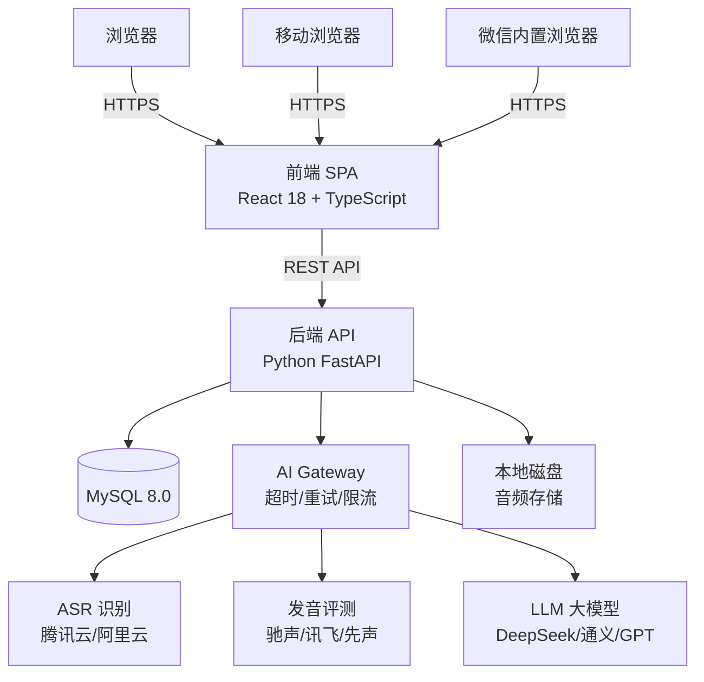

**技术选型：**

| 组件 | 技术选型 | 说明 |
|---|---|---|
| 前端框架 | React 18 + TypeScript | SPA，响应式布局 |
| CSS 框架 | Tailwind CSS | 原子化 CSS |
| 状态管理 | Zustand | 轻量级 |
| 前端路由 | React Router v6 | 约 11 个页面 |
| 图表库 | Recharts | V1.1 启用 |
| 后端框架 | Python FastAPI | 异步 I/O，自动 OpenAPI 文档 |
| ORM + 迁移 | SQLAlchemy 2.0 + Alembic | up/down 迁移 |
| 数据库 | MySQL 8.0 | JSON 存储半结构化数据 |
| 音频存储 | 本地磁盘 | V2 迁移至 OSS |
| AI 服务代理 | 后端 AI Gateway | 统一超时/重试/限流 |

### 2.2 软件功能

英语口语训练系统

│

├── 功能模块一：用户注册与登录（V1.0）

├── 功能模块二：英语水平测评（V1.0）

├── 功能模块三：AI 发音评测与纠错（V1.0）

├── 功能模块四：智能语音对话练习（V1.0）

├── 功能模块五：学习进度可视化（V1.0）

│

├── 功能模块六：个性化学习路径规划（V2.0）

├── 功能模块七：游戏化闯关学习（V2.0）

├── 功能模块八：学习社区与社交互动（V2.0）

│

├── 功能模块九：教师端教学管理后台（V3.0）

├── 功能模块十：运营管理后台（V3.0）

├── 功能模块十一：智能客服与帮助系统（V3.0）

│

└── AI 服务层（跨版本）

├── ASR 语音识别

├── 音素级发音评测

├── 大语言模型对话引擎

└── TTS 语音合成

| 模块 | 子功能 | 版本 | 核心要点 |
|---|---|---|---|
| 模块一 | 注册 / 登录 | V1.0 | 邮箱或手机号注册，采集年龄和学习目标；bcrypt 存储密码，5 次错误锁定 30 分钟，JWT 7 天有效 |
| 模块二 | 20 题固定测评 | V1.0 | 词汇/语法/阅读/听力各 5 题，60 秒限时，最后 10 秒变红，自动定级初/中/高三档 |
| 模块三 | 跟读评测 / 音素纠错 | V1.0 | 用户跟读→录音→ASR→音素级三维评分→逐词颜色标记→红色词展开纠错面板 |
| 模块四 | 3 场景 × 5 轮对话 | V1.0 | 选场景和难度→角色对话→每轮录音→LLM 回复→对话后独立评分（40/30/30） |
| 模块五 | 3 张数字卡片 | V1.0 | 练习次数 / 学习时长 / 最高分，仅统计 completed，测评不计入，新用户空状态引导 |
| 模块六 | 3 条预设路径 | V2.0 | 规则驱动路径（中考/四六级/日常），每日自动推送任务 + 学习日历打卡 |
| 模块七 | 闯关/PK/勋章 | V2.0 | 主题关卡链 + 单词 PK（异步对比分数）+ 积分勋章 + 好友/全站排行榜 |
| 模块八 | 小组/挑战/互评 | V2.0 | 学习小组创建加入 + 组内语音挑战 + 匿名互评录音 + 每日话题讨论 |
| 模块九 | 班级/作业/点评 | V3.0 | 班级管理 + 全班学习报告 + 个体详情 + 文字/语音作业点评 |
| 模块十 | 用户/内容/数据 | V3.0 | 用户查询封禁 + AI 预审 + 人工复审队列 + 运营看板（DAU/MAU/留存/付费） |
| 模块十一 | FAQ + LLM 客服 | V3.0 | FAQ 静态页 + LLM 文字对话客服，目标自动解决率 >60% |

### 2.3 用户特征

本系统涉及四类角色。以下从经验、能力和权限三个维度描述各角色特征。

**学习者（系统主要使用者）**

| 维度 | 说明 |
|---|---|
| 经验 | 覆盖全年龄段（6-99 岁），V1.0 核心群体为 K12 学生（12-18 岁）和大学生（18-22 岁）。K12 群体有中考/高考口语应试需求，大学生有四六级口语应试需求。其余群体（儿童、职场人士、中老年）V2 逐步覆盖 |
| 能力 | 儿童需家长辅助操作（平板为主）；青少年和大学生可独立使用手机和电脑，能完成注册登录、麦克风授权、录音操作、跟读练习等基本交互；职场人士和中老年偏好碎片化、低频使用，需简洁直观的界面 |
| 权限 | 注册账号，参与测评和所有学习功能，查看个人学习进度，管理个人资料。不能访问管理后台，不能查看其他用户数据 |

**教师（V3.0 启用）**

| 维度 | 说明 |
|---|---|
| 经验 | 具备英语教学经验，熟悉班级管理和作业布置流程，有查看学生学习数据和给出点评的需求。使用频率中等，以电脑端操作为主 |
| 能力 | 能独立完成班级创建、学生添加、作业布置、报告查看、文字和语音点评等操作。不需要编程或技术背景，界面需直观易操作 |
| 权限 | 创建和管理所辖班级，添加/移除学生，布置和批改作业，查看班级整体和个体学习报告，发送文字或语音点评。不能查看非管辖班级数据，不能修改系统配置，不能管理其他教师 |

**运营人员（V3.0 启用）**

| 维度 | 说明 |
|---|---|
| 经验 | 具备互联网产品运营经验，熟悉用户管理、内容审核和数据看板的使用场景。使用频率较高（日常登录），以电脑端操作为主 |
| 能力 | 能独立完成用户查询、封禁/解封操作，处理内容审核队列（AI 预审 + 人工复审），阅读运营数据看板并导出报表。需要基本的 Excel 或 BI 工具操作能力 |
| 权限 | 查看全部用户信息，封禁/解封用户账号，审核和处置 UGC 内容，查看运营数据（DAU/MAU/留存率/付费转化/渠道来源）。不能修改系统代码，不能操作教师权限，不能直接删改用户学习数据 |

**系统管理员（V1.0 起即存在，开发团队兼任）**

| 维度 | 说明 |
|---|---|
| 经验 | 具备后端开发和运维经验，熟悉 Linux 服务器管理、MySQL 数据库维护、日志分析和系统监控。为开发团队成员兼任，非专职 DBA 角色 |
| 能力 | 能完成数据库迁移（Alembic up/down）、服务器部署、SSL 证书更新、AI API Key 轮换、定时任务巡检（语音 168h 删除）、系统监控和告警处理。熟练使用命令行和运维工具 |
| 权限 | 全部系统权限：数据库直连、服务器 SSH、API Key 管理、用户数据导出、日志查询、系统配置修改、审计日志只读。此角色权限不对外开放，仅限开发团队内部持有 |

### 2.4 假设和依赖关系

**假设：**

| 编号 | 假设内容 | 影响 |
|---|---|---|
| A1 | 发音评测 API 音素级评分能力满足需求 | 不满足则降级为单词级评分 |
| A2 | Edge TTS 接口在开发期间保持可用 | 不可用则切换 Azure TTS（付费） |
| A3 | 用户授权麦克风权限 | 不授权则录音功能不可用 |
| A4 | LLM 输出质量可接受 | 不达标则人工介入 |

**依赖关系：**

| 编号 | 依赖项 | 类型 |
|---|---|---|
| D1 | 发音评测 API（驰声/先声/讯飞） | 外部服务 |
| D2 | ASR API（腾讯云/阿里云 NUI） | 外部服务 |
| D3 | LLM API（DeepSeek/通义千问/GPT-4o-mini） | 外部服务 |
| D4 | Edge TTS（edge-tts） | 开源工具 |
| D5 | 云服务器（2核4GB） + 域名 + SSL 证书 | 基础设施 |

## 3 具体需求

### 3.1 系统用例

在此处描述系统高层整体用例。V1.0 系统包含 6 个核心用例，所有需要登录态的用例通过 include 关系依赖"登录校验"。

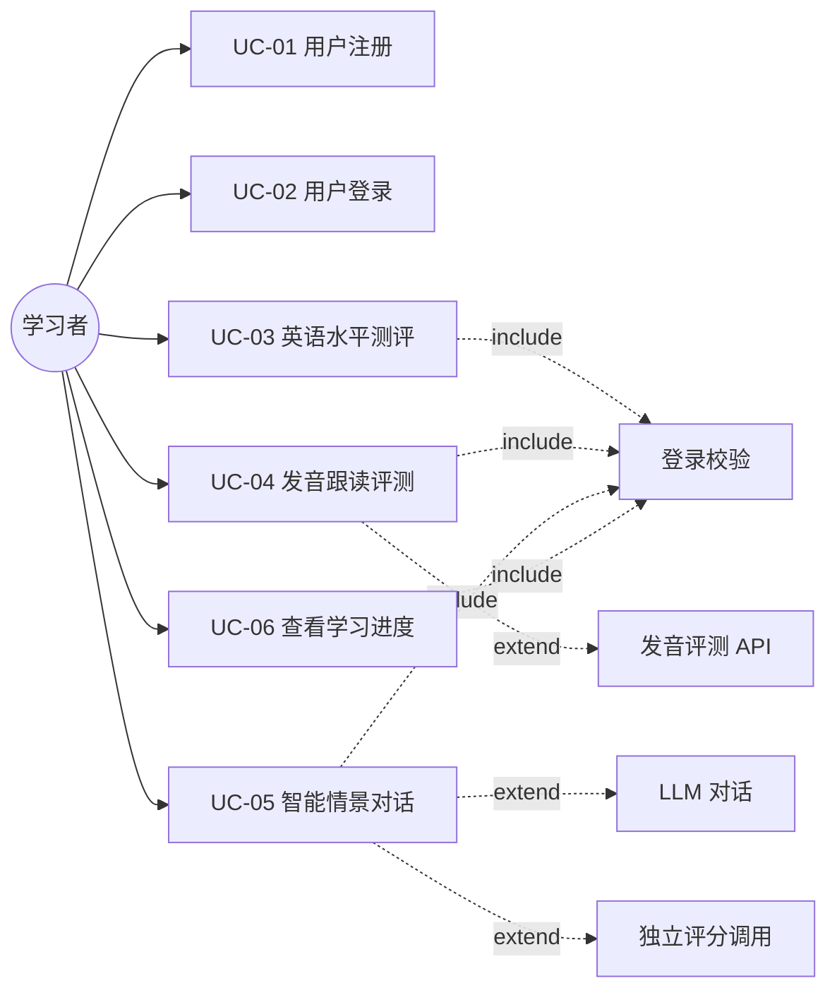

**图3-1 系统用例图**

| 用例 ID | 用例名称 | 参与者 | 描述 |
|---|---|---|---|
| UC-01 | 用户注册 | 学习者 | 邮箱/手机号注册，采集年龄和学习目标 |
| UC-02 | 用户登录 | 学习者 | 邮箱/手机号 + 密码登录，获取 JWT Token |
| UC-03 | 英语水平测评 | 学习者 | 完成 20 题测评，获取初/中/高三档等级 |
| UC-04 | 发音跟读评测 | 学习者 | 跟读内容 → 录音 → 三维评分 + 逐词纠错 |
| UC-05 | 智能情景对话 | 学习者 | 选择场景 → 5 轮角色对话 → 综合评分 |
| UC-06 | 查看学习进度 | 学习者 | 查看 3 张统计数字卡片 |

### 3.2 功能模块一：用户注册与登录

##### 1 功能简介

用户通过邮箱或手机号创建账号并登录系统。采集年龄和学习目标用于后续学习内容匹配。V1.0 不支持第三方社交账号登录，提供密码强度校验和登录安全锁定机制。

##### 2 功能系统用例

本模块包含用户注册和用户登录两个子功能。

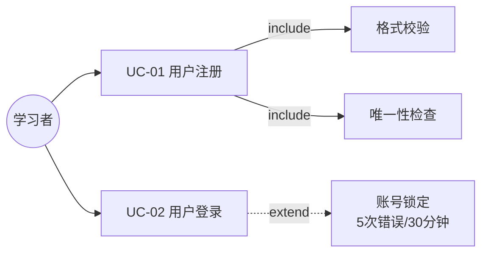

**图3-2  功能系统用例图**

| 用例 ID | 用例名称 | 参与者 | 前置条件 | 后置条件 |
|---|---|---|---|---|
| UC-01 | 用户注册 | 学习者 | 无 | 用户记录写入 users 表，跳转登录页 |
| UC-02 | 用户登录 | 学习者 | 已注册 | 获取 JWT Token（7 天），进入首页 |

#### 3.2.1 子功能 用户注册

**1 介绍**

用户在注册页填写注册信息（邮箱或手机号二选一 + 密码 + 年龄 + 学习目标），点击注册按钮后，前端先校验各字段格式是否合法（邮箱 RFC 5322、手机号 11 位、密码 8-20 位含字母和数字、年龄 6-99、学习目标已选）。校验通过后提交至后端，后端检查邮箱/手机号唯一性、同 IP 注册频率（≤3次/min），全部通过后将密码做 bcrypt 哈希（cost=12）写入 users 表，并返回注册成功结果。若任一校验不通过，返回对应错误提示，用户需修改后重新提交。

**2 输入**

| 输入项 | 来源 | 有效输入范围 |
|---|---|---|
| 邮箱 | 用户手动输入 | 符合 RFC 5322 标准（含 + 号等合法字符），不超过 100 字符 |
| 手机号 | 用户手动输入 | 中国大陆手机号 11 位数字，以 1 开头（与邮箱二选一） |
| 密码 | 用户手动输入 | 8-20 位，至少含 1 字母 + 1 数字 |
| 年龄 | 用户选择 | 6-99 岁 |
| 学习目标 | 用户选择 | 三选一：daily（日常交流）/ exam（考试）/ business（商务） |

操作：用户填写信息后点击"注册"按钮提交。

**3 处理**

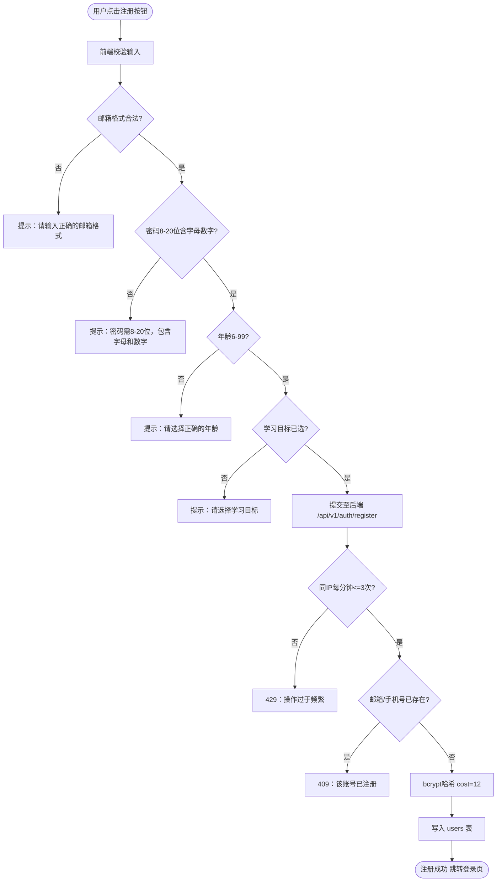

**图3-3  用户注册流程图**

操作流程说明：

a. 前端先校验用户名、密码、邮箱格式。若全部符合规则，则提交后端。

b. 后端校验同 IP 注册频率限流。若超限，返回 429。

c. 后端校验邮箱/手机号唯一性。若已注册，返回 409 + 登录页链接。

d. 全部校验通过后，bcrypt 哈希密码（cost=12），写入 users 表。

e. 注册成功，返回成功结果，前端跳转至登录页。

**4 输出**

| 输出项 | 目标 | 说明 |
|---|---|---|
| 注册成功 | 前端弹窗 + 页面跳转 | 文案："注册成功！即将跳转到登录页" |
| 邮箱格式错误 | 表单字段下方 | "请输入正确的邮箱格式" |
| 手机号格式错误 | 表单字段下方 | "请输入正确的手机号" |
| 密码格式错误 | 表单字段下方 | "密码需8-20位，包含字母和数字" |
| 已注册 | 表单字段下方 | "该邮箱/手机号已注册，请直接登录" |
| 频率超限 | 页面顶部 Toast | "操作过于频繁，请稍后再试" |
| 用户记录 | MySQL users 表 | email/phone + password_hash + age + goal |

#### 3.2.2 子功能 用户登录

**1 介绍**

用户使用已注册邮箱或手机号 + 密码登录。输入账号和密码后点击登录按钮，前端先校验非空，后端依次校验账号是否存在、密码是否正确。连续 5 次密码错误后账号锁定 30 分钟，锁定期间提示"账号已被临时锁定，请 30 分钟后再试"。验证通过后生成 JWT Token（7 天有效期），跳转首页。若用户在录音/对话中 Token 过期，前端将已录音频暂存至 IndexedDB，登录成功后恢复。

**2 输入**

| 输入项 | 来源 | 有效输入范围 |
|---|---|---|
| 账号 | 用户手动输入 | 邮箱或手机号，不为空 |
| 密码 | 用户手动输入 | 8-20 位，不为空 |

操作：用户填写账号密码后点击"登录"按钮提交。

**3 处理**

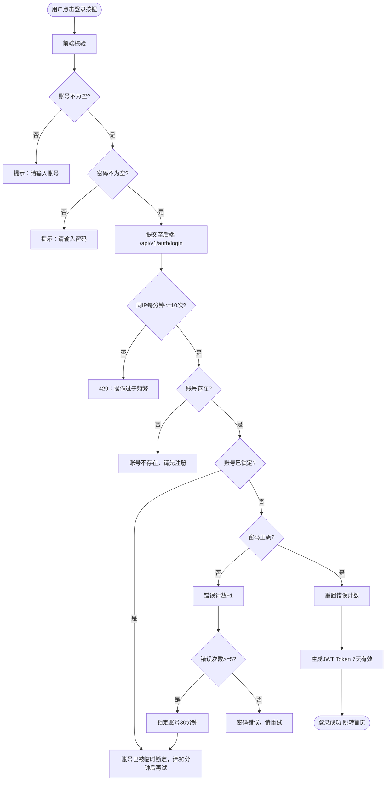

**图3-4  用户登录流程图**

操作流程说明：

a. 前端校验账号和密码均不为空。若为空，提示用户输入。

b. 后端校验同 IP 登录频率（≤10次/min）。若超限，返回 429。

c. 后端校验账号是否存在。若不存在，提示"账号不存在，请先注册"。

d. 后端校验账号是否已被锁定。若锁定，提示剩余等待时间。

e. 后端校验密码是否正确。若错误，错误计数 +1；累计满 5 次，锁定 30 分钟。

f. 密码正确则重置错误计数，生成 JWT Token（7 天有效），跳转首页。

**4 输出**

| 输出项 | 目标 | 说明 |
|---|---|---|
| 登录成功 | 页面跳转至首页 | JWT 写入 Cookie/localStorage，7 天有效 |
| 账号为空 | 表单字段下方 | "请输入账号" |
| 密码为空 | 表单字段下方 | "请输入密码" |
| 账号不存在 | 前端页面 | "账号不存在，请先注册" |
| 密码错误 | 前端页面 | "密码错误，请重试" |
| 账号锁定 | 前端页面 | "账号已被临时锁定，请 30 分钟后再试" |
| Token 过期 | API 返回 401 | 跳转登录页 + 保留路径回跳 |
| 登录记录 | users.last_login_at / last_login_ip 更新 | UTC 时间 |

### 3.3 功能模块二：英语水平测评

##### 1 功能简介

用户完成 20 道固定选择题（词汇/语法/阅读/听力各 5 题），每题限时 60 秒，最后 10 秒倒计时变红。完成后自动计算总分并定级（初级 0-40 / 中级 41-70 / 高级 71-100），用于后续内容难度匹配。不支持返回修改已答题目，中途刷新不保存进度。API 返回题目时必须字段白名单过滤，禁止返回 correct_answer。

##### 2 功能系统用例

本模块包含水平测评子功能。

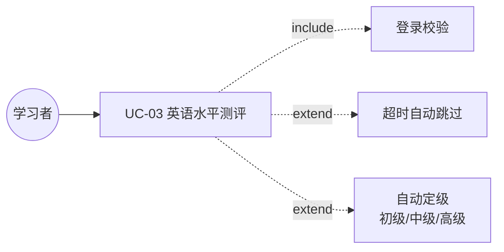

**图3-5  英语水平测评功能系统用例图**

| 用例 ID | 用例名称 | 参与者 | 前置条件 | 后置条件 |
|---|---|---|---|---|
| UC-03 | 英语水平测评 | 学习者 | 已登录，无进行中测评 | 等级写入 users.level，展示结果页 |

#### 3.3.1 子功能 水平测评

**1 介绍**

用户进入测评页后，系统从题库中按序抽取 20 题（词汇 5→语法 5→阅读 5→听力 5），每题展示题目文本、4 个选项、进度条（第 N/20 题）和倒计时（60 秒，最后 10 秒变红）。用户点击选项即提交答案进入下一题；若 60 秒内未点击则自动跳过计 0 分。20 题完成后自动计算总分（每题 5 分，满分 100），按分数段定级并展示结果页（总分 + 等级徽章 + 四维得分概要）。安全要求：API 返回题目时必须字段白名单过滤，仅返回 question_text + options_json + sort_order，禁止返回 correct_answer。

**2 输入**

| 输入项 | 来源 | 有效输入范围 |
|---|---|---|
| 答题选择 | 用户点击选项 | 20 题，A/B/C/D 四选一，每题限时 60 秒 |

操作：用户点击选项即提交，不支持返回修改。

**3 处理**

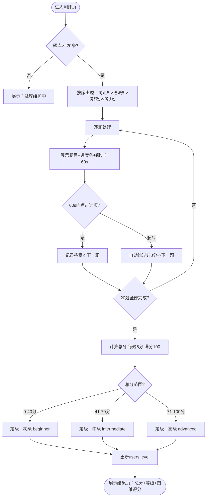

**图3-6  英语水平测评流程图**

操作流程说明：

a. 后端校验题库记录数 ≥20 条。若不足，展示"题库维护中，请稍后再试"。

b. 按序出题：词汇 5 题 → 语法 5 题 → 阅读 5 题 → 听力 5 题。

c. 每题展示题目文本、4 个选项、进度条（第 N/20 题）、倒计时（60 秒，最后 10 秒变红）。

d. 60 秒内点击选项 → 记录答案，进入下一题。

e. 60 秒超时 → 自动跳过，计 0 分，进入下一题。

f. 20 题完成后计算总分 = 每题 5 分 × 正确题数，满分 100。

g. 定级规则：0-40 分 → 初级，41-70 分 → 中级，71-100 分 → 高级。

h. 写入 users.level 和 assessment_records 表，展示结果页。

**4 输出**

| 输出项 | 目标 | 说明 |
|---|---|---|
| 测评结果 | 结果页 | 总分 + 等级徽章 + 四维得分概要 |
| 题库维护提示 | 测评页 | "题库维护中，请稍后再试" |
| 超时提示 | 测评页 | 60 秒超时自动跳过，计 0 分 |
| 水平等级 | MySQL users.level | 首次测评自动写入，后续测评需用户确认更新 |
| 测评记录 | assessment_records 表 | 含 answers_json 逐题答案详情 |

### 3.4 功能模块三：AI 发音评测与纠错

##### 1 功能简介

用户跟读系统展示的句子后录音，系统经过 ASR 语音识别 + 第三方音素级评测引擎进行三维评分（准确度/流利度/完整度），以逐词颜色标记（绿≥80 / 黄 60-79 / 红<60）展示发音质量，点击红色单词弹出音素级纠错面板。此为本产品核心差异化功能。

##### 2 功能系统用例

本模块包含发音跟读评测子功能。

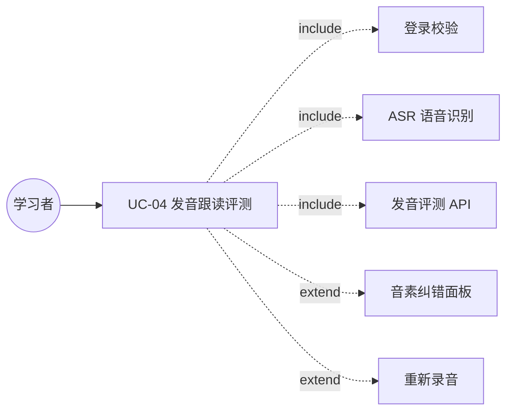

**图3-7  发音跟读评测用例图**

| 用例 ID | 用例名称 | 参与者 | 前置条件 | 后置条件 |
|---|---|---|---|---|
| UC-04 | 发音跟读评测 | 学习者 | 已登录，麦克风已授权 | 评测记录写入 practice_records |

#### 3.4.1 子功能 发音评测

**1 介绍**

用户进入发音评测页，查看跟读文本 → 点击"开始录音"（移动端建议长按 Push-to-Talk）→ 朗读 → 松手/点击"结束录音"→ 系统自动上传并评测。录音结束后前端先校验时长和大小：<0.5s 提示重新朗读，>60s 自动截断，>5MB 提示控制时长。校验通过后上传音频至后端，后端先检查同一用户 + 同一 content_id 是否有进行中的录音（有则 429），通过后走 AI Gateway：ASR 识别 → 发音评测 API。结果页采用渐进式加载：Step1 展示 ASR 转写文本 → Step2 展示总分 + 三维分 → Step3 逐词颜色标记。点击红色单词弹出音素纠错面板（音素符号 + 中文发音描述 + 正确发音播放按钮）。支持点击"重新录音"重复流程。

**2 输入**

| 输入项 | 来源 | 有效输入范围 |
|---|---|---|
| 录音音频 | 用户麦克风 | ≤60 秒，16kHz Mono，≤5MB，WAV 或 WebM（后端 ffmpeg 转码） |
| 跟读内容 ID | 系统 | content_sentences 表中的有效 ID |

操作：用户长按/点击录音按钮开始录音，松手/再点击结束录音。

**3 处理**

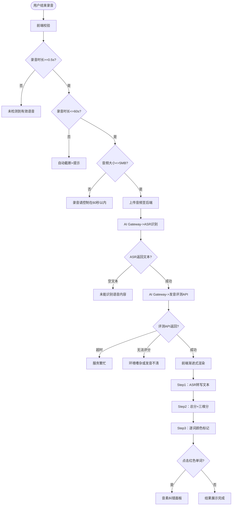

**图3-8  发音评测流程图**

操作流程说明：

a. 用户结束录音后，前端按优先级校验：时长 <0.5s → 提示重新朗读；时长 >60s → 自动截断 + 提示；大小 >5MB → 提示控制时长。

b. 后端音频处理锁：同一用户 + 同一 content_id 有进行中录音时返回 429。

c. 音频上传后经 AI Gateway 依次调用 ASR 和发音评测 API。

d. ASR 返回空文本/置信度低 → 提示"未能识别语音内容"。

e. 评测 API 超时 → 提示"服务繁忙"；返回无法评分 → 提示"环境嘈杂或发音不清"。

f. 评测成功后，前端渐进式渲染：ASR 文本 → 总分 + 三维分 → 逐词颜色标记。

g. 点击红色单词 → 弹出音素纠错面板（音素符号 / 中文发音描述 / 正确发音按钮）。

h. 支持"重新录音"→ 清除结果 → 回到录音界面。

**4 输出**

| 输出项 | 目标 | 说明 |
|---|---|---|
| 评测成功 | 评测结果页 | 总分 + 三维分（准确度/流利度/完整度）+ 逐词颜色标记 |
| 录音过短 | 前端提示 | "未检测到有效语音，请重新朗读" |
| 录音过长 | 前端提示 | "录音已自动结束（最长60秒）" |
| 文件过大 | 前端提示 | "录音请控制在60秒以内" |
| ASR 空文本 | 前端提示 | "未能识别语音内容，请确保发音清晰" |
| 评测超时 | 前端提示 | "服务繁忙，请稍后重试" |
| 无法评分 | 前端提示 | "环境嘈杂或发音不清，无法准确评分" |
| 评测记录 | practice_records 表 | JSON 完整详情 + status 状态 + duration_seconds |
| 学习时长 | study_sessions 表 | 本次录音实际时长 |

### 3.5 功能模块四：智能语音对话练习

##### 1 功能简介

用户选择对话场景（3 选 1）和难度后，与 AI 虚拟角色进行 5 轮语音对话。每轮用户录音 → ASR 转写 → LLM 生成角色回复（仅返回文本，低延迟 <3s）。对话结束后系统独立调用评分 Prompt（Temperature=0.1-0.3，权重 40%/30%/30%）输出三维综合评分。中间 1-2 轮失败不影响已完成轮次，≥3 轮失败则本次对话作废。

##### 2 功能系统用例

本模块包含智能情景对话子功能。

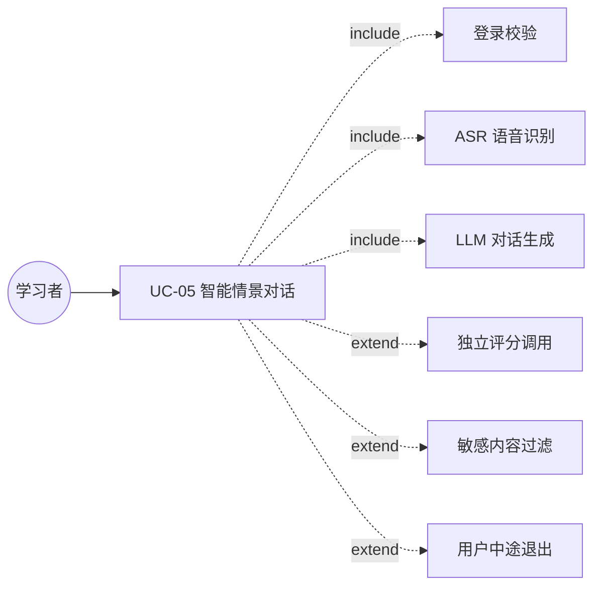

**图3-9  智能情景对话用例图**

| 用例 ID | 用例名称 | 参与者 | 前置条件 | 后置条件 |
|---|---|---|---|---|
| UC-05 | 智能情景对话 | 学习者 | 已登录，无其他 active 会话 | 对话+评分写入 conversation_sessions |

#### 3.5.1 子功能 语音对话

**1 介绍**

用户进入对话选择页，从 3 个场景（self_intro 自我介绍 / campus_life 校园生活 / restaurant 餐厅点餐）中选择一个，选择难度档位（beginner / intermediate / advanced）。系统校验同一用户无其他 active 会话后（有则 429），加载对应场景 Prompt 模板（含角色设定 + 难度控制），创建 conversation_sessions 记录，AI 角色发起第 1 轮对话（文本 + 角色头像）。之后开始循环 5 轮：用户录音 → ASR 转写（失败则提示重试本轮，不计轮数）→ 用户文本展示（右侧气泡）→ 输入过滤（≤500 字符 + 敏感词正则检测）→ 发送至 LLM → AI 回复展示（左侧气泡 + 角色头像）。第 4 轮结束后轻提示"即将结束，还剩 1 轮"。第 5 轮结束后统计成功轮次：5 轮全成功正常评分；1-2 轮失败已完成轮次评分保留、失败标注"未计算"；≥3 轮失败对话作废无法评分。评分独立调用（Temperature=0.1-0.3），权重为语法准确性 40% + 回答相关性 30% + 流利度 30%。结果以弹窗展示总分 + 三维分 + 评语。

场景详细信息：

| 场景 | 角色 | 示例首轮 | V1.0 |
|---|---|---|---|
| 自我介绍 | 新同学 Alex | "Hi there! I'm Alex. What's your name?" | ✅ |
| 校园生活 | 同学 | "Hey! Did you finish the English homework?" | ✅ |
| 餐厅点餐 | 服务员 | "Good evening! Welcome to our restaurant." | ✅ |
| 旅行出行 | 酒店前台 | — | V1.1 |
| 商务会议 | 同事 | — | V1.1 |

**2 输入**

| 输入项 | 来源 | 有效输入范围 |
|---|---|---|
| 场景选择 | 用户选择 | 3 选 1：self_intro / campus_life / restaurant |
| 难度档位 | 用户选择 | beginner / intermediate / advanced |
| 每轮语音 | 用户麦克风录音 | 5 段，每段 ≤60 秒，≤5MB |

操作：用户选择场景和难度后进入对话，每轮通过录音按钮录制语音。

**3 处理**

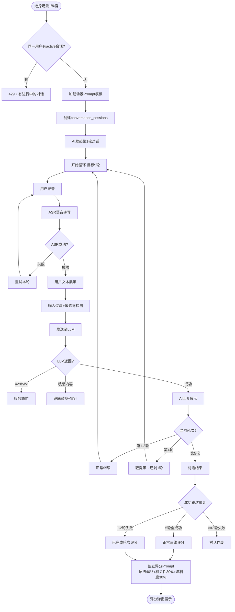

**图3-10  语音对话流程图**

操作流程说明：

a. 用户选择场景和难度后，后端校验同一用户无其他 active 会话。若有，返回 429。

b. 加载场景 Prompt 模板（角色设定 + 难度控制词），创建 conversation_sessions。

c. AI 角色发起第 1 轮对话（文本 + 角色头像/名称）。

d. 每轮用户录音 → ASR 转写。ASR 失败时展示错误气泡"语音识别失败，请重试本轮"，不计轮数。

e. ASR 成功后展示用户文本（右侧气泡），输入过滤（≤500 字符 + 敏感词正则检测）后发送至 LLM。

f. LLM 返回角色回复（左侧气泡 + 角色头像）。429/5xx 时本轮标记失败。

g. 第 4 轮后展示轻提示"即将结束，还剩 1 轮"。

h. 5 轮完成后统计：全成功 → 正常评分；1-2 轮失败 → 失败轮次标注"未计算"；≥3 轮失败 → 对话作废。

i. 评分独立调用 LLM（Temperature=0.1-0.3），权重 40%/30%/30%，弹窗展示。

**4 输出**

| 输出项 | 目标 | 说明 |
|---|---|---|
| 对话成功 | 对话页 + 评分弹窗 | 完整 5 轮气泡 + 总分 + 三维分 + 评语 |
| 对话作废 | 弹窗 | "本次对话有效轮次不足，无法评分" |
| 重复会话 | 前端提示 | "您有一个进行中的对话，请先完成" |
| LLM 繁忙 | 前端提示 | "服务繁忙，请稍后重试" |
| 对话会话 | conversation_sessions 表 | status 标记（completed/llm_timeout/user_aborted 等） |
| 对话消息 | conversation_messages 表 | 每轮 user + ai 消息 + audio_url |
| 学习时长 | study_sessions 表 | 对话录音总时长 |

### 3.6 功能模块五：学习进度可视化

##### 1 功能简介

用户查看个人学习统计数据。V1.0 以 3 张数字卡片展示学习总览：总练习次数、总学习时长、历史最高分。仅统计 status=completed 的记录，测评不计入练习次数。新用户无记录时展示空状态引导。V1.1 增加折线图，V2.0 增加雷达图。

##### 2 功能系统用例

本模块包含查看学习进度子功能。

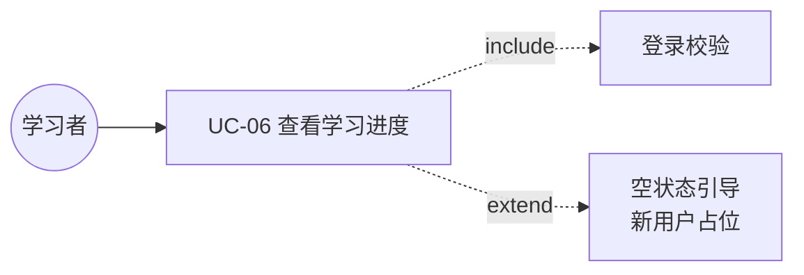

**图3-11  查看学习进度用例图**

| 用例 ID | 用例名称 | 参与者 | 前置条件 | 后置条件 |
|---|---|---|---|---|
| UC-06 | 查看学习进度 | 学习者 | 已登录 | 展示 3 张统计数字卡片 |

#### 3.6.1 子功能 查看进度

**1 介绍**

用户进入"学习进度"页后，后端聚合查询 practice_records（status=completed）、conversation_sessions（status=completed）、study_sessions 三张表，判断是否存在数据。若不存在（新用户），返回空状态标识，前端展示占位图和引导文案"开始你的第一次练习吧"，3 张卡片均显示 0。若存在，计算三项统计：练习次数 = 跟读完成次数 + 对话完成次数（测评不计入）；总学习时长 = 跟读录音时长 + 对话录音时长（不含页面停留时间）；历史最高分 = MAX(评测总分)。前端渲染为 3 张数字卡片横向排列（移动端纵向堆叠）。

**2 输入**

无用户输入。数据来源于历史练习记录，页面进入时自动加载。

**3 处理**

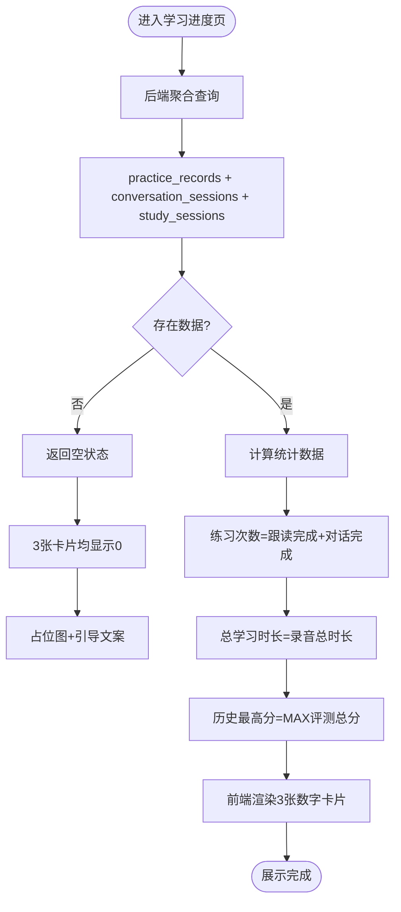

**图3-12  查看学习进度流程图**

操作流程说明：

a. 用户进入学习进度页，自动调用后端聚合查询接口。

b. 后端查询 practice_records、conversation_sessions（均仅 status=completed）、study_sessions 三表。

c. 若三表均无该用户记录 → 返回空状态标识。

d. 空状态时，3 张卡片均显示 0，展示占位图和引导文案"开始你的第一次练习吧"。

e. 若有数据，计算：练习次数（跟读完成 + 对话完成，测评不计入）、总学习时长（录音时长累加，不含页面停留）、历史最高分（MAX 评测总分）。

f. 前端渲染 3 张数字卡片，桌面端横向排列，移动端纵向堆叠。

g. 用户后续完成练习后，重新进入页面时刷新数据。

**4 输出**

| 输出项 | 目标 | 说明 |
|---|---|---|
| 正常展示 | 进度页 | 3 张数字卡片：总练习次数 / 总学习时长（分钟）/ 历史最高分 |
| 空状态 | 进度页 | 占位图 +"开始你的第一次练习吧"，3 张卡片均显示 0 |
| 数据加载中 | 进度页 | 骨架屏 +"数据加载中，请稍候" |
| 查询失败 | 进度页 | "暂时无法获取学习数据，请稍后重试" + 重试按钮 |
| 折线图 | V1.1 | 练习次数趋势 + 分数趋势 |

### 3.7 数据字典

所有时间字段统一使用 UTC 存储，前端按用户浏览器时区展示。

##### users（用户表）

| 字段 | 类型 | 可为空 | 约束 | 描述 |
|---|---|---|---|---|
| id | BIGINT | 否 | PK AUTO_INCREMENT | 主键 |
| email | VARCHAR(100) | 是 | UNIQUE | 邮箱 |
| phone | VARCHAR(20) | 是 | UNIQUE | 手机号 |
| password_hash | VARCHAR(255) | 否 | NOT NULL | bcrypt（cost=12） |
| age | TINYINT | 否 | CHECK (6-99) | 年龄 |
| goal | ENUM('daily','exam','business') | 否 | NOT NULL | 学习目标 |
| level | ENUM('beginner','intermediate','advanced') | 是 | — | 水平等级 |
| last_login_at | DATETIME | 是 | — | 最近登录时间（UTC） |
| last_login_ip | VARCHAR(45) | 是 | — | 最近登录 IP |
| feature_flags | JSON | 是 | — | V2 灰度预留 |
| created_at | DATETIME | 否 | NOT NULL | 注册时间（UTC） |
| updated_at | DATETIME | 否 | NOT NULL | 更新时间（UTC） |

索引：UNIQUE(email)、UNIQUE(phone)、INDEX(level)

##### assessment_records（测评记录表）

| 字段 | 类型 | 可为空 | 描述 |
|---|---|---|---|
| id | BIGINT | 否 | PK AUTO_INCREMENT |
| user_id | BIGINT | 否 | FK → users.id |
| total_score | TINYINT | 否 | 总分 0-100 |
| vocab_score | TINYINT | 否 | 词汇得分 |
| grammar_score | TINYINT | 否 | 语法得分 |
| reading_score | TINYINT | 否 | 阅读得分 |
| listening_score | TINYINT | 否 | 听力得分 |
| result_level | ENUM('beginner','intermediate','advanced') | 否 | 评级 |
| answers_json | JSON | 否 | 逐题答案 |
| created_at | DATETIME | 否 | 测评时间（UTC） |

索引：INDEX(user_id, created_at)

##### practice_records（发音评测记录表）

| 字段 | 类型 | 可为空 | 描述 |
|---|---|---|---|
| id | BIGINT | 否 | PK AUTO_INCREMENT |
| user_id | BIGINT | 否 | FK → users.id |
| content_id | INT | 否 | FK → content_sentences.id |
| audio_url | VARCHAR(500) | 是 | 录音路径（168h 后删除） |
| audio_deleted_at | DATETIME | 是 | 音频删除时间 |
| total_score | DECIMAL(5,2) | 是 | 总分 |
| accuracy_score | DECIMAL(5,2) | 是 | 准确度 |
| fluency_score | DECIMAL(5,2) | 是 | 流利度 |
| completeness_score | DECIMAL(5,2) | 是 | 完整度 |
| eval_detail_json | JSON | 是 | 逐词+音素详情 |
| status | ENUM('completed','asr_failed','eval_failed','timeout') | 否 | 状态 |
| duration_seconds | INT | 否 | 录音时长（秒） |
| created_at | DATETIME | 否 | 评测时间（UTC） |

索引：INDEX(user_id, created_at)、INDEX(content_id)

##### conversation_sessions（对话会话表）

| 字段 | 类型 | 可为空 | 描述 |
|---|---|---|---|
| id | BIGINT | 否 | PK AUTO_INCREMENT |
| user_id | BIGINT | 否 | FK → users.id |
| scene | VARCHAR(50) | 否 | self_intro / campus_life / restaurant |
| difficulty | ENUM('beginner','intermediate','advanced') | 否 | 难度 |
| status | ENUM('completed','asr_failed','llm_timeout','llm_sensitive','user_aborted') | 否 | 状态 |
| grammar_score | DECIMAL(5,2) | 是 | 语法评分 |
| relevance_score | DECIMAL(5,2) | 是 | 相关性评分 |
| fluency_score | DECIMAL(5,2) | 是 | 流利度评分 |
| total_score | DECIMAL(5,2) | 是 | 综合总分 |
| total_duration_seconds | INT | 否 | 总录音时长 |
| created_at | DATETIME | 否 | 会话开始时间（UTC） |

索引：INDEX(user_id, created_at)、INDEX(user_id, status)

##### conversation_messages（对话消息表）

| 字段 | 类型 | 可为空 | 描述 |
|---|---|---|---|
| id | BIGINT | 否 | PK AUTO_INCREMENT |
| session_id | BIGINT | 否 | FK → conversation_sessions.id |
| round | TINYINT | 否 | 轮次 1-5 |
| role | ENUM('user','ai') | 否 | 说话人 |
| content | TEXT | 否 | 消息文本 |
| audio_url | VARCHAR(500) | 是 | 语音存档（168h 删除） |
| created_at | DATETIME | 否 | 消息时间（UTC） |

索引：INDEX(session_id, round)

##### study_sessions（学习时长记录表）

| 字段 | 类型 | 可为空 | 描述 |
|---|---|---|---|
| id | BIGINT | 否 | PK AUTO_INCREMENT |
| user_id | BIGINT | 否 | FK → users.id |
| type | ENUM('practice','conversation') | 否 | 类型 |
| duration_seconds | INT | 否 | 时长（秒） |
| reference_id | BIGINT | 是 | 多态外键（应用层保证一致性） |
| created_at | DATETIME | 否 | 记录时间（UTC） |

索引：INDEX(user_id, created_at)、INDEX(type, created_at)

说明：reference_id 指向 practice_records 或 conversation_sessions，无法建 DB 级 FK，应用层保证一致性。

##### content_sentences（句子内容表）

| 字段 | 类型 | 可为空 | 描述 |
|---|---|---|---|
| id | INT | 否 | PK AUTO_INCREMENT |
| sentence | TEXT | 否 | 句子文本 |
| level | ENUM('k12','cet4') | 否 | 级别 |
| difficulty | TINYINT | 是 | 1-5（V2 预留） |
| audio_url | VARCHAR(500) | 否 | Edge TTS 预生成 mp3 |
| created_at | DATETIME | 否 | 创建时间（UTC） |

索引：INDEX(level, difficulty)

##### assessment_questions（测评题目表）

| 字段 | 类型 | 可为空 | 描述 |
|---|---|---|---|
| id | INT | 否 | PK AUTO_INCREMENT |
| type | ENUM('vocab','grammar','reading','listening') | 否 | 题目类型 |
| question_text | TEXT | 否 | 题目文本 |
| options_json | JSON | 否 | 4 个选项 |
| correct_answer | CHAR(1) | 否 | API 禁止返回前端 |
| audio_url | VARCHAR(500) | 是 | 听力题音频 |
| sort_order | TINYINT | 否 | 出题顺序 |
| created_at | DATETIME | 否 | 创建时间（UTC） |

索引：INDEX(type, sort_order)

##### audit_logs（审计日志表）

| 字段 | 类型 | 可为空 | 描述 |
|---|---|---|---|
| id | BIGINT | 否 | PK AUTO_INCREMENT（append-only） |
| user_id | BIGINT | 是 | 关联用户 |
| action | VARCHAR(50) | 否 | 操作类型 |
| data_type | VARCHAR(50) | 否 | 数据类型 |
| data_id | BIGINT | 是 | 数据 ID |
| data_hash | VARCHAR(64) | 是 | SHA256 |
| status | ENUM('success','failed') | 否 | 结果 |
| error_message | VARCHAR(500) | 是 | 失败原因 |
| request_id | VARCHAR(36) | 是 | UUID |
| duration_ms | INT | 是 | 耗时 |
| ip_address | VARCHAR(45) | 否 | 操作 IP |
| user_agent | VARCHAR(500) | 是 | 浏览器 UA |
| created_at | DATETIME | 否 | 操作时间（UTC） |

索引：INDEX(user_id, created_at)、INDEX(action, created_at)

### 3.8 E-R 关系图

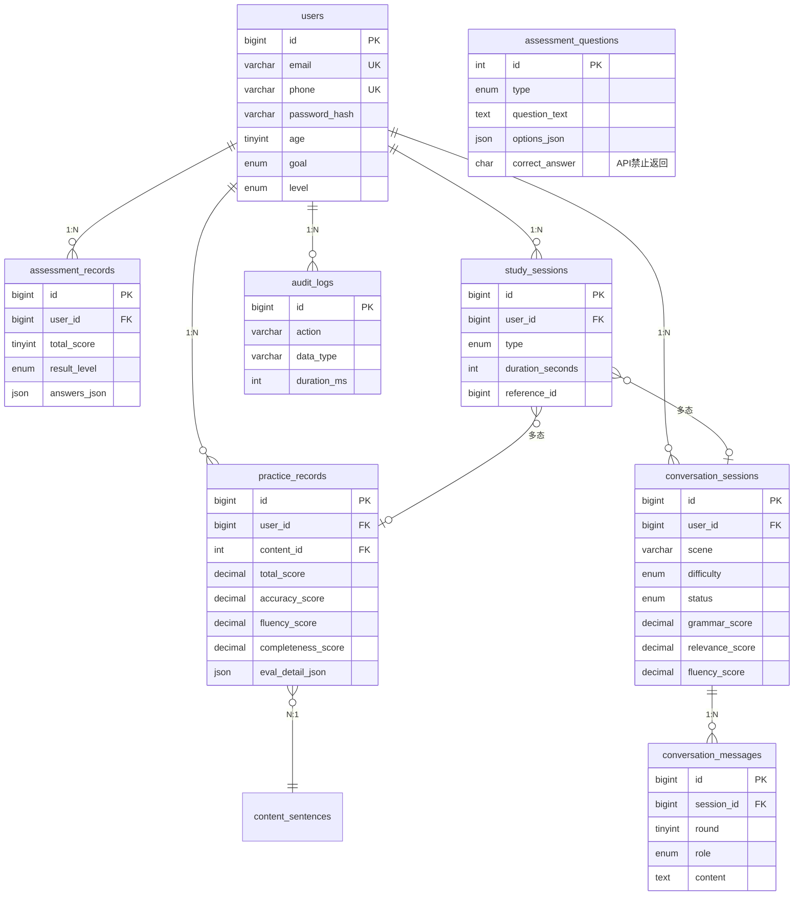

**图3-13  E-R图**

## 4 性能需求

### 4.1 时间性能需求

| 指标 | 目标值 | 测量方法 |
|---|---|---|
| 首屏加载（移动端 Slow 4G） | FCP <1.5s、LCP <2.5s | Lighthouse v12+ |
| 首屏加载（桌面端 WiFi） | FCP <0.8s、LCP <1.5s | Lighthouse v12+ |
| 评测结果返回 | P95 <6s，P99 <10s | 上传完成→评分渲染 |
| 对话单轮回复 | P95 <3s，P99 <5s | ASR 完成→LLM 文本渲染 |
| 发音评测 API 成功率 | >95%（按自然日） | 成功=HTTP 200+有效评分 |
| 录音上传（4G） | P95 <8s | Chrome DevTools 4G Throttle |
| 核心服务可用性 | >99%（MVP） | 不含第三方 API 故障 |

### 4.2 弱网超时与重试策略

| 操作 | 弱网超时 | 正常超时 | 最大重试 |
|---|---|---|---|
| ASR 识别 | 15s | 8s | 3 次 |
| LLM 对话 | 20s | 10s | 1 次 |
| 发音评测 | 20s | 10s | 1 次 |
| 音频上传 | 40s | 20s | 3 次 |

弱网检测：前端连续 3 次请求超时后判定为弱网，展示"当前网络较慢"黄色提示条。

### 4.3 界面友好性需求

系统采用响应式设计，适配375px至1440px宽度范围。色彩方案以教育/学习类配色为主，保证正文对比度不低于4.5:1（WCAG 2.1 AA级）。所有可点击元素最小触摸区域为44x44px（含padding，不含margin）。加载状态使用骨架屏或loading动画，禁止白屏等待。错误提示使用通俗语言，禁止出现技术术语。以下对各核心页面提出界面规划与交互要求。

**登录页**

**页面规划：**

登录页采用简洁居中布局，背景使用低饱和度的渐变色调，避免杂乱装饰元素。页面中央放置登录卡片，卡片内包含：系统Logo与名称、账号输入框（邮箱/手机号）、密码输入框（支持显示/隐藏切换）、登录按钮。下方提供"没有账号？去注册"链接。

**交互要求：**

账号输入框支持邮箱或手机号格式自动识别，前端实时校验非空

密码输入框右侧提供眼睛图标，点击可切换密码明文/密文显示

登录按钮点击后显示loading状态（按钮内旋转动画+"正在登录..."），禁止重复点击

连续5次密码错误后弹出提示"账号已被临时锁定，请30分钟后再试"，按钮置灰不可点击

登录成功后展示欢迎提示，1.5秒后自动跳转至首页

支持回车键快捷提交

**首页**

**页面规划：**

首页作为用户登录后的默认着陆页，展示学习总览和功能入口。顶部为欢迎区域（显示用户昵称和学习等级徽章）；中部为3张数字卡片横向排列（总练习次数/总学习时长/历史最高分），点击卡片可跳转至学习进度详情页；下方为功能入口区，以图标+文字网格布局展示：开始测评、发音练习、情景对话、学习进度四个入口。移动端底部使用固定底部导航栏（首页/练习/对话/我的），桌面端使用左侧侧边导航栏。

**交互要求：**

数字卡片加载时展示骨架屏动画，数据加载完成后数字以渐增动画呈现

新用户（0条记录）卡片显示0，下方展示空状态占位图及引导文案"开始你的第一次练习吧"

功能入口卡片hover时轻微上浮（桌面端），点击后路由跳转至对应页面

移动端底部导航栏固定吸附，当前页面对应图标高亮

**测评页**

**页面规划：**

测评页顶部展示进度条（"第 N/20 题"），中部为题目文本区域（大字展示），下方为4个选项按钮（A/B/C/D），右侧显示60秒倒计时（最后10秒变红闪烁）。听力题额外展示音频播放按钮（可重复播放）。不支持返回修改已答题目。

**交互要求：**

点击选项后0.2秒过渡动画进入下一题

60秒超时自动跳过，计0分，弹出Toast"本题已超时"

测评中刷新或关闭浏览器，进度不保存，下次进入从头开始

全部完成后展示总分、等级徽章、四维得分（词汇/语法/阅读/听力）的动画展示

**发音评测页**

**页面规划：**

发音评测页以跟读文本居中大字展示，下方为录音控制区域。移动端采用长按Push-to-Talk模式（按住录音、松手结束），桌面端点击按钮开始/结束录音。录音中展示波形呼吸动画（帧率不低于30fps，呼吸周期2-3秒）。结果页采用渐进式加载：Step1 ASR转写文本 -> Step2 总分+三维分 -> Step3 逐词颜色标记（绿>=80/黄60-79/红<60）。

**交互要求：**

录音按钮位于拇指区（移动端屏幕下部1/3区域），防止误触

录音中按钮变为红色呼吸灯效果，给予用户明确的录音反馈

弱网环境下上传进度条展示百分比，超时后提示"网络较慢"并提供重试

点击红色单词弹出音素纠错面板（音素符号+中文发音描述+正确发音播放按钮）

支持"重新录音"按钮，点击清除当前结果回到录音初始状态

**对话页**

**页面规划：**

对话页采用类聊天界面设计。顶部显示当前场景名称和角色信息（头像+名称）。中部为气泡列表区域，用户消息右对齐（浅蓝色气泡），AI消息左对齐（浅灰色气泡+角色头像）。底部为录音按钮区域，第4轮结束后弹出轻提示"即将结束，还剩1轮"。中间失败轮次的气泡标记"识别失败，已重试"。

**交互要求：**

新消息到达时自动滚动至底部

AI回复以打字机效果逐字展示（模拟真人对话节奏）

对话结束后自动弹出评分弹窗，展示总分+三维分+简要评语

用户中途退出时弹窗二次确认"确定退出吗？已完成的对话将被保存"

学习进度页

**页面规划：**

V1.0展示3张数字卡片（总练习次数/总学习时长/历史最高分），桌面端横向排列，移动端纵向堆叠。新用户0记录时展示空状态占位图+引导文案"开始你的第一次练习吧"。V1.1增加折线图（练习次数趋势+分数趋势），V2.0增加雷达图（多维度能力分布）。

**交互要求：**

卡片数据加载时展示骨架屏，加载失败提供重试按钮

折线图支持按周/按月切换粒度，悬停展示具体数值

**管理后台页（V3.0）**

**页面规划：**

教师后台包含班级列表页（表格展示班级名称+学生数+最近活动时间）、学习报告页（全班概览卡片+个体详情雷达图）、作业布置页（富文本编辑器+语音附件上传）。运营后台包含用户管理页（搜索+表格+封禁操作）、内容审核页（AI预审结果+人工复审队列）、数据看板页（DAU/MAU/留存率/付费转化率等核心指标卡片+趋势图）。

**交互要求：**

教师后台支持班级筛选和搜索，学生列表支持分页

运营后台审核队列支持快捷键操作（通过/驳回/跳过）

数据看板支持自定义时间范围和导出报表

### 4.4 系统可用性需求

**系统应达到以下可用性指标：**

**有效性**

系统能够完成用户规定的全部基本需求（注册、测评、发音评测、场景对话、学习进度查看），核心功能闭合环路无阻断

用户的附加需求（如重新录音、重试失败轮次、空状态引导）能够基本满足

第三方AI服务不可用时，系统降级为友好提示，不导致核心功能崩溃

核心服务可用性目标：>99%（MVP阶段，不含第三方API故障）

**效率**

首屏加载：移动端Slow 4G下FCP <1.5s、LCP <2.5s；桌面端WiFi下FCP <0.8s、LCP <1.5s

评测结果返回：P95 <6s，P99 <10s（计时口径：上传完成->评分渲染完成）

对话单轮回复：P95 <3s，P99 <5s（计时口径：ASR完成->LLM文本渲染完成）

录音上传（4G）：P95 <8s

API响应时间：非AI接口P95 <500ms

前端交互响应：用户操作到视觉反馈不超过100ms

**满意度**

用户首次注册到完成首次测评的转化率目标 >70%

单次对话完成率目标 >50%

发音评测与人工评分偏差控制在1档以内

单次会话时长目标 >8分钟

所有错误提示使用友好文案（非技术术语），给予用户明确的操作指引

关键操作（退出对话、删除数据、重新测评）提供二次确认，防止误操作

系统7x24小时可用，计划内维护提前公告，计划外故障30分钟内响应

### 4.5 可管理性需求

**配置管理**

提供系统配置界面（V3.0运营后台），支持管理员对系统参数进行可视化配置，无需修改代码或直接操作数据库

可配置项包括：每日LLM调用上限、限流阈值（注册/登录/评测QPS）、音频保留时长（默认168小时）、AI API供应商切换选择

配置变更实时生效，无需重启服务，变更记录写入audit_logs

开发阶段通过环境变量管理配置，生产环境通过配置中心或配置文件管理

**监控与告警**

AI API调用量按日统计，单日费用超过10元触发通知（邮件/企业微信）

音频磁盘使用率超过80%触发告警

MySQL每日自动备份，保留最近7天，备份失败触发告警

服务健康检查端点 /api/v1/health 提供公网可达的存活检测

所有API调用自动记录至audit_logs（含耗时、IP、UA、request_id），日志append-only不可篡改

**维护与扩展**

数据库迁移使用Alembic，每次迁移必须同时编写up（执行）和down（回滚）脚本

后端AI Gateway采用adapter模式，切换AI供应商仅需替换adapter实现，不影响业务逻辑代码

前端路由模块化，新增页面仅需添加路由配置和对应组件，不修改现有页面代码

API使用/api/v1/前缀版本化，后续升级可新增/api/v2/，不影响旧版API

定期维护计划：每月1次安全补丁更新，每季度1次依赖库审计与升级

语音数据创建满168小时后由定时任务（每小时轮询）精确物理删除，删除记录写入audit_logs

**代码与文档**

前端：ESLint + Prettier 统一代码格式；后端：mypy 类型检查

核心功能模块编写单元测试，AI Gateway adapter编写集成测试

API接口使用FastAPI自动生成OpenAPI文档（/docs），保持与代码同步

版本发布使用Git标签管理（v1.0.0语义化版本），每次发布附Release Notes

## 5 接口需求

### 5.1 用户接口

| 页面 | 关键元素 | 说明 |
|---|---|---|
| 注册页 | 邮箱/手机输入框、密码（显示/隐藏）、年龄选择器、目标单选组 | 前端实时校验 |
| 登录页 | 账号/密码、登录按钮 | Enter 提交 |
| 首页 | 数字卡片 ×3、功能入口按钮、导航 | — |
| 测评页 | 进度条、题目、4 选项、倒计时 | 最后 10s 变红 |
| 测评结果页 | 总分、四维分、评级徽章 | 动画展示 |
| 发音评测页 | 跟读文本、录音按钮（长按）、波形动画 | 录音中变红+呼吸灯 |
| 评测结果页 | 总分+三维分、逐词颜色文本、纠错面板 | 渐进式加载 |
| 对话选择页 | 3 场景卡片、难度选择器 | 卡片点击 |
| 对话页 | 气泡列表、录音按钮、轮次提示 | 用户右/AI 左 |
| 评分弹窗 | 总分+三维分+评语 | 对话结束自动弹出 |
| 进度页 | 数字卡片 ×3、空状态占位（新用户） | — |

### 5.2 软件接口

| 接口 | 功能 | 后端代理路径 |
|---|---|---|
| ASR 语音识别 | 一句话识别 | /api/v1/asr/recognize |
| 发音评测 API | 音素级评测 | /api/v1/eval/pronounce |
| LLM 对话 | 对话生成 | /api/v1/chat/message |
| LLM 评分 | 独立评分 | /api/v1/chat/score |
| Edge TTS | 离线批量生成 mp3 | 本地离线 |

### 5.3 硬件接口

本系统为纯软件Web应用（前后端分离架构），不涉及定制化硬件接口。系统运行所需的硬件设备均为用户自有或云服务商提供的通用设备，通过标准协议与操作系统API进行交互。以下对涉及的用户硬件设备和服务器硬件进行描述：

| 接口/设备 | 类型 | 连接方式 | 协议/API | 说明 |
|---|---|---|---|---|
| 用户麦克风 | 输入设备 | 内置/外接（USB/3.5mm） | Web Audio API (getUserMedia) | 浏览器调用操作系统麦克风驱动，无需本系统额外适配。需HTTPS安全上下文，用户主动授权后使用 |
| 用户扬声器/耳机 | 输出设备 | 内置/外接（USB/3.5mm/蓝牙） | HTML5 Audio API | 播放听力题音频、音素纠错示范音、TTS生成语音。标准浏览器音频播放，无需额外适配 |
| 用户摄像头（可选） | 输入设备 | 内置/外接USB | WebRTC (getUserMedia) | V3.0预留：人脸识别登录备用方案。V1.0/V2.0不使用 |
| 触摸屏 | 输入设备 | 移动设备内置 | Touch Events API | 移动端长按录音（Push-to-Talk）、滑动、点击等交互。浏览器标准事件，无需适配 |
| 云服务器 | 服务端 | 网络连接 | TCP/IP、HTTPS | 2核CPU、4GB内存、20GB系统盘+50GB数据盘。部署后端API、MySQL数据库、音频文件存储 |
| 网络连接（用户端） | 网络 | WiFi/4G/5G | HTTPS (TLS 1.2+) | 前后端通信加密。Web Audio API要求安全上下文（HTTPS或localhost），HTTP自动301重定向至HTTPS |
| 网络连接（服务端） | 网络 | 数据中心网络 | HTTPS (TLS 1.2+) | 后端与第三方AI服务（ASR/发音评测/LLM）通信加密 |

**补充说明：**

本系统不涉及串口通信、USB HID设备、传感器、打印机、扫描仪等专用硬件

麦克风和扬声器为用户自有设备，系统无需提供硬件，仅需在初始化时检测设备可用性并引导用户授权

微信内置浏览器环境下，MediaRecorder API对WAV MIME支持不稳定，前端自动检测isTypeSupported并降级为WebM格式录制，后端ffmpeg转码为16kHz Mono WAV

服务器硬件由云服务商提供和运维，本系统无需直接管理物理硬件

### 5.4 通讯接口

- 前后端：HTTPS + RESTful API（/api/v1/），JSON 格式

- 后端 ↔ 第三方 AI：HTTPS

- 音频上传：multipart/form-data

- CORS：生产环境 Access-Control-Allow-Origin 严格限制具体域名，禁用 *

- Web Audio API 要求安全上下文（HTTPS 或 localhost）

## 6  总体设计约束

### 6.1 标准符合性

| 标准 | 说明 |
|---|---|
| HTTPS | 全站强制，HTTP 301 重定向 |
| RESTful API | /api/v1/ 前缀 |
| JSON Schema | API 数据结构规范 |
| WCAG 2.1 AA | 对比度 ≥4.5:1、键盘可操作 |
| 《个人信息保护法》 | 语音 168h 精确删除 |
| CSRF 防护 | SameSite=Strict + CSRF Token |
| CSP 头策略 | 限制 script-src 和 connect-src |
| 全局限流 | 注册 3/min/IP、登录 10/min/IP、评测 1/s/用户 |

### 6.2 硬件约束

本节描述软件在不同硬件平台运行时的约束条件，包括时间相关约束、内存相关约束、存储相关约束等。

**服务端硬件约束**

| 约束项 | 最低配置 | 推荐配置 | 说明 |
|---|---|---|---|
| CPU | 2核 | 4核 | ffmpeg音频转码为CPU密集型操作，并发转码时需预留额外算力 |
| 内存 | 4GB | 8GB | FastAPI异步服务+MySQL连接池+ffmpeg子进程，4GB下并发用户数上限约50 |
| 系统盘 | 20GB SSD | 40GB SSD | 操作系统+应用+日志 |
| 数据盘 | 50GB | 100GB+ | 用户录音音频存储。按单条录音平均500KB、日均1000条计算，50GB可存约100天数据。168h自动删除策略下实际占用远低于上限 |
| 网络带宽 | 5Mbps | 10Mbps+ | 音频上传为主要带宽消耗（单条<=5MB），5Mbps下并发上传5条即可能出现排队 |

**时间约束**

| 约束项 | 数值 | 说明 |
|---|---|---|
| ffmpeg转码耗时 | <=3s（60秒音频） | WebM->WAV 16kHz Mono，与音频时长正相关 |
| ASR API超时 | 正常8s / 弱网15s | 取决于第三方服务响应时间和音频大小 |
| 发音评测API超时 | 正常10s / 弱网20s | 音素级评测计算量大，耗时高于ASR |
| LLM对话超时 | 正常10s / 弱网20s | 对话需低延迟（<3s目标），超时影响用户体验 |
| 数据库连接超时 | 5s | pool_pre_ping=True，超时后自动重连 |
| 定时任务执行间隔 | 每小时 | 语音168h删除轮询，执行耗时<1分钟 |

**客户端硬件约束**

| 约束项 | 要求 | 说明 |
|---|---|---|
| 浏览器内存 | 可用内存>=256MB | React SPA首屏约2-3MB，IndexedDB暂存音频最大占用约50MB（<=10条录音） |
| 麦克风 | 需内置或外接 | 采样率最低16kHz Mono，浏览器getUserMedia API调用 |
| 扬声器/耳机 | 需内置或外接 | 听力题和纠错示范音播放用 |
| 网络连接 | 需支持HTTPS | Web Audio API强制要求安全上下文，不支持HTTP |
| 微信内置浏览器 | 版本>=7.0 | MediaRecorder对WAV MIME支持不稳定，需WebM降级+后端转码 |
| iOS Safari | iOS >=14.5 | 较早版本对MediaRecorder支持有限，14.5起完整支持 |
| Android Chrome | Android >=8.0 | Chrome 70+完整支持MediaRecorder，低于此版本提示升级 |

**存储约束**

| 约束项 | 数值 | 说明 |
|---|---|---|
| 单条录音上限 | 5MB | 前端校验拦截，约对应60秒16kHz Mono WAV |
| 单用户IndexedDB暂存上限 | 50MB | 约10条录音的本地缓存，超出后FIFO淘汰 |
| MySQL单表数据量 | 建议<=500万行 | 超出后需考虑分表或归档，按日均100条记录可用约13年 |
| 音频磁盘使用率告警阈值 | 80% | 触发后需扩容或清理 |
| 每日LLM调用上限 | 由后端每日预算上限控制 | 防止费用失控，默认每日<=5000次调用 |

### 6.3 技术限制

| 约束项 | 说明 |
|---|---|
| 前端 | React 18 + TypeScript + Tailwind CSS + Zustand + React Router v6 |
| 后端 | Python FastAPI + SQLAlchemy 2.0 + Alembic |
| 数据库 | MySQL 8.0，所有时间 UTC |
| 浏览器兼容 | Chrome/Safari/Firefox/Edge 近 2 大版本 + 微信内置浏览器 |
| AI 自研 | V1.0 不研发 AI 模型，全部走第三方 API |
| 音频格式 | 16kHz Mono，微信环境自动检测+转码 |
| 密码存储 | bcrypt，cost=12 |
| LLM 评分 | 与对话 Prompt 分离，独立调用 Temperature=0.1-0.3 |
| LLM 安全 | 输入 ≤500 字符 + 敏感词检测；输出内容安全检测 |
| API 答案安全 | correct_answer 禁止通过 API 返回 |

## 7 软件质量特性

本章详细描述软件质量特性，包括适应性、可移植性、可靠性、可用性、正确性、灵活性、互操作性、可维护性、鲁棒性、可测试性和易用性等。每个属性独立描述，尽可能量化和可验证。以下属性按重要性排序，其中易用性、可靠性、可维护性为最高优先级。

### 7.1 可靠性

- 适应性：前后端分离 + adapter 架构，新模块不影响原系统

- 容错性：第三方 API 故障降级提示，不崩溃。前端 IndexedDB 离线暂存，网络恢复后自动重试上传

- 可恢复性：对话中断已有消息不丢失，服务崩溃自动重启

### 7.2 易用性

- 前端实时校验 + 后端二次校验

- 退出对话、重录等关键操作二次确认

- 测评、对话等复杂流程进度指示

- 移动端优先：录音按钮拇指区、长按 Push-to-Talk

| 错误场景 | 友好文案 |
|---|---|
| 录音 <0.5s | 未检测到有效语音，请重新朗读 |
| ASR 空文本 | 未能识别语音内容，请确保发音清晰、环境安静后重试 |
| 发音评测超时 | 服务繁忙，请稍后重试 |
| 噪音/非英文 | 环境嘈杂或发音不清，无法准确评分，建议更换安静环境后重试 |
| QPS 超限 | 操作过于频繁，请稍后再试 |
| 网络中断 | 网络不稳定，请重试 |
| Token 过期 | 登录已过期，请重新登录 |
| 题库维护 | 题库维护中，请稍后再试 |
| LLM 繁忙 | 服务繁忙，请稍后再试 |
| 密码错误锁定 | 账号已被临时锁定，请 30 分钟后再试 |

禁止技术术语：confidence < 0.3、HTTP 500、JSON parse error、timeout、null pointer、exception、stack trace。

## 8 需求分级

| ID | 需求名称 | 分类 | 验收标准 |
|---|---|---|---|
| REQ-001 | 用户注册 | A | 密码 8-20 位+字母数字前后端均校验；已注册返回 409；邮箱 RFC 5322 ≤100 字符；同 IP 注册 ≤3/min |
| REQ-002 | 用户登录 | A | 连续 5 次错误锁定 30 分钟；JWT 过期 401+回跳；同 IP 登录 ≤10/min |
| REQ-003 | 水平测评 | A | 每题 60s 限时最后 10s 变红；中途刷新不保存；题库 <20 条提示；API 禁止返回 correct_answer |
| REQ-004 | AI 发音评测 | A | <0.5s 提示重读；逐词 ≥80 绿/60-79 黄/<60 红；ASR 空文本区分提示；同用户 QPS ≤1/s |
| REQ-005 | 智能语音对话 | A | 5 轮自动结束权重 40/30/30；JSON 解析失败正则兜底；中间失败不影响已完成轮次；评分独立调用 |
| REQ-006 | 学习进度 | A | 新用户空状态+引导；仅统计 completed 记录；测评不计入练习次数 |
| REQ-007 | 内容数据库 | A | 全量音频预生成；TTS 固定 en-US-Aria；AI 内容每类抽检 20% |
| REQ-008 | AI API 网关 | A | 前端不持有第三方 Key；统一超时/重试/日志/限流 |
| REQ-009 | 审计日志 | A | 所有 API 请求记录含耗时；append-only 不可 UPDATE/DELETE |
| REQ-010 | 语音删除 | A | 168h 触发物理删除（每小时轮询）；删除写审计日志+清空 audio_url |
| REQ-011 | HTTPS | A | HTTP→HTTPS 301；SSL 证书自动续期 |
| REQ-012 | 响应式布局 | A | 375/768/1024/1440px 无溢出无横向滚动；触摸目标 ≥44×44px |
| — | — | — | — |
| REQ-013 | 五维发音评测 | B | V2.0 |
| REQ-014 | 60+ 对话场景 | B | V2.0 |
| REQ-015 | 游戏化闯关 | B | V2.0 |
| REQ-016 | 学习路径规划 | B | V2.0 |
| REQ-017 | 学习社区 | B | V2.0 |
| — | — | — | — |
| REQ-018 | 管理后台 | C | V3.0 |
| REQ-019 | 智能客服 | C | V3.0 |

A=必须的（MVP）；B=重要的（V2.0）；C=最好有的（V3.0）

## 9 附录

附录 A：16 模块版本分布矩阵

| # | 功能模块 | V1.0 MVP | V2.0 | V3.0 |
|---|---|---|---|---|
| 1 | 用户注册与多维画像 | 🟢 简化 | 🔵 完整画像 | — |
| 2 | 英语水平智能测评 | 🟢 20题/三档 | 🔵 自适应/CEFR | — |
| 3 | 个性化学习路径规划 | — | 🔵 规则驱动 | — |
| 4 | AI 发音评测与纠错 | 🟢 三维 | 🔵 五维 | — |
| 5 | 流利度与完整性评估 | 🟢 合并#4 | 🔵 独立 | — |
| 6 | 智能语音对话练习 | 🟢 3 场景 | 🔵 60+ 场景 | — |
| 7 | AI 语法纠错与润色 | 🟢 合并#6 | 🔵 独立入口 | — |
| 8 | 情景角色扮演 | 🟢 合并#6 | 🔵 独立入口 | — |
| 9 | 学习资料智能推荐 | — | 🔵 协同过滤 | — |
| 10 | 游戏化闯关学习 | — | 🔵 闯关/PK/勋章 | — |
| 11 | 学习社区与社交互动 | — | 🔵 小组/挑战/互评 | — |
| 12 | 学习进度可视化 | 🟢 数字卡片 | 🔵 雷达图 | — |
| 13 | 学习效果预测与预警 | — | 🔵 预测+预警 | — |
| 14 | 教师端教学管理后台 | — | — | 🟣 班级/作业 |
| 15 | 运营管理后台 | — | — | 🟣 用户/内容/数据 |
| 16 | 智能客服与帮助系统 | — | — | 🟣 FAQ+LLM |

附录 B：内容数据清单

| 内容类型 | V1.0 数量 | 来源 |
|---|---|---|
| K12 跟读单词 | 100 个 | AI 按年级大纲生成 |
| K12 跟读句子 | 40 句 | AI 基于单词造句 |
| 四级高频词 | 100 个 | AI 从公开词库筛选 |
| 四六级真题句子 | 30 句 | AI 从真题整理 |
| 测评题目 | 20 题 | AI 按难度出题 |
| 发音音频 | ~290 条 | Edge TTS 预生成 mp3（en-US-Aria） |

附录 C：场景 Prompt 模板

| 场景 | 角色 | 示例首轮 | V1.0 |
|---|---|---|---|
| 自我介绍 | 新同学 Alex | "Hi there! I'm Alex. What's your name and where are you from?" | ✅ |
| 校园生活 | 同学 | "Hey! Did you finish the English homework? I found it really challenging." | ✅ |
| 餐厅点餐 | 服务员 | "Good evening! Welcome to our restaurant. How many people are in your party?" | ✅ |
| 旅行出行 | 酒店前台 | — | V1.1 |
| 商务会议 | 同事 | — | V1.1 |

附录 D：V1.0 上线检查清单

- 注册→测评→跟读评测→对话→查看进度，完整流程无阻断

- Desktop Chrome / Safari / Android Chrome / 微信内置浏览器四平台录音通过

- 发音评测与人工评分偏差 ≤1 档

- 核心边界场景正确：空录音、权限拒绝、API 超时、ASR 空识别、噪音无法评分、Token 过期

- AI API 全部通过后端代理，前端无 Key 暴露

- HTTPS 全站 + 答案 API 不返回 correct_answer

- 审计日志正常记录，168h 删除定时任务生效

- 375px / 1280px 布局正常

- Prompt 注入防护 + 全局限流生效

